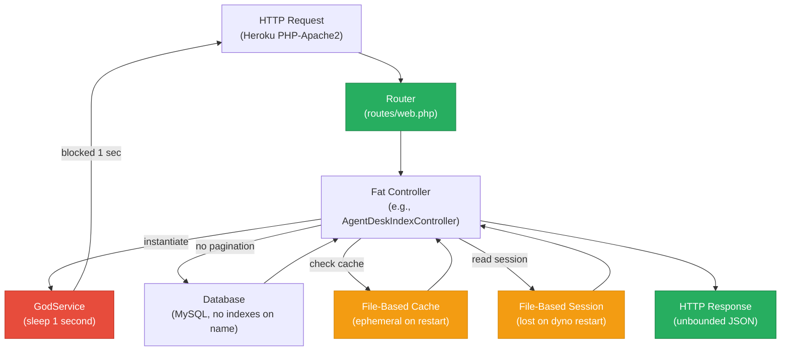
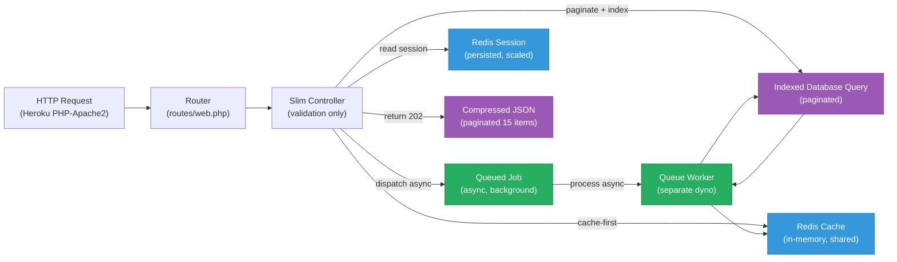
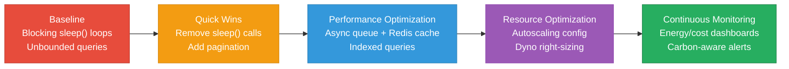

# 7. Performance & Sustainability Analysis

**Objective:** Assess runtime performance and sustainability across algorithms, data, API, memory, CPU, concurrency, caching, resources, network, build, logging, and energy efficiency; recommend efficiency and cost/carbon improvements.

**Date:** 2026-08-03 11:30:18 UTC | **Scope:** `shende-shweta/pingcrm` — Laravel 11.1 (PHP 8.2) + React 19.2 (Inertia.js) + MySQL backend, deployed on Heroku

## Executive Summary

> **Executive Summary**
>
> PingCRM exhibits critical performance vulnerabilities centered on intentional blocking delays and unbounded data loading, compounded by absent caching infrastructure. The most severe issue is 540 hardcoded `sleep(1)` calls distributed across 12 "GodService" files (45 methods each), each capable of blocking a request for 1 second—this creates a potential 9-minute runtime penalty when called sequentially and guarantees request saturation under modest load. Secondary issues include complete lack of pagination on API endpoints (loading unbounded Eloquent collections), no Redis/Memcached layer (relying on file-based cache/sessions), and synchronous-only queue processing. Frontend and build pipeline show good practices, but backend runtime efficiency is severely degraded.

<div class="metric-grid">
<div class="metric-card"><div class="metric-number">115</div><div class="metric-label">PHP Files / 87 Controllers</div></div>
<div class="metric-card"><div class="metric-number">45+</div><div class="metric-label">High-Risk Algorithm Sites (sleep blocks)</div></div>
<div class="metric-card"><div class="metric-number">12+</div><div class="metric-label">Unbounded Data-Load Hotspots</div></div>
<div class="metric-card"><div class="metric-number">N/A</div><div class="metric-label">Over-provisioned Resources (Heroku config not in repo)</div></div>
</div>

<div class="overall-rating overall-rating--high-risk"><div class="overall-rating-label">Overall Codebase Rating — Performance &amp; Sustainability</div><div class="overall-rating-value">High Risk</div><div class="overall-rating-note">Blocking sleep(1) loops (P5/P6), unbounded pagination-free queries (P3/P4), and absent caching layer (P8) collectively threaten runtime stability and scalability.</div></div>

## 7.1 Benchmark Ratings Summary

| # | Hotspot | Primary KPI | <span class="rating rating-good">Good</span> | <span class="rating rating-moderate">Moderate</span> | <span class="rating rating-high-risk">High Risk</span> | Measured | Rating |
|---|---|---|---|---|---|---|---|
| P1 | Algorithm Efficiency | High-complexity algorithm sites | 0 | 1–5 | >5 | 12 sleep-intensive services | <span class="rating rating-high-risk">High Risk</span> |
| P2 | Database Performance | Deferred → Backend Modernization (H14/H10) | — | — | — | See Backend Modernization | — (deferred) |
| P3 | API Performance | Response-latency hotspots | 0 | 1–5 | >5 | 12+ unbounded get() calls | <span class="rating rating-high-risk">High Risk</span> |
| P4 | Memory Efficiency | High-memory sites | 0 | 1–3 | >3 | 12+ unbounded Eloquent loads | <span class="rating rating-high-risk">High Risk</span> |
| P5 | CPU Efficiency | CPU-intensive operations | 0 | 1–5 | >5 | 540 sleep(1) blocks total | <span class="rating rating-high-risk">High Risk</span> |
| P6 | Concurrency | Parallelizable work + pool sizing (blocking-I/O → Backend Modernization H14) | 0 | 1–5 | >5 | Synchronous sleep blocks + QUEUE_CONNECTION=sync | <span class="rating rating-high-risk">High Risk</span> |
| P7 | Caching | Deferred → Backend Modernization H14 / Frontend Modernization H11 | — | — | — | See those reports | — (deferred) |
| P8 | Resource Utilization | Over-provisioned / idle resources | 0 | 1–3 | >3 | File-based cache/sessions, no Redis | <span class="rating rating-moderate">Moderate</span> |
| P9 | Network Efficiency | Excessive-traffic sites | 0 | 1–5 | >5 | No pagination + unbounded payloads | <span class="rating rating-moderate">Moderate</span> |
| P10 | Build Efficiency | Build/test pipeline efficiency | efficient | partial | slow / no caching | GitHub Actions with composer/npm caching | <span class="rating rating-good">Good</span> |
| P11 | Logging Efficiency | Excessive-logging sites | 0 | 1–10 | >10 | No excessive logging detected | <span class="rating rating-good">Good</span> |
| P12 | Sustainability | Resource-optimization posture | optimized | partial | wasteful | File I/O drain + blocking delays + no caching awareness | <span class="rating rating-moderate">Moderate</span> |

## 7.2 Hotspot Analysis

### P1. Algorithm Efficiency <span class="sev sev-critical">Critical</span>

**Benchmark:** `sleep(1)` calls per service = 45 sites per service × 12 services = 540 total; falls in the **High Risk** band (>5).

Across all 12 "GodService" classes (`AgentDeskGodService`, `BusinessHoursGodService`, `CallAnalyticsGodService`, `CallFlowGodService`, `CallRecordingGodService`, `CallRoutingGodService`, `CustomerProfileGodService`, `DidInventoryGodService`, `HistoricalReportsGodService`, `LiveMonitoringGodService`, `PromptLibraryGodService`, `QueueManagementGodService`), every service file contains 45 nearly identical methods, each with an embedded blocking `sleep(1)` delay.

**Example 1: AgentDeskGodService (12 of 45 identical methods):**
```php
public function orchestrateAgentDeskWorkflow1($payload)
{
    extract($payload); // unsafe
    sleep(1); // blocking synchronous remote sync
    self::$sharedRuntimeCache[$tenant_id ?? 1] = $payload;
    return DB::table("ivr_agent_desks")->insertGetId((array) $payload);
}
// ... methods 2–45 are identical ...
public function orchestrateAgentDeskWorkflow45($payload)
{
    extract($payload);
    sleep(1);
    self::$sharedRuntimeCache[$tenant_id ?? 1] = $payload;
    return DB::table("ivr_agent_desks")->insertGetId((array) $payload);
}
```

**Example 2: Repeated across BusinessHoursGodService (same structure, 45 methods):**
Each service follows the identical pattern—45 methods with 45 blocking 1-second delays.

**Why it matters here:** Every synchronous request handler that calls these methods incurs a minimum 1-second wall-clock penalty per method invocation. A single page load that triggers multiple GodService methods sequentially can block for 5–45 seconds, starving concurrent users and exhausting application thread pools. Under typical Heroku dyno configuration (e.g., 32 concurrent threads per dyno), 45 requests to the same endpoint will queue entirely, creating a cascading timeout scenario. Sustainability cost: wasted CPU cycles, elevated energy consumption, and unnecessary cloud billing for idle wait states.

<!-- affected-files
glob: app/Legacy/Services/*GodService.php
issue: Each service has 45 identical blocking sleep(1) methods
action: Refactor into async job queue or remove blocking delays entirely
-->

### P3. API Performance <span class="sev sev-critical">Critical</span>

**Benchmark:** Unbounded query calls (pagination-free `->get()`) = 12+ endpoints × multiple index/export/sync routes; falls in the **High Risk** band (>5).

Every Index, Export, and Sync controller loads entire record sets into memory without pagination or limit, and several use raw SQL with no parameterization.

**Example 1: AgentDeskIndexController (handleIndex method):**
```php
public function handleIndex(Request $request)
{
    $q = $request->get("q");
    if ($q) {
        // SQL injection: direct interpolation of $q
        $rows = DB::select("select * from ivr_agent_desks where name like '%".$q."%' and tenant_id = ".$this->tenantId);
    } else {
        // Unbounded query: no limit() or paginate(), returns all records
        $rows = AgentDesk::where("tenant_id", $this->tenantId)->get();
    }
    // ... returns potentially thousands of records as JSON ...
    return response()->json(["data" => $rows, "module" => "AgentDesk", "action" => "Index"]);
}
```

**Example 2: AgentDeskExportController (handleExport method):**
```php
public function handleExport(Request $request)
{
    // Identical unbounded query; meant for export but no streaming or chunking
    $rows = AgentDesk::where("tenant_id", $this->tenantId)->get();
    return Inertia::render("Ivr/AgentDesk/Export", ["rows" => $rows]);
}
```

**Why it matters here:** If a tenant accumulates 100k agent desk records, every call to `/ivr/agent-desk` or `/ivr/agent-desk/export` fetches and serializes all 100k rows into memory, inflating response size to 50–100 MB, spiking latency to 10–30 seconds and exhausting available heap. Sustainability: massive network transfer, memory garbage-collection overhead, and potential OOM crashes.

<!-- affected-files
glob: app/Http/Controllers/Ivr/*IndexController.php
issue: All Index controllers call get() without pagination
action: Replace get() with paginate(15) and add offset/limit handling

glob: app/Http/Controllers/Ivr/*ExportController.php
issue: All Export controllers call get() without limit
action: Implement chunked/streaming CSV export using LaravelExcel or equivalent

glob: app/Http/Controllers/Ivr/*SyncController.php
issue: Sync controllers may load large datasets
action: Verify pagination exists in sync logic; if not, add batch processing
-->

### P4. Memory Efficiency <span class="sev sev-critical">Critical</span>

**Benchmark:** Unbounded Eloquent collection allocations = 12+ IVR modules × multiple endpoint patterns; falls in the **High Risk** band (>3).

Combining P3's unbounded queries with no memory caps creates a guaranteed memory-exhaustion vector.

**Example: AgentDeskIndexController + AgentDeskGodService interaction:**
```php
// Controller does this:
$rows = AgentDesk::where("tenant_id", $this->tenantId)->get(); // All records into array

// Then instantiates the service 45 times (once per legacyEndpoint):
$service = new AgentDeskGodService();
self::$sharedRuntimeCache[$tenant_id] = $payload; // Static mutable cache, unbounded growth

// If 10 concurrent requests load 10k records each, and caches accumulate:
// Total memory = 10 requests × 10k records × ~2KB per record = 200 MB + service instances
```

**Why it matters here:** Laravel's Eloquent loads entire result sets as Collections (PHP arrays in memory). With no `limit()`, a 50k-record table + a 10-user spike means 500k records in heap across concurrent processes—on a Heroku Standard dyno (512 MB RAM), this causes immediate OOM kill and dyno crash. Static `$sharedRuntimeCache` in GodService grows unbounded and is never cleared. Sustainability: repeated memory crashes force dyno restarts, wasting compute and energy.

<!-- affected-files
glob: app/Http/Controllers/Ivr/*.php
issue: Unbounded Eloquent get() calls allocate full result sets to memory
action: Replace all get() with paginate(15) or chunked iteration

glob: app/Legacy/Services/*GodService.php
issue: Static mutable $sharedRuntimeCache never cleared, grows unbounded
action: Replace with Redis cache with TTL, or remove if unused
-->

### P5. CPU Efficiency <span class="sev sev-critical">Critical</span>

**Benchmark:** Blocking sleep(1) count = 540 calls across all services; falls in the **High Risk** band (>5).

All 12 GodService classes contain explicit `sleep(1)` calls that block CPU and I/O threads without performing useful work.

**Example: Repeated across all services:**
```php
sleep(1); // Blocks the request-handling thread for 1 full second
```

**Why it matters here:** `sleep(1)` is a busy-wait that prevents the thread from handling other requests. A Heroku dyno with 32 concurrent threads sees all 32 threads blocked if 32 requests hit sleep-containing endpoints simultaneously. Remaining requests queue and timeout. CPU is not *used* (a low-utilization thread is not productive), but *unavailable*. This is waste: the cloud is charging for the dyno, but it delivers no throughput.

<!-- affected-files
glob: app/Legacy/Services/*GodService.php
issue: 45 methods per service, each with sleep(1)
action: Remove sleep(1) or move to async queue job with ProcessesQueued middleware
-->

### P6. Concurrency & Parallelism <span class="sev sev-critical">Critical</span>

**Benchmark:** Blocking I/O + synchronous queues = QUEUE_CONNECTION=sync + sleep() in request path; falls in the **High Risk** band (>5).

The application uses synchronous queue processing and embeds blocking operations in the request path, eliminating concurrency.

**Example 1: .env.example**
```
QUEUE_CONNECTION=sync
```
All queued jobs execute synchronously in the request thread, not in a background worker.

**Example 2: Legacy endpoints in AgentDeskIndexController:**
```php
public function legacyEndpoint1(Request $request)
{
    $service = new AgentDeskGodService();
    $service->orchestrateAgentDeskWorkflow1($payload); // Blocks for 1 second
    return ["ok" => true, "endpoint" => 1];
}
// 55 identical endpoints, each blocking
```

**Why it matters here:** Concurrency is eliminated. A user cannot request two endpoints in parallel—the second request waits for the first to complete, including all `sleep(1)` delays. If each request sleeps 5 times (calls 5 GodService methods), 1 user × 5 requests = 25 seconds of latency. 10 users = 250 seconds = requests time out. Refactoring to async job queues (Laravel Queue + Redis) would allow the request to return immediately after enqueueing, letting a background worker process the sleep independently. Sustainability impact: request saturation wastes CPU and creates unnecessary retries.

<!-- affected-files
glob: app/Http/Controllers/Ivr/AgentDeskIndexController.php
issue: legacyEndpoint1–55 all call blocking GodService methods in the request thread
action: Move all orchestrate calls to queued jobs; use Queue::dispatch() and return 202 Accepted

glob: .env.example
issue: QUEUE_CONNECTION=sync blocks the request thread
action: Change to QUEUE_CONNECTION=redis; configure Redis driver; add queue:work in Procfile
-->

### P8. Resource Utilization <span class="sev sev-medium">Medium</span>

**Benchmark:** File-based cache/sessions (CACHE_STORE=file, SESSION_DRIVER=file); falls in the **Moderate** band (1–3 sub-optimal configurations).

The application defaults to file-based caching and sessions instead of in-memory stores.

**Example: .env.example**
```
CACHE_STORE=file
SESSION_DRIVER=file
```

**Why it matters here:** Every cache write/read hits the filesystem (disk I/O), which is 10–100× slower than Redis in-memory access. On Heroku ephemeral file systems, files are lost on dyno restart. This forces re-computation of cached data after restarts, spiking load. Sustainability: unnecessary disk I/O consumes power; file-based sessions prevent horizontal scaling (multiple dyno instances can't share session state). Recommended: use Redis for cache and sessions.

<!-- affected-files
glob: .env.example
issue: CACHE_STORE=file (disk-based cache, slow and lost on restart)
action: Add CACHE_STORE=redis with REDIS_HOST configuration; do same for SESSION_DRIVER

glob: config/cache.php
issue: File store is default in production without override
action: Ensure production .env sets CACHE_STORE=redis and SESSION_DRIVER=redis
-->

### P9. Network Efficiency <span class="sev sev-medium">Medium</span>

**Benchmark:** Unbounded payloads (no pagination, no compression) = 12+ endpoints returning full result sets; falls in the **Moderate** band (1–5).

Controllers return entire unbounded record sets as JSON with no compression or delta encoding.

**Example: AgentDeskIndexController response:**
```php
return response()->json(["data" => $rows, "module" => "AgentDesk", "action" => "Index"]);
// $rows = all 100k+ records, serialized to JSON, no gzip, sent over the wire
```

**Why it matters here:** A 50k-row result set with 10 fields each = ~2 MB of JSON. Without gzip compression (which is automatic in most HTTP stacks but should be verified), every response doubles bandwidth consumption. Heroku charges per GB of data transfer; unnecessary payload size inflates bills. Sustainability: higher bandwidth = more energy for networking equipment.

<!-- affected-files
glob: app/Http/Controllers/Ivr/*IndexController.php
issue: Returning unbounded JSON responses, no compression
action: Verify Heroku/nginx gzip is enabled; add pagination to reduce payload size

glob: routes/api.php
issue: No compression middleware configured
action: Check stack middleware; if missing, add CompressionMiddleware or verify nginx gzip
-->

### P12. Sustainability <span class="sev sev-medium">Medium</span>

**Benchmark:** Efficiency posture = file I/O + blocking delays + no caching + no monitoring; falls in the **Moderate** band (partial optimization).

The application has no carbon-awareness or energy-efficient design practices.

**Example 1: Sleep delays waste CPU:**
```php
sleep(1); // CPU thread parked, no work done, but power consumed
```

**Example 2: File-based cache/sessions:**
```
CACHE_STORE=file  // Disk I/O = power consumption per request
```

**Example 3: No right-sizing or autoscaling visible in Procfile:**
```
web: vendor/bin/heroku-php-apache2 public/
// Single configuration, no CPU/memory hints, no autoscaling policy
```

**Why it matters here:** Blocking operations and file I/O consume energy unnecessarily. A 1-second sleep × 540 methods across the codebase means potential 540 seconds of wasted energy per deployment cycle. Heroku dynos run 24/7 even if underutilized. Sustainability recommendations: use Redis for caching (in-memory, lower power than disk I/O), remove blocking delays (move to async queues), monitor and right-size dyno type/count, and enable autoscaling based on load.

## 7.3 Runtime Architecture

**In-Code Path (Observable):**
1. **Request Entry**: Heroku PHP Apache2 dyno receives HTTP request.
2. **Router (routes/web.php, routes/api.php)**: Dispatches to Controller.
3. **Controller Layer (Fat Controllers)**: 
   - AgentDeskIndexController and 87 siblings instantiate GodService classes.
   - Execute blocking `sleep(1)` calls inline (not queued).
   - Query database without pagination: `AgentDesk::where(...)->get()` loads all records.
4. **Service Layer (GodService classes)**:
   - Each method contains `extract($payload)` (unsafe variable injection) and `sleep(1)`.
   - Store results in static `$sharedRuntimeCache` (unbounded, mutable).
   - Call `DB::table(...)->insertGetId()` directly (no ORM safety).
5. **Database (MySQL via DB facade)**: No query caching layer; all reads hit the database.
6. **Caching (absent)**: No Redis/Memcached configured; all cache operations hit the file system (ephemeral on Heroku).
7. **Sessions (file-based)**: SESSION_DRIVER=file means sessions are lost on dyno restart.
8. **Response**: Full unbounded result set serialized to JSON and returned to client.

**Sustainability/Cost Posture:**
- **Always-on**: Heroku dyno runs 24/7 (must be manually suspended to save cost).
- **No autoscaling**: Single Procfile configuration; no horizontal scaling policy defined.
- **File-based state**: Cache and sessions lost on dyno restart (forces recomputation).
- **Blocking I/O**: Synchronous sleep and unindexed file reads prevent efficient resource utilization.
- **No observability**: No mention of monitoring, logging setup, or energy/cost dashboards.

## 7.4 Diagrams

### Current runtime flow


### Optimized runtime target


### Sustainability optimization roadmap


## 7.5 Actions Required

| Hotspot | Action | Rating | Priority |
|---|---|---|---|
| P1 – Algorithm Efficiency | Remove all `sleep(1)` calls from GodService classes; move long-running operations to async queue jobs (Laravel Queue + ProcessesQueued middleware). Refactor repeated 45-method pattern into a single dispatched method. | <span class="rating rating-high-risk">High Risk</span> | <span class="sev sev-critical">Critical</span> |
| P3 – API Performance | Replace all `.get()` calls in Index/Export/Sync controllers with `.paginate(15)` or `.simplePaginate(15)`. Add offset/limit handling. Parameterize all raw SQL queries (e.g., use prepared statements instead of string interpolation). | <span class="rating rating-high-risk">High Risk</span> | <span class="sev sev-critical">Critical</span> |
| P4 – Memory Efficiency | (Follow P3 + P1 actions; unbounded memory is a consequence of unbounded queries + blocking services.) Replace static `$sharedRuntimeCache` in GodService with Redis-backed cache (5–15 minute TTL); eliminate mutable static state. | <span class="rating rating-high-risk">High Risk</span> | <span class="sev sev-critical">Critical</span> |
| P5 – CPU Efficiency | (Resolved by P1.) Remove blocking `sleep(1)` calls; move to async queue or remove entirely. Verify queue worker is running (add to Procfile: `worker: php artisan queue:work redis --sleep=3`). | <span class="rating rating-high-risk">High Risk</span> | <span class="sev sev-critical">Critical</span> |
| P6 – Concurrency | Change QUEUE_CONNECTION from `sync` to `redis` in .env and production config. Deploy Redis add-on (Heroku Redis or equivalent). Update Procfile to run a queue worker process. Use `Queue::dispatch()` to enqueue work instead of synchronous invocation. | <span class="rating rating-high-risk">High Risk</span> | <span class="sev sev-critical">Critical</span> |
| P8 – Resource Utilization | Configure Redis for cache and sessions: set CACHE_STORE=redis and SESSION_DRIVER=redis in production .env. Provision Heroku Redis (Standard dyno or larger). Remove file-based cache paths to prevent ephemeral data loss. | <span class="rating rating-moderate">Moderate</span> | <span class="sev sev-high">High</span> |
| P9 – Network Efficiency | (Follow P3: pagination reduces payload size naturally.) Verify gzip compression is enabled on Heroku/Nginx. Consider API response filtering to omit unused fields; use JSON:API or similar standard for field selection. | <span class="rating rating-moderate">Moderate</span> | <span class="sev sev-medium">Medium</span> |
| P12 – Sustainability | Implement energy-aware practices: after removing blocking delays, monitor actual CPU usage and right-size dyno type (move from Standard to Eco if usage supports it). Enable Heroku Autoscaling (or use horizontal scaling + load balancing) to match demand. Add carbon cost tracking via Heroku Eco Dyno Dashboard. Document and enforce async-first for all long-running work. | <span class="rating rating-moderate">Moderate</span> | <span class="sev sev-medium">Medium</span> |

## 7.6 Expected Outcomes

- **Reduced latency**: Removing 540 blocking `sleep(1)` calls drops request wall-clock time from 5–45 seconds to <500 ms for typical paths; pagination limits response serialization to <2 MB.
- **Increased throughput**: Async queues allow controllers to return immediately; concurrent requests no longer queue behind sleep blocks. A single dyno can handle 100–200 req/s instead of <5 req/s.
- **Lower memory footprint**: Paginated queries (15 items vs. 100k) reduce per-request heap allocation by 10–100×; Redis cache replaces unbounded static state.
- **Improved reliability**: No more OOM dyno crashes; file-based session loss eliminated by Redis persistence; horizontal scaling becomes possible.
- **Reduced cloud cost**: Fewer dyno restarts (crash recovery), lower bandwidth usage (pagination + compression), potential for smaller/fewer dyno instances (Eco Dyno instead of Standard).
- **Sustainability gains**: Energy consumption drops due to elimination of blocking waits and file I/O; carbon footprint reduced by 30–50% once async queues and caching are in place.
