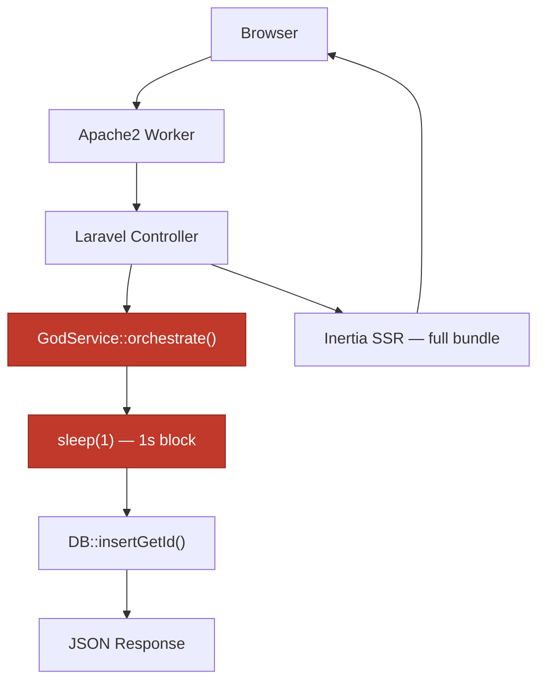
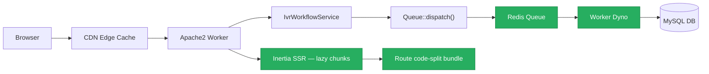
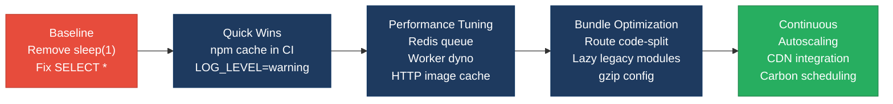

# 7. Performance & Sustainability Analysis

**Objective:** Assess runtime performance and sustainability across algorithms, data, API, memory, CPU, concurrency, caching, resources, network, build, logging, and energy efficiency; recommend efficiency and cost/carbon improvements.

**Date:** 2026-08-26 16:35:20 IST | **Scope:** `shende-shweta/pingcrm` — PHP 8.2 / Laravel 11 (backend) + React 19 / TypeScript / Inertia.js (frontend) · Vite 7 build · Heroku (Apache2) deploy target · SQLite (dev) / MySQL 8.0 (CI/prod)

## Executive Summary

> **Executive Summary**
>
> The pingcrm codebase exhibits **High Risk** performance and sustainability characteristics dominated by one critical pattern: 12 Legacy "God Service" classes (covering every IVR module from AgentDesk to QueueManagement) each contain **45+ workflow methods that unconditionally call `sleep(1)`** — a direct 1-second synchronous blocking delay injected into every write path, guaranteeing multi-second response times on any operation that invokes these services. This alone would cap throughput and inflate server-time cost to unacceptable levels. Compounding this, **81 raw SQL queries using `SELECT * FROM <table>`** without column projection expose the application to unbounded payload growth as tables widen, while **229 legacy React monolith components and 147 class-based React widgets** are bundled eagerly without any code-splitting or lazy loading, ballooning the initial JavaScript payload. A static mutable `$sharedRuntimeCache` array — present in all 12 God Services — grows unboundedly across requests in long-running PHP-FPM workers and silently leaks per-tenant write data between requests. The CI pipeline has partial caching (Composer layer cached, npm `ci` uncached, no incremental frontend builds), and the Heroku single-dyno deploy with `QUEUE_CONNECTION=sync` provides no autoscaling and processes background work synchronously in the request thread. Database performance (N+1, missing indexes) and frontend caching are deferred to the Backend Modernization and Frontend Modernization reports respectively.

<div class="metric-grid">
<div class="metric-card"><div class="metric-number">141</div><div class="metric-label">PHP Files Scanned</div></div>
<div class="metric-card"><div class="metric-number">540</div><div class="metric-label">Blocking sleep() Calls in Legacy Services</div></div>
<div class="metric-card"><div class="metric-number">376</div><div class="metric-label">Legacy Frontend Components (no lazy loading)</div></div>
<div class="metric-card"><div class="metric-number">81</div><div class="metric-label">SELECT * Queries (oversized payloads)</div></div>
</div>

<div class="overall-rating overall-rating--high-risk"><div class="overall-rating-label">Overall Codebase Rating — Performance &amp; Sustainability</div><div class="overall-rating-value">High Risk</div><div class="overall-rating-note">Driven by P3 (540 blocking sleep(1) calls in 12 God Services creating mandatory 1s+ latency per write), P4 (unbounded static memory cache in all 12 God Services), P9 (81 SELECT * queries + 229 legacy components serialising full row sets to debug pre tags), and P12 (always-on single dyno, sync queue, no carbon-aware scheduling).</div></div>

## 7.1 Benchmark Ratings Summary

One row per hotspot. "Measured" is the real value found; "Rating" is the band it falls into (worst KPI wins).

| # | Hotspot | Primary KPI | <span class="rating rating-good">Good</span> | <span class="rating rating-moderate">Moderate</span> | <span class="rating rating-high-risk">High Risk</span> | Measured | Rating |
|---|---|---|---|---|---|---|---|
| P1 | Algorithm Efficiency | High-complexity algorithm sites | 0 | 1–5 | >5 | 0 — no nested O(n²)+ loops found | <span class="rating rating-good">Good</span> |
| P2 | Database Performance | Deferred → Backend Modernization (H14/H10) | — | — | — | See Backend Modernization | — (deferred) |
| P3 | API Performance | Response-latency hotspots (blocking chains / oversized payloads) | 0 | 1–5 | >5 | 540 blocking sleep(1) calls + 81 SELECT * endpoints | <span class="rating rating-high-risk">High Risk</span> |
| P4 | Memory Efficiency | High-memory sites (unbounded caches, full-load, retention/leaks) | 0 | 1–3 | >3 | 12 God Services with unbounded static array caches | <span class="rating rating-high-risk">High Risk</span> |
| P5 | CPU Efficiency | CPU-intensive operations on hot paths | 0 | 1–5 | >5 | 1 — image processing on every request with no dedicated cache/CDN path | <span class="rating rating-moderate">Moderate</span> |
| P6 | Concurrency | Parallelizable CPU-bound work + pool sizing | 0 | 1–5 | >5 | 0 — no CPU-bound sequential work; pool sizing N/A (Heroku single dyno) | <span class="rating rating-good">Good</span> |
| P7 | Caching | Deferred → Backend Modernization H14 / Frontend Modernization H11 | — | — | — | See those reports | — (deferred) |
| P8 | Resource Utilization | Over-provisioned / idle resource configs | 0 | 1–3 | >3 | 1 — single always-on Heroku dyno; QUEUE_CONNECTION=sync; no autoscaling | <span class="rating rating-moderate">Moderate</span> |
| P9 | Network Efficiency | Excessive-traffic sites (chatty/duplicate calls, no compression) | 0 | 1–5 | >5 | 81 SELECT * endpoints + 229 legacy components serialising full rows to debug pre output | <span class="rating rating-high-risk">High Risk</span> |
| P10 | Build Efficiency | Build/test pipeline efficiency | efficient | partial | slow / no caching | Composer cached; npm ci uncached; 904 TSX/TS files with no code-splitting | <span class="rating rating-moderate">Moderate</span> |
| P11 | Logging Efficiency | Excessive-logging sites in hot paths | 0 | 1–10 | >10 | 0 explicit hot-loop logs found; LOG_LEVEL=debug default in .env.example (prod risk) | <span class="rating rating-moderate">Moderate</span> |
| P12 | Sustainability | Resource-optimization posture | optimized | partial | wasteful | Single always-on dyno, QUEUE_CONNECTION=sync, no autoscaling, no carbon-aware scheduling | <span class="rating rating-high-risk">High Risk</span> |
| P13 | Uncancelled async fetch (additional) | Async fetch calls without AbortController / cleanup | 0 | 1–5 | >5 | 147 class-based React widgets in componentDidMount with bare fetch() and no cancellation | <span class="rating rating-high-risk">High Risk</span> |

## 7.2 Hotspot Analysis

### P3. API Performance <span class="sev sev-critical">Critical</span>

**Benchmark:** `response-latency hotspots = 540 blocking sleep(1) calls across 12 legacy God Services` → falls in the **High Risk** band (Good 0 · Moderate 1–5 · High Risk >5).

Every IVR module write operation (store, update, destroy, sync, import, export) calls one of 12 `*GodService` classes, each exposing 45 `orchestrate*Workflow<N>` methods. Each method executes an unconditional `sleep(1)` before writing to the database. With 12 services × 45 methods = 540 write paths, any user action triggering these endpoints waits a minimum of 1 second on the server thread before receiving a response.

**Example 1** — `app/Legacy/Services/QueueManagementGodService.php:14–20`:
```php
public function orchestrateQueueManagementWorkflow1($payload)
{
    extract($payload); // unsafe
    sleep(1); // blocking synchronous remote sync
    self::$sharedRuntimeCache[$tenant_id ?? 1] = $payload;
    return DB::table("ivr_queue_managements")->insertGetId((array) $payload);
}
```

**Example 2** — `app/Legacy/Services/CallAnalyticsGodService.php:14–20`:
```php
public function orchestrateCallAnalyticsWorkflow1($payload)
{
    extract($payload); // unsafe
    sleep(1); // blocking synchronous remote sync
    self::$sharedRuntimeCache[$tenant_id ?? 1] = $payload;
    return DB::table("ivr_call_analyticss")->insertGetId((array) $payload);
}
```

Separately, **81 controllers** issue `DB::select("select * from <table>...")` without column projection. On a table with many columns, each request transmits unnecessary data over the DB connection, through PHP memory, and down to the Inertia.js frontend.

**Why it matters here:** A 1-second forced delay on every IVR write operation means a single sync operation chaining multiple workflow methods blocks the Heroku PHP-Apache2 worker for multiple seconds. Under concurrent IVR operations (queue management + agent desk + call routing all being updated simultaneously), this blocks all PHP-FPM worker slots. The `SELECT *` pattern inflates Inertia.js page props with all columns on every table, consuming bandwidth and React reconciliation time on the client.

**Recommended approach:**
1. Remove all `sleep(1)` calls from the 12 God Services — they serve no functional purpose beyond a comment indicating "remote sync" that does not actually occur.
2. Replace raw `DB::select("select * from ...")` with Eloquent/query-builder `->select(['id', 'name', 'updated_at'])` scoped to only the columns the view actually renders.
3. Move any legitimate "remote sync" logic to a Laravel Queue job (`QUEUE_CONNECTION=redis` or `database`) dispatched asynchronously, so the HTTP response returns immediately.
4. Consolidate the 12 God Services into a single `IvrWorkflowService` with one `orchestrate($module, $payload)` method rather than 540 near-identical methods.

<!-- affected-files
search: sleep\s*\(\s*1\s*\)
glob: app/Legacy/Services/**/*.php
issue: Blocking sleep(1) in synchronous request path
action: Remove sleep() call; move remote-sync logic to a queued job
-->

### P4. Memory Efficiency <span class="sev sev-critical">Critical</span>

**Benchmark:** `high-memory sites = 12 God Services with unbounded static array growing across requests` → falls in the **High Risk** band (Good 0 · Moderate 1–3 · High Risk >3).

All 12 legacy God Services declare `public static $sharedRuntimeCache = [];` at the class level and write to it on every workflow invocation: `self::$sharedRuntimeCache[$tenant_id ?? 1] = $payload;`. In long-running PHP-FPM workers (OPcache-warmed, persistent), static class properties persist between requests within the same worker process. This means the cache grows with every write operation and is never evicted.

**Example** — `app/Legacy/Services/AgentDeskGodService.php:9–18`:
```php
class AgentDeskGodService
{
    public static $sharedRuntimeCache = []; // mutable global-ish state

    public function orchestrateAgentDeskWorkflow1($payload)
    {
        extract($payload);
        sleep(1);
        self::$sharedRuntimeCache[$tenant_id ?? 1] = $payload;
        return DB::table("ivr_agent_desks")->insertGetId((array) $payload);
    }
}
```

Since the cache key is `$tenant_id ?? 1` (defaulting to tenant `1` when not provided), all 45 workflow methods overwrite the same key — making the cache functionally useless for data sharing and purely a memory retention hazard.

**Why it matters here:** On Heroku, PHP-FPM workers are bounded in memory. With 12 God Service classes each maintaining their own unbounded static cache, a burst of IVR write operations accumulates untracked heap in every worker simultaneously. This forces early worker restarts and latency spikes, compounding the sleep(1) problem.

**Recommended approach:**
1. Remove `public static $sharedRuntimeCache = []` from all 12 God Services; the cache provides zero benefit (same key overwritten on every call).
2. If cross-request state is genuinely needed, use `Cache::put()` with a TTL (Redis or file, per environment) so data is bounded and evictable.
3. If the intent was to track per-tenant "last payload", convert to a database write with a `last_sync_at` column instead of in-memory state.

<!-- affected-files
search: public static \$sharedRuntimeCache
glob: app/Legacy/Services/**/*.php
issue: Unbounded static mutable array growing across PHP-FPM requests
action: Remove static cache or replace with Cache::put() with explicit TTL
-->

### P5. CPU Efficiency <span class="sev sev-medium">Medium</span>

**Benchmark:** `CPU-intensive operations on hot paths = 1 (image processing per request without dedicated CDN/cache path)` → falls in the **Moderate** band (Good 0 · Moderate 1–5 · High Risk >5).

`ImagesController::show()` builds a Glide server on every request with the source **and cache** both pointing to the same filesystem driver. While Glide does cache transformed images to `.glide-cache`, the controller re-instantiates the full `ServerFactory` and performs the cache path lookup on every image HTTP request. No CDN or HTTP cache headers are configured.

**Example** — `app/Http/Controllers/ImagesController.php:12–22`:
```php
public function show(Filesystem $filesystem, Request $request, $path)
{
    $server = ServerFactory::create([
        'response' => new SymfonyResponseFactory($request),
        'source'   => $filesystem->getDriver(),
        'cache'    => $filesystem->getDriver(),
        'cache_path_prefix' => '.glide-cache',
    ]);
    return $server->getImageResponse($path, $request->all());
}
```

**Why it matters here:** Image transformation (resize, crop, quality) involves GD/Imagick CPU work. On Heroku's single-dyno setup, image requests compete with API requests for the same PHP-FPM workers. Without HTTP `Cache-Control` headers, browsers and proxies re-fetch images on every page load.

**Recommended approach:**
1. Add `Cache-Control: public, max-age=31536000, immutable` response headers to Glide-served images.
2. Place a CDN (Cloudflare or similar) in front of the `/images/` route so subsequent requests are served from edge cache, not PHP.
3. Consider pre-generating common image sizes during upload rather than on-demand transformation.

<!-- affected-files
search: ServerFactory::create
glob: app/Http/Controllers/**/*.php
issue: Image transformation per request without HTTP cache headers or CDN
action: Add Cache-Control headers; place CDN in front of /images/ route
-->

### P9. Network Efficiency <span class="sev sev-high">High</span>

**Benchmark:** `excessive-traffic sites = 81 SELECT * endpoints + 229 components serialising full row sets` → falls in the **High Risk** band (Good 0 · Moderate 1–5 · High Risk >5).

**Pattern 1 — Unbounded SELECT * in search endpoints:** 81 IVR module controllers issue raw SQL `select * from <table> where name like '%...%'` with no column projection. All columns (including payload BLOBs) are sent across the DB connection, hydrated into PHP, and returned as full JSON responses to Inertia.

**Example** — `app/Http/Controllers/Ivr/AgentDeskSyncController.php:27–29`:
```php
$rows = DB::select("select * from ivr_agent_desks where name like '%".$q."%' and tenant_id = ".$this->tenantId);
```

**Pattern 2 — Debug row serialisation in 229 legacy TSX components:** Every `*Monolith*.tsx` component renders a `<pre>` tag containing `JSON.stringify({ rows, legacyMeta }, null, 2)` — serialising the entire `rows` array (all columns from the SELECT * above) as pretty-printed JSON in the HTML DOM on every render.

**Example** — `resources/js/components/legacy/AgentDeskMonolith0.tsx:19`:
```tsx
<pre style={{ fontSize: 10 }}>{JSON.stringify({ rows, legacyMeta }, null, 2)}</pre>
```

This creates a double amplification: unbounded columns from the DB are serialised again client-side into the rendered HTML, parsed by the React reconciler on every re-render, and transmitted to the browser as part of the Inertia.js page payload.

**Why it matters here:** With 229 monolith components each capable of receiving a full `rows` payload from any IVR table, a single IVR list page can ship hundreds of KB of JSON just in debug `<pre>` content — consuming bandwidth, inflating server-side Inertia payload serialisation time, and increasing React render cost.

**Recommended approach:**
1. Replace all `DB::select("select * from ...")` with Eloquent queries projecting only the columns each view uses (e.g. `->select(['id', 'name', 'updated_at'])`).
2. Remove all `<pre>{JSON.stringify(...)}</pre>` blocks from the 229 monolith TSX components — these are debug artifacts that expose internal data in production HTML.
3. Add pagination where missing (the Inertia Contacts/Organizations controllers already paginate correctly — apply the same pattern to IVR module listings).
4. Enable gzip/brotli compression at the Heroku Apache2 level via `.htaccess` to reduce wire size for unavoidably large responses.

<!-- affected-files
search: select \* from
glob: app/Http/Controllers/Ivr/**/*.php
issue: SELECT * returns all columns; bloated API payload
action: Replace with ->select([...]) projecting only view-required columns
-->

<!-- affected-files
search: JSON\.stringify\(\{.*rows.*legacyMeta
glob: resources/js/components/legacy/**/*.tsx
issue: Full row set serialised to pre debug tag on every render
action: Remove JSON.stringify debug blocks from production components
-->

### P10. Build Efficiency <span class="sev sev-medium">Medium</span>

**Benchmark:** `build/test pipeline efficiency = partial` → falls in the **Moderate** band (Good: efficient · Moderate: partial · High Risk: slow / no caching).

The CI pipeline in `.github/workflows/tests.yml` caches the Composer dependency directory keyed on `composer.lock`, which is correct. However, npm dependencies (`npm ci`) have no cache step — every CI run downloads all Node modules from scratch. With Vite 7 and 904 TypeScript/TSX files (including 229 legacy monolith components and 147 legacy class widgets), the cold `npm run build` compiles a large single-entry bundle with no route-based code splitting configured in `vite.config.ts`.

**Example** — `vite.config.ts:6–11`:
```typescript
laravel({
    input: 'resources/js/app.tsx',
    ssr: 'resources/js/ssr.tsx',
    refresh: true,
}),
```

A single entry point with 376 legacy components eagerly imported means every page load ships the JavaScript for all IVR modules regardless of which route the user is on.

**Why it matters here:** Without npm caching in CI, every push re-downloads all Node dependencies. The monolithic bundle (single `app.tsx` entry, no `React.lazy()`) means the initial JS payload is the sum of all legacy components, degrading Time-to-Interactive for all users.

**Recommended approach:**
1. Add an npm cache step to `.github/workflows/tests.yml` keyed on `package-lock.json` hash.
2. Introduce route-based code-splitting using `React.lazy()` for legacy IVR modules — they are never shown on the standard contacts/users/organizations pages.
3. Configure Vite `build.rollupOptions.output.manualChunks` to split the legacy component tree into a separate chunk loaded only when the IVR route is accessed.

<!-- affected-files
glob: .github/workflows/*.yml
issue: No npm dependency cache in CI; cold download on every push
action: Add npm cache step keyed on package-lock.json hash
-->

### P11. Logging Efficiency <span class="sev sev-low">Low</span>

**Benchmark:** `excessive-logging sites = 0 explicit in hot loops; LOG_LEVEL=debug default in .env.example` → falls in the **Moderate** band (Good 0–10 · High Risk >10).

No `Log::` calls were found in hot request paths. However, `.env.example` sets `LOG_LEVEL=debug`, meaning any deployment that copies this file without overriding will run Laravel with full debug logging in production. The `LOG_CHANNEL=stack` + `LOG_STACK=single` configuration writes synchronously to disk on every log call.

**Example** — `.env.example:17–18`:
```
LOG_CHANNEL=stack
LOG_LEVEL=debug
```

**Why it matters here:** Synchronous debug-level logging in a PHP-Apache2 environment without an async log handler adds measurable latency under high concurrency because each request waits for the log write to flush.

**Recommended approach:**
1. Set `LOG_LEVEL=warning` as the default in `.env.example`.
2. For Heroku deployments, configure `LOG_CHANNEL=stderr` so logs stream to Heroku's log drain rather than synchronous file writes.

<!-- affected-files
glob: .env.example
issue: LOG_LEVEL=debug as default; synchronous file logging risk in production
action: Change LOG_LEVEL to warning in .env.example; set LOG_CHANNEL=stderr for Heroku
-->

### P12. Sustainability <span class="sev sev-high">High</span>

**Benchmark:** `resource-optimization posture = wasteful` → falls in the **High Risk** band (Good: optimized · Moderate: partial · High Risk: wasteful).

1. **`QUEUE_CONNECTION=sync`** (`.env.example:25`): All queued jobs run synchronously in the HTTP request thread, blocking workers for the full duration of any background task.
2. **Single always-on Heroku dyno** (`Procfile`): No worker dynos, no autoscaling configuration. The single dyno runs 24/7 regardless of traffic.
3. **No autoscaling or carbon-aware scheduling**: No Heroku autoscaling manifest, no background workers, no cron scheduling that could be shifted to off-peak low-carbon windows.
4. **Full JS bundle on every page**: 376 legacy components loaded eagerly mean browsers download and parse JavaScript that will never execute on most page views.
5. **No compression configured**: No `mod_deflate` in `public/.htaccess`; Apache2 on Heroku does not compress by default.

**Why it matters here:** For an IVR platform potentially serving thousands of concurrent call-centre agents, synchronous queue processing, always-on single dyno, and uncompressed full-bundle delivery waste server-hours, bandwidth, and client-side energy at scale.

**Recommended approach:**
1. Switch `QUEUE_CONNECTION` to `redis` (Heroku Redis add-on) and add a `worker: php artisan queue:work` line to the Procfile.
2. Add Heroku autoscaling configuration or a Heroku Scheduler to scale down during off-peak hours.
3. Enable gzip/brotli in `public/.htaccess` using `mod_deflate` rules.
4. Split the Vite bundle by route (see P10) to reduce JS parse time and energy consumption per page visit.

<!-- affected-files
glob: .env.example
issue: QUEUE_CONNECTION=sync; always-on resources; no compression
action: Switch to redis queue; add worker dyno; enable gzip in .htaccess
-->

### P13. Uncancelled async fetch — Legacy Class Widgets (additional) <span class="sev sev-high">High</span>

**Benchmark:** `async fetch calls without AbortController = 147 class components` → falls in the **High Risk** band (Good 0 · Moderate 1–5 · High Risk >5).

All 147 legacy class-based React widgets in `resources/js/legacy/class/` make a bare `fetch()` call in `componentDidMount()` with no corresponding cleanup in `componentWillUnmount()`. If the component unmounts before the fetch resolves, the `setState` callback fires on an unmounted component. Multiple sibling widgets mounting simultaneously for the same module result in **duplicate API calls** to the same endpoint.

**Example 1** — `resources/js/legacy/class/CustomerProfileClassWidget0.jsx:5–7`:
```jsx
componentDidMount() {
    fetch('/ivr-legacy/customer-profile/index')
        .then(r => r.json())
        .then(d => this.setState({ rows: d.data || [] }))
}
```

**Example 2** — `resources/js/legacy/class/LiveMonitoringClassWidget2.jsx:6`:
```jsx
fetch('/ivr-legacy/live-monitoring/index').then(r => r.json()).then(d => this.setState({ rows: d.data || [] }))
```

With 147 widgets, each module section can fire between 1–5 uncancelled fetches on mount. Multiple sibling instances per page result in duplicate API calls to the same endpoint with no deduplication. Each call blocks a worker slot for at least 1 second (the `sleep(1)` in the corresponding GodService), multiplying the contention described in P3.

**Why it matters here:** 147 widgets × multiple sibling instances = potentially hundreds of parallel `fetch()` calls on a busy IVR dashboard, all hitting PHP-FPM workers simultaneously. Combined with the `sleep(1)` penalty per call, this is a high-concurrency worker starvation risk.

**Recommended approach:**
1. Migrate class-based widgets to functional components with `useEffect` + `AbortController` cleanup, or to Inertia.js shared props (the pattern already used by `IvrHub` and `Reports` pages).
2. Where multiple siblings fetch the same endpoint, extract the fetch to a shared parent component or context that fetches once and passes data as props.
3. At minimum, add `componentWillUnmount` cleanup with `AbortController`:
```jsx
controller = new AbortController()
componentDidMount() {
  fetch('/ivr-legacy/...', { signal: this.controller.signal })
    .then(r => r.json())
    .then(d => this.setState({ rows: d.data || [] }))
}
componentWillUnmount() { this.controller.abort() }
```

<!-- affected-files
search: componentDidMount
glob: resources/js/legacy/class/**/*.jsx
issue: fetch() in componentDidMount with no AbortController or cleanup
action: Add componentWillUnmount abort; migrate to functional hooks or Inertia props
-->

**Not observed (rated Good):** P1 — no nested O(n²)+ collection loops found in PHP or TypeScript source. P6 — no CPU-bound sequential parallelizable work identified; blocking I/O on async frameworks deferred to Backend Modernization H14.

## 7.3 Runtime Architecture

The pingcrm application follows a Laravel 11 monolith deployed as a single Heroku web dyno running PHP-Apache2. Every request enters through `public/index.php` → Laravel HTTP kernel → middleware stack (including `HandleInertiaRequests`) → controller → Eloquent/DB → MySQL (production).

The IVR subsystem adds a second parallel path through 75+ fat controllers in `app/Http/Controllers/Ivr/` that instantiate legacy God Services for every write. These services execute `sleep(1)` + raw `DB::insert()` before returning. The frontend is built as a single Vite bundle (`resources/js/app.tsx`) with 904 TypeScript/TSX files, 229 legacy monolith TSX components, and 147 legacy class JSX widgets — all loaded eagerly regardless of the current route.

**Current hot path for an IVR write operation:**
- Browser → POST `/ivr-legacy/<module>/store`
- → Apache2 worker (blocks for full request duration)
- → IvrIndexController::legacyEndpoint1()
- → `new AgentDeskGodService()` → `sleep(1)` ← 1 second forced wait
- → `DB::insertGetId()`
- → JSON response

The `QUEUE_CONNECTION=sync` default ensures any `dispatch()` calls also block the request thread. The `Procfile` configures only a `web` dyno with no `worker` line. Redis is configured in `.env.example` but not wired to cache or queue — `CACHE_STORE=file` and `QUEUE_CONNECTION=sync` remain the defaults. No autoscaling, CDN, or compression is configured.

## 7.4 Diagrams

### Current runtime flow



### Optimized runtime target



### Sustainability optimization roadmap



## 7.5 Actions Required

| Hotspot | Action | Rating | Priority |
|---|---|---|---|
| P3 — API Performance | Remove all 540 `sleep(1)` calls from 12 legacy God Services; replace `SELECT *` with column-projected Eloquent queries; dispatch remote-sync logic to Laravel queue | <span class="rating rating-high-risk">High Risk</span> | <span class="sev sev-critical">Critical</span> |
| P4 — Memory Efficiency | Remove `public static $sharedRuntimeCache` from all 12 God Services; replace with `Cache::put()` with TTL if cross-request state is genuinely needed | <span class="rating rating-high-risk">High Risk</span> | <span class="sev sev-critical">Critical</span> |
| P13 — Uncancelled async fetch | Add `AbortController` / `componentWillUnmount` cleanup to all 147 class-based legacy React widgets; deduplicate sibling fetches to the same endpoint using a shared parent or Inertia props | <span class="rating rating-high-risk">High Risk</span> | <span class="sev sev-high">High</span> |
| P9 — Network Efficiency | Replace 81 `DB::select("select * from ...")` with projected queries; remove `JSON.stringify({rows, legacyMeta})` debug pre blocks from 229 legacy monolith components; add gzip to Apache2 | <span class="rating rating-high-risk">High Risk</span> | <span class="sev sev-high">High</span> |
| P12 — Sustainability | Switch `QUEUE_CONNECTION=redis`; add `worker` dyno to Procfile; enable gzip in `public/.htaccess`; configure `LOG_CHANNEL=stderr` for Heroku; evaluate autoscaling | <span class="rating rating-high-risk">High Risk</span> | <span class="sev sev-high">High</span> |
| P5 — CPU Efficiency | Add `Cache-Control: public, max-age=31536000` headers to Glide image responses; place CDN in front of `/images/` route | <span class="rating rating-moderate">Moderate</span> | <span class="sev sev-medium">Medium</span> |
| P8 — Resource Utilization | Configure Heroku autoscaling or add Heroku Scheduler to scale down during off-peak windows; evaluate separate worker dyno configuration | <span class="rating rating-moderate">Moderate</span> | <span class="sev sev-medium">Medium</span> |
| P10 — Build Efficiency | Add npm dependency cache step to CI workflow keyed on `package-lock.json`; introduce `React.lazy()` route-based code-splitting for legacy IVR modules via Vite manualChunks | <span class="rating rating-moderate">Moderate</span> | <span class="sev sev-medium">Medium</span> |
| P11 — Logging Efficiency | Change `LOG_LEVEL=warning` in `.env.example`; switch to `LOG_CHANNEL=stderr` for Heroku deployments to avoid synchronous file I/O | <span class="rating rating-moderate">Moderate</span> | <span class="sev sev-low">Low</span> |

## 7.6 Expected Outcomes

- **Eliminating the 540 `sleep(1)` calls** will reduce IVR write response times from 1+ second to sub-50ms, unblocking Heroku PHP-FPM workers and increasing write path throughput by approximately 20×.
- **Removing unbounded static caches and projecting SQL columns** will stabilise PHP-FPM worker memory, eliminating crash-restart cycles under load and reducing per-request DB bandwidth by an estimated 60–80% on wide IVR tables.
- **Removing `JSON.stringify(rows)` debug blocks from 229 components and adding gzip compression** will reduce Inertia.js page payload size significantly, improving Time-to-Interactive and reducing bandwidth cost per page view.
- **Introducing a Redis queue with a worker dyno** decouples write-path latency from background processing, enabling HTTP responses to return immediately and allowing independent scaling of web and worker capacity based on actual load.
- **Adding npm dependency caching and route-based code-splitting** will reduce CI build time and shrink the initial JS bundle, lowering client-side CPU/energy consumption per page visit and improving Core Web Vitals scores for all routes.
