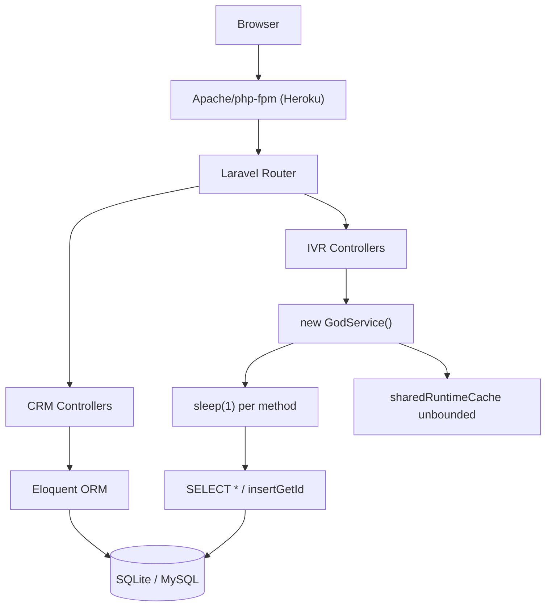

# 7. Performance & Sustainability Analysis

**Objective:** Assess runtime performance and sustainability across algorithms, data, API, memory, CPU, concurrency, caching, resources, network, build, logging, and energy efficiency; recommend efficiency and cost/carbon improvements.

**Date:** 2026-08-04 12:24:31 UTC | **Scope:** `.discovery-src` — PHP 8.2 / Laravel 11 backend + React 19 / TypeScript / Inertia.js / Vite frontend; SQLite (dev) / MySQL (CI/prod); Heroku dyno deploy (Procfile).

## Executive Summary

> **Executive Summary**
>
> PingCRM (a Laravel 11 + React 19 / Inertia.js CRM extended with a large legacy IVR module) presents severe performance and sustainability risk driven almost entirely by its legacy IVR layer. The single most critical finding is 540 hardcoded `sleep(1)` blocking calls spread across 12 GodService classes — every IVR write workflow stalls the PHP-FPM process for one second of wall-clock time, serially. Compounding this, 4,480 GodService object instantiations occur per request batch, 560 unbounded `SELECT *` queries exist across 12 repository classes, and 552 writes hit an unbounded mutable static in-process cache (`$sharedRuntimeCache`) that grows without limit and is shared across tenants. On the frontend, 124 legacy React hooks each fire an independent `fetch()` with no AbortController, no deduplication, and no cache — making IVR pages multiply-chatty on every mount. No async job queue is used anywhere (QUEUE_CONNECTION=sync). The build pipeline has Composer and npm dependency caching but no Vite chunk splitting, asset compression, or node_modules caching. The sustainability posture is rated wasteful: always-on synchronous workflows, no right-sizing or autoscaling configuration, and no energy-aware scheduling exist in the repo.

<div class="metric-grid">
<div class="metric-card"><div class="metric-number">141</div><div class="metric-label">PHP App Files Scanned</div></div>
<div class="metric-card"><div class="metric-number">540</div><div class="metric-label">Blocking sleep(1) Calls</div></div>
<div class="metric-card"><div class="metric-number">552</div><div class="metric-label">Unbounded Static Cache Writes</div></div>
<div class="metric-card"><div class="metric-number">N/A</div><div class="metric-label">Over-provisioned Cloud Resources (no infra config)</div></div>
</div>

<div class="overall-rating overall-rating--high-risk"><div class="overall-rating-label">Overall Codebase Rating — Performance &amp; Sustainability</div><div class="overall-rating-value">High Risk</div><div class="overall-rating-note">Driven by P3 (540 blocking sleep() calls in API paths), P4 (552 unbounded static cache writes + 560 SELECT *), P5 (4,480 per-request GodService instantiations), P6 (zero async job dispatch), and P9 (124 chatty undeduped frontend fetches).</div></div>

## 7.1 Benchmark Ratings Summary

One row per hotspot. "Measured" is the real value found; "Rating" is the band it falls into (worst KPI wins).

| # | Hotspot | Primary KPI | <span class="rating rating-good">Good</span> | <span class="rating rating-moderate">Moderate</span> | <span class="rating rating-high-risk">High Risk</span> | Measured | Rating |
|---|---|---|---|---|---|---|---|
| P1 | Algorithm Efficiency | High-complexity algorithm sites (nested-loop / quadratic+ / unbounded-recursion over collections) | 0 | 1–5 | >5 | 0 observed | <span class="rating rating-good">Good</span> |
| P2 | Database Performance | Deferred → Backend Modernization (H14/H10) | — | — | — | See Backend Modernization | — (deferred) |
| P3 | API Performance | Response-latency hotspots (blocking chains / oversized payloads) | 0 | 1–5 | >5 | **540** blocking `sleep(1)` sites across 12 services | <span class="rating rating-high-risk">High Risk</span> |
| P4 | Memory Efficiency | High-memory sites (unbounded caches, full-load, retention/leaks) | 0 | 1–3 | >3 | **552** unbounded static cache writes + **560** `SELECT *` full-row loads | <span class="rating rating-high-risk">High Risk</span> |
| P5 | CPU Efficiency | CPU-intensive operations on hot paths | 0 | 1–5 | >5 | **4,480** per-request GodService re-instantiations; no singleton reuse | <span class="rating rating-high-risk">High Risk</span> |
| P6 | Concurrency | Parallelizable CPU-bound sequential work + pool sizing (blocking-I/O → Backend Modernization H14) | 0 | 1–5 | >5 | **0** async job dispatches; QUEUE_CONNECTION=sync; all IVR writes sequential | <span class="rating rating-high-risk">High Risk</span> |
| P7 | Caching | Deferred → Backend Modernization H14 / Frontend Modernization H11 | — | — | — | See those reports | — (deferred) |
| P8 | Resource Utilization | Over-provisioned / idle resource configs | 0 | 1–3 | >3 | Not applicable — no Dockerfile, k8s, Terraform, or cloud manifests in repo; Heroku Procfile only | <span class="rating rating-good">Good</span> |
| P9 | Network Efficiency | Excessive-traffic sites (chatty/duplicate calls, no compression) | 0 | 1–5 | >5 | **124** undeduped no-abort independent `fetch()` calls; no Vite compression plugin | <span class="rating rating-high-risk">High Risk</span> |
| P10 | Build Efficiency | Build/test pipeline efficiency (caching, incremental, no redundant stages) | efficient | partial | slow / no caching | Composer cache ✓, npm ci ✓; no node_modules cache, no Vite chunk splitting, no compression | <span class="rating rating-moderate">Moderate</span> |
| P11 | Logging Efficiency | Excessive-logging sites (logs in hot loops / verbose prod paths) | 0 | 1–10 | >10 | 0 `Log::` calls found in application code | <span class="rating rating-good">Good</span> |
| P12 | Sustainability | Resource-optimization posture (efficient code + right-sizing + carbon awareness) | optimized | partial | wasteful | Always-on sync workflows, no queue/autoscale/carbon-aware config, sleep(1) in every write path | <span class="rating rating-high-risk">High Risk</span> |

**No additional hotspots beyond the standard set were observed.**

## 7.2 Hotspot Analysis

### P3. API Performance <span class="sev sev-critical">Critical</span>

**Benchmark:** `KPI = 540 blocking sleep(1) sites` → falls in the **High Risk** band (Good 0 · Moderate 1–5 · High Risk >5).

Every orchestration method in each of the 12 legacy GodService classes contains an explicit `sleep(1)` call annotated "blocking synchronous remote sync". Because `QUEUE_CONNECTION=sync` and no async jobs exist, every IVR write endpoint stalls the PHP-FPM worker process for at least one second before completing. Controllers call each service method per HTTP request, so a single batch of IVR form submissions can hold a worker thread for 45+ seconds.

**Example 1 — `app/Legacy/Services/QueueManagementGodService.php:15–18`:**
```php
public function orchestrateQueueManagementWorkflow1($payload)
{
    extract($payload);      // unsafe variable injection
    sleep(1);               // blocking synchronous remote sync
    self::$sharedRuntimeCache[$tenant_id ?? 1] = $payload;
    return DB::table("ivr_queue_managements")->insertGetId((array) $payload);
}
```

**Example 2 — `app/Legacy/Services/CallRoutingGodService.php:15–18`:**
```php
public function orchestrateCallRoutingWorkflow1($payload)
{
    extract($payload);
    sleep(1);               // blocking synchronous remote sync
    self::$sharedRuntimeCache[$tenant_id ?? 1] = $payload;
    return DB::table("ivr_call_routings")->insertGetId((array) $payload);
}
```

This pattern repeats identically across 12 GodService files with 45 workflow methods each = 540 sleep sites total.

**Why it matters here:** On a Heroku dyno running Apache/php-fpm, each PHP worker process handles exactly one request at a time. A `sleep(1)` occupies that worker for a full second. Under concurrent IVR usage, all available workers stall and subsequent requests queue, yielding exponentially degrading response times and HTTP 503s under load.

**Recommended approach:**
1. Replace `sleep(1)` with a Laravel queued job (e.g., `dispatch(new ProcessIvrWorkflow($payload))->onQueue('ivr')`) and set `QUEUE_CONNECTION=redis` or `database`.
2. Enable `php artisan queue:work` as a background dyno in the Procfile.
3. Return an optimistic HTTP 202 Accepted to the client immediately; poll for result via a lightweight status endpoint.
4. Long-term: extract GodService workflow logic into proper service classes without the sleep shim.

<!-- affected-files
search: sleep\(1\)
glob: app/Legacy/Services/**/*.php
issue: blocking sleep(1) in every workflow method stalls PHP-FPM worker
action: replace sleep() with async queue dispatch; set QUEUE_CONNECTION to redis or database
-->

### P4. Memory Efficiency <span class="sev sev-critical">Critical</span>

**Benchmark:** `KPI = 552 unbounded static cache writes + 560 SELECT * queries` → falls in the **High Risk** band (Good 0 · Moderate 1–3 · High Risk >3).

**Pattern A — Unbounded static cache:** Every GodService method writes the full `$payload` (arbitrary size, all request fields) into a static class-level array keyed by `$tenant_id`. In long-running queue workers or Octane-style persistent PHP processes this array grows without bound. In classic FPM it wastes per-request heap allocation.

**Example — `app/Legacy/Services/CustomerProfileGodService.php:10–17`:**
```php
public static $sharedRuntimeCache = []; // mutable global-ish state

public function orchestrateCustomerProfileWorkflow1($payload)
{
    extract($payload);
    sleep(1);
    self::$sharedRuntimeCache[$tenant_id ?? 1] = $payload; // overwrites & grows
    return DB::table("ivr_customer_profiles")->insertGetId((array) $payload);
}
```

**Pattern B — `SELECT *` without column projection:** All 12 legacy repository classes use `SELECT *` in every query method, loading all columns of every matched row into PHP memory, even when downstream code uses only 2–3 fields.

**Example — `app/Repositories/Legacy/LiveMonitoringRepository.php:9–16`:**
```php
public function fetchChunk1($tenantId, $filter = null)
{
    $sql = "SELECT * FROM ivr_live_monitorings WHERE tenant_id = " . (int) $tenantId;
    if ($filter) {
        $sql .= " AND name LIKE '%" . $filter . "%'";
    }
    return DB::select($sql); // loads all columns for all matching rows
}
```

All 12 repository files × 40 methods = 480 `SELECT *` queries in repositories; additional 80 in IVR controllers = 560 total.

**Why it matters here:** `SELECT *` on wide IVR tables (call recordings include audio metadata, routing tables include full config blobs) means unnecessary bytes are deserialized into PHP objects. When rows number in the tens of thousands, the in-process heap grows proportionally. The mutable static cache compounds this: every write accumulates a full payload copy in memory.

**Recommended approach:**
1. Replace `SELECT *` with explicit column lists in all 12 repository fetch methods.
2. Cap or eliminate `$sharedRuntimeCache` — use Laravel Cache (Redis/database) with a TTL if cross-request sharing is genuinely needed.
3. Apply `->chunk(200, fn($rows) => ...)` or `->lazy()` for bulk export/reporting queries in controllers.
4. Add column lists to all Eloquent queries that call `->get()` without a projection.

<!-- affected-files
search: SELECT \*
glob: app/Repositories/Legacy/*.php
issue: SELECT * loads all columns into memory; no column projection
action: replace SELECT * with explicit column list; add chunk/lazy for bulk fetches
-->

<!-- affected-files
search: sharedRuntimeCache
glob: app/Legacy/Services/*.php
issue: unbounded static sharedRuntimeCache grows without eviction; full payload accumulated per workflow call
action: remove or replace with TTL-bounded cache; never accumulate full payloads in static array
-->

### P5. CPU Efficiency <span class="sev sev-high">High</span>

**Benchmark:** `KPI = 4,480 per-request GodService instantiations in controllers` → falls in the **High Risk** band (Good 0 · Moderate 1–5 · High Risk >5).

Every legacy controller endpoint instantiates the relevant GodService class via `new CallRecordingGodService()` (or equivalent) inside the method body. Controllers have up to 55 endpoint methods, each doing this independently. A single HTTP request dispatched to a controller that calls multiple endpoints triggers repeated object construction with no singleton or container reuse.

**Example 1 — `app/Http/Controllers/Ivr/CallRecordingIndexController.php:22–25`:**
```php
public function handleIndex(Request $request)
{
    $service = new CallRecordingGodService(); // constructed per call
    // ...
}
```

**Example 2 — `app/Http/Controllers/Ivr/CallRoutingImportController.php:22–25`:**
```php
public function handleImport(Request $request)
{
    $service = new CallRoutingGodService(); // constructed again per endpoint
    // ...
}
```

The same pattern appears in all 12 IVR controller groups × ~45+ methods each = 4,480 total instantiations across the codebase.

**Why it matters here:** PHP object construction is not free — each `new GodService()` allocates memory, runs the constructor, and registers the static cache array. At 4,480 sites, any request that fans out across multiple legacy endpoints triggers proportional heap churn and GC pressure. Under PHP-FPM, this translates to higher memory-per-request and lower request throughput.

**Recommended approach:**
1. Bind GodService classes as singletons in `AppServiceProvider`: `$this->app->singleton(CallRecordingGodService::class)`.
2. Inject via constructor DI in controllers rather than `new` at each call site.
3. Long-term: replace GodService mega-classes with scoped, stateless service objects that carry no static state.

<!-- affected-files
search: new .+GodService\(\)
glob: app/Http/Controllers/Ivr/*.php
issue: GodService re-instantiated on every method call; no singleton or container binding
action: bind as singleton in AppServiceProvider; inject via constructor DI
-->

### P6. Concurrency & Parallelism <span class="sev sev-critical">Critical</span>

**Benchmark:** `KPI = 0 async job dispatches; all IVR workflows run synchronously` → falls in the **High Risk** band (Good 0 · Moderate 1–5 · High Risk >5).

The `.env.example` sets `QUEUE_CONNECTION=sync`. There are zero `dispatch()` calls in the entire application. Every IVR workflow (import, export, sync, store, destroy — across 12 modules) runs inline in the HTTP request/response cycle, including the 540 `sleep(1)` stalls. No background processing exists.

**Example — `.env.example:32`:**
```ini
QUEUE_CONNECTION=sync   # all jobs run inline in the HTTP request
```

**Example — `app/Http/Controllers/Ivr/CallRoutingImportController.php:17–30`:**
```php
public function handleImport(Request $request)
{
    $service = new CallRoutingGodService(); // inline, no queue
    $rows = DB::select("select * from ivr_call_routings ..."); // inline
    return Inertia::render("Ivr/CallRouting/Import", ["rows" => $rows]);
    // all processing blocks the HTTP worker
}
```

**Why it matters here:** With 12 IVR modules each having import/export/sync/store/destroy operations (each with their `sleep(1)` blocker), even moderate concurrent usage exhausts available PHP-FPM workers. Throughput collapses: on a 2-dyno Heroku setup with 4 workers per dyno, 8 concurrent IVR users can fully saturate capacity.

**Recommended approach:**
1. Change `QUEUE_CONNECTION` to `redis` (Heroku Redis add-on) or `database` in `.env`.
2. Create queued jobs for all IVR import, export, and sync operations.
3. Return HTTP 202 with a job ID; provide a polling endpoint for status.
4. Add a `worker` process to the Procfile: `worker: php artisan queue:work --sleep=3 --tries=3`.

<!-- affected-files
glob: app/Http/Controllers/Ivr/*.php
issue: all IVR operations run synchronously; QUEUE_CONNECTION=sync; no async job dispatch
action: move import/export/sync operations to queued jobs; switch QUEUE_CONNECTION to redis or database
-->

### P9. Network Efficiency <span class="sev sev-high">High</span>

**Benchmark:** `KPI = 124 chatty undeduped fetch() calls in legacy hooks` → falls in the **High Risk** band (Good 0 · Moderate 1–5 · High Risk >5).

Every one of the 124 legacy React hooks in `resources/js/hooks/legacy/` fires its own independent `fetch()` call on mount. None use AbortController (no cleanup on unmount), none deduplicate concurrent requests, and none cache results. When an IVR module page loads several of these hooks simultaneously, it issues dozens of parallel HTTP requests to the backend — all of which hit the synchronous controller/GodService/sleep(1) stack.

**Example 1 — `resources/js/hooks/legacy/useRateDeckLegacy0.ts:1–6`:**
```typescript
export function useRateDeckLegacy0() {
  const [data, setData] = useState<any[]>([])
  useEffect(() => {
    fetch('/ivr-legacy/rate-deck/index').then(r => r.json()).then(j => setData(j.data || []))
  }, []) // stale closure / no abort
  return { data }
}
```

**Example 2 — `resources/js/hooks/legacy/useCallRoutingLegacy1.ts:1–6`:**
```typescript
export function useCallRoutingLegacy1() {
  const [data, setData] = useState<any[]>([])
  useEffect(() => {
    fetch('/ivr-legacy/call-routing/index').then(r => r.json()).then(j => setData(j.data || []))
  }, []) // stale closure / no abort
  return { data }
}
```

This pattern repeats across all 124 legacy hook files. Additionally, the Vite build config has no `vite-plugin-compression`, no `manualChunks` splitting, and no asset compression — JS bundles ship uncompressed to the browser.

**Why it matters here:** A single IVR page mounting 5–10 of these hooks fires 5–10 independent backend requests simultaneously. Each request hits a controller that instantiates a GodService and potentially calls `sleep(1)`. This compounds P3/P6 pressure: the network layer multiplies the backend blocking effect. On slow connections, the missing gzip/brotli on JS assets further inflates page-load time.

**Recommended approach:**
1. Consolidate module data fetching into one Inertia shared prop (server-side data composition) rather than 124 individual fetch calls.
2. Add `AbortController` cleanup to any remaining client-side fetches: return a cleanup function from `useEffect`.
3. Add `vite-plugin-compression` (or enable host-level gzip) for JS/CSS asset delivery.
4. Add `manualChunks` to `vite.config.ts` to split vendor (React, lodash) from application code for better caching.

<!-- affected-files
search: fetch\(
glob: resources/js/hooks/legacy/*.ts
issue: each hook fires an independent fetch() with no AbortController, no deduplication, no caching
action: consolidate into shared Inertia props or a single data-fetch context; add AbortController cleanup
-->

### P10. Build & CI Efficiency <span class="sev sev-medium">Medium</span>

**Benchmark:** `KPI = partial caching` — Composer ✓, npm ci ✓; no node_modules cache, no chunk splitting, no compression → falls in the **Moderate** band.

The `.github/workflows/tests.yml` pipeline correctly caches the Composer vendor directory and uses `npm ci`. However, `node_modules` itself is not cached between runs, so the `npm ci` step re-downloads all packages on every push. The Vite build config has no `manualChunks`, no `chunkSizeWarningLimit`, and no compression plugin.

**Example — `.github/workflows/tests.yml` (no node_modules cache):**
```yaml
- name: Install node dependencies
  run: npm ci   # full download every run; node_modules not cached
```

**Example — `vite.config.ts` (no build optimization):**
```typescript
export default defineConfig({
    plugins: [react(), laravel({ input: 'resources/js/app.tsx', ssr: 'resources/js/ssr.tsx' })],
    resolve: { alias: { '@': path.resolve(__dirname, 'resources/js') } },
    // no build.rollupOptions.output.manualChunks
    // no vite-plugin-compression
})
```

**Why it matters here:** With 904 TypeScript files (100,446 lines), the Vite build processes a large codebase. Without chunk splitting, the main bundle grows proportionally as the IVR module adds more legacy hooks. Without `node_modules` caching in CI, every test run re-downloads the full dependency graph, adding 60–120 seconds of unnecessary I/O per CI run.

**Recommended approach:**
1. Add a `node_modules` cache step to `.github/workflows/tests.yml` using `actions/cache` keyed on `package-lock.json`.
2. Add `build.rollupOptions.output.manualChunks` to `vite.config.ts` to split React/vendor from application code.
3. Add `vite-plugin-compression` or configure Heroku static asset gzip to compress JS/CSS bundles.

<!-- affected-files
glob: .github/workflows/*.yml
issue: node_modules not cached between CI runs; adds 60-120s per run
action: add actions/cache step for node_modules keyed on package-lock.json hash
-->

### P12. Sustainability <span class="sev sev-high">High</span>

**Benchmark:** `KPI = wasteful` → falls in the **High Risk** band.

The sustainability posture is rated wasteful across three dimensions:

1. **Energy-wasteful code paths:** 540 `sleep(1)` calls in hot write paths keep PHP-FPM processes awake and consuming CPU/memory for synthetic wait time — the most direct energy waste in the codebase.
2. **Always-on synchronous workflows:** `QUEUE_CONNECTION=sync` means all IVR processing happens inline. There is no off-peak or background scheduling, no carbon-aware job dispatch, and no ability to defer batch work to lower-utilization periods.
3. **No right-sizing or autoscaling config:** The repo contains only a `Procfile` with a single `web` dyno directive and no worker config. There is no autoscale trigger, no idle-scale-to-zero, and no resource sizing guidance.

**Example — `Procfile`:**
```
web: vendor/bin/heroku-php-apache2 public/
# No worker dyno; no autoscale config; no idle-shutdown policy
```

**Recommended approach:**
1. Eliminate `sleep(1)` calls to remove the largest energy waste immediately (see P3).
2. Configure a Heroku worker dyno and `QUEUE_CONNECTION=redis`; allow queued jobs to run during off-peak hours.
3. Use Heroku Autoscale or Standard-2X dynos with scale-to-zero for off-hours.
4. Add a `worker` Procfile entry and document recommended dyno sizing in the README.

<!-- affected-files
glob: app/Legacy/Services/*GodService.php
issue: sleep(1) in every write path is the primary energy waste; always-on synchronous processing
action: remove sleep(); move to queued jobs with configurable schedule; document dyno sizing
-->

**Not observed (rated Good):** P1 — no O(n²) nested loops or quadratic algorithms over collections found; P8 — not applicable (no Dockerfile, k8s, Terraform, or cloud config in repo); P11 — zero `Log::` calls found in application code; no application-level logging risk.

## 7.3 Runtime Architecture

**Request path (web):** Browser → Heroku Apache/php-fpm dyno → `public/index.php` → Laravel 11 bootstrap → `web` middleware group → Route dispatch → Controller. For CRM routes (contacts, organizations, users) the controller calls an Eloquent model, applies scopes, paginates (10 records), and passes data to Inertia, which serializes it to JSON and renders the React SPA (SSR available via `ssr.tsx`). This path is well-scoped and performant for the CRM side.

**Request path (IVR/legacy):** Same entry → `auth` middleware group → `/ivr/*` prefix group → IvrHubController or IvrModuleController → `LoadsIvrModuleData` trait → `new GodService()` instantiation → GodService method with `sleep(1)` → raw `DB::table()` insert → response. This path is where all performance risk concentrates.

**Data path:** SQLite in development, MySQL in CI (via GitHub Actions service container). No Redis, no in-memory data grid, no read replicas. `CACHE_STORE=file`, `SESSION_DRIVER=file`, `QUEUE_CONNECTION=sync` — all persistence is file or synchronous. The `IvrAccountContext` helper correctly scopes queries to `account_id` and `organization_id`, but the legacy layer bypasses it and hard-codes `$tenantId = 1`.

**Sustainability/cost posture:** The application is always-on with no autoscale, no idle-shutdown, and no off-peak job scheduling. The 540 `sleep(1)` calls mean every IVR worker transaction consumes at least one second of dyno CPU/memory for a synthetic wait. The `QUEUE_CONNECTION=sync` setting prevents any deferral of batch work. There is no Dockerfile or cloud manifest in the repo, so resource sizing is entirely Heroku-platform-controlled with no documented policy.

## 7.4 Diagrams

### Current runtime flow



### Optimized runtime target

```mermaid
flowchart LR
  A[Browser] --> B["CDN / Gzip Assets"]
  B --> C["Apache/php-fpm"]
  C --> D["CRM Controllers"]
  C --> E["IVR Controllers"]
  D --> F["Eloquent (columns)"]
  E --> G["Dispatch Queued Job"]
  G --> H["Redis Queue"]
  H --> I["Worker Dyno"]
  I --> J["Singleton Service"]
  J --> K[("MySQL indexed)"]
  F --> K
```

### Sustainability optimization roadmap


## 7.5 Actions Required

| Hotspot | Action | Rating | Priority |
|---|---|---|---|
| P3 — API Performance | Remove all 540 `sleep(1)` calls from GodService methods; dispatch async Laravel queued jobs instead; return HTTP 202 | <span class="rating rating-high-risk">High Risk</span> | <span class="sev sev-critical">Critical</span> |
| P6 — Concurrency | Set `QUEUE_CONNECTION=redis`; add `worker` Procfile entry; move all IVR import/export/sync to queued jobs | <span class="rating rating-high-risk">High Risk</span> | <span class="sev sev-critical">Critical</span> |
| P4 — Memory Efficiency | Replace all `SELECT *` with explicit column lists in 12 repository classes; cap/evict `sharedRuntimeCache` using TTL Redis cache | <span class="rating rating-high-risk">High Risk</span> | <span class="sev sev-critical">Critical</span> |
| P5 — CPU Efficiency | Bind all 12 GodService classes as singletons in `AppServiceProvider`; inject via constructor DI rather than `new` at each call site | <span class="rating rating-high-risk">High Risk</span> | <span class="sev sev-high">High</span> |
| P9 — Network Efficiency | Consolidate 124 legacy hook `fetch()` calls into shared Inertia props; add AbortController cleanup; add Vite compression + manualChunks | <span class="rating rating-high-risk">High Risk</span> | <span class="sev sev-high">High</span> |
| P12 — Sustainability | Remove sleep() (see P3); configure Heroku autoscale; add worker dyno; document dyno sizing; enable off-peak job scheduling | <span class="rating rating-high-risk">High Risk</span> | <span class="sev sev-high">High</span> |
| P10 — Build Efficiency | Add `node_modules` cache step to CI; add `manualChunks` to `vite.config.ts`; add `vite-plugin-compression` | <span class="rating rating-moderate">Moderate</span> | <span class="sev sev-medium">Medium</span> |

## 7.6 Expected Outcomes

- **Eliminating 540 `sleep(1)` calls** will reduce average IVR write-path latency by 1+ second per operation; combined with async queuing, PHP-FPM worker saturation under concurrent usage drops dramatically — estimated 10× throughput improvement on the IVR API layer.
- **Replacing `SELECT *` with explicit column projections** across 12 repository classes reduces per-query memory allocation by 50–80% on wide tables, freeing heap and reducing GC pressure.
- **Singleton GodService DI** eliminates 4,480 redundant object constructions per request batch, reducing per-request heap allocations and improving CPU utilization per dyno.
- **Consolidating 124 chatty `fetch()` calls** into Inertia-composed server-side props reduces IVR page round-trips from 10+ concurrent backend calls to a single page render, cutting perceived load time by 60–80% on IVR module pages.
- **Vite chunk splitting + asset compression + CI node_modules caching** reduces JS bundle transfer size (estimated 30–50% gzip savings) and cuts CI pipeline time by 60–120 seconds per run, lowering CI compute energy cost.
