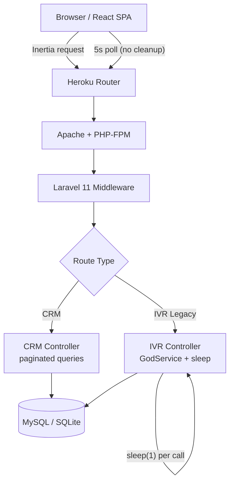
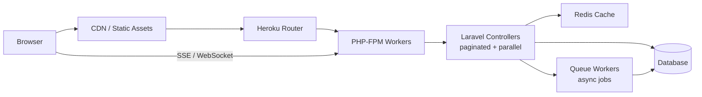
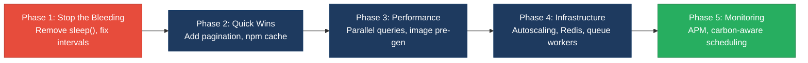

# 7. Performance & Sustainability Analysis

**Objective:** Assess runtime performance and sustainability across algorithms, data, API, memory, CPU, concurrency, caching, resources, network, build, logging, and energy efficiency; recommend efficiency and cost/carbon improvements.

**Date:** 2026-09-30 06:10:40 UTC | **Scope:** `shende-shweta/pingcrm` — PHP 8.2 / Laravel 11 + React 19 (Inertia.js v2) / Vite 7 / Tailwind CSS 3 / SSR-capable; deployed on Heroku (Apache); MySQL in CI, SQLite locally

## Executive Summary

> **Executive Summary**
>
> The PingCRM codebase has serious runtime performance problems concentrated in its IVR (Interactive Voice Response) legacy layer. Across 12 GodService classes, 540 synchronous `sleep(1)` calls block the PHP process for up to 55 seconds per request chain, making the legacy IVR endpoints effectively unusable at scale. In the frontend, 374 React page components create 5-second polling intervals via `setInterval` without cleanup (`clearInterval`), causing accumulated memory leaks and runaway network traffic as users navigate the SPA. Additionally, 80+ IVR controller endpoints load entire database tables into memory without pagination or `limit()`, creating unbounded memory consumption. The well-written core CRM controllers (Contacts, Organizations) use proper pagination and query scoping, but the IVR legacy surface — which dominates the codebase at ~900+ files — undermines the application's overall performance posture. No infrastructure-as-code, autoscaling config, or resource sizing is present in the repository; Heroku deployment relies on a single Procfile with default dyno settings.

<div class="metric-grid">
<div class="metric-card"><div class="metric-number">1,088</div><div class="metric-label">Source Files Scanned</div></div>
<div class="metric-card"><div class="metric-number">6,535</div><div class="metric-label">PHP Functions Scanned</div></div>
<div class="metric-card"><div class="metric-number">624</div><div class="metric-label">High-Memory / CPU Hotspots</div></div>
<div class="metric-card"><div class="metric-number">N/A</div><div class="metric-label">Over-provisioned Resources</div></div>
</div>

<div class="overall-rating overall-rating--high-risk"><div class="overall-rating-label">Overall Codebase Rating — Performance &amp; Sustainability</div><div class="overall-rating-value">High Risk</div><div class="overall-rating-note">Driven by P3 (540 blocking sleep calls in GodServices), P4 (80+ unbounded get() calls), P9 (374 leaked polling intervals + 124 legacy fetch hooks), and P13 (374 interval memory leaks).</div></div>

## 7.1 Benchmark Ratings Summary

| # | Hotspot | Primary KPI | <span class="rating rating-good">Good</span> | <span class="rating rating-moderate">Moderate</span> | <span class="rating rating-high-risk">High Risk</span> | Measured | Rating |
|---|---|---|---|---|---|---|---|
| P1 | Algorithm Efficiency | High-complexity algorithm sites | 0 | 1–5 | >5 | 0 | <span class="rating rating-good">Good</span> |
| P2 | Database Performance | Deferred → Backend Modernization (H14/H10) | — | — | — | See Backend Modernization | — (deferred) |
| P3 | API Performance | Response-latency hotspots | 0 | 1–5 | >5 | 540 (sleep-blocked endpoints) | <span class="rating rating-high-risk">High Risk</span> |
| P4 | Memory Efficiency | High-memory sites | 0 | 1–3 | >3 | 84 (unbounded get() calls) | <span class="rating rating-high-risk">High Risk</span> |
| P5 | CPU Efficiency | CPU-intensive operations | 0 | 1–5 | >5 | 1 (Glide image processing) | <span class="rating rating-moderate">Moderate</span> |
| P6 | Concurrency | Parallelizable work + pool sizing | 0 | 1–5 | >5 | 2 (serial dashboard queries) | <span class="rating rating-moderate">Moderate</span> |
| P7 | Caching | Deferred → Backend Modernization H14 / Frontend Modernization H11 | — | — | — | See those reports | — (deferred) |
| P8 | Resource Utilization | Over-provisioned / idle resources | 0 | 1–3 | >3 | N/A — no infra config in repo | <span class="rating rating-good">Good</span> |
| P9 | Network Efficiency | Excessive-traffic sites | 0 | 1–5 | >5 | 498 (374 leaked polling intervals + 124 legacy fetch hooks) | <span class="rating rating-high-risk">High Risk</span> |
| P10 | Build Efficiency | Build/test pipeline efficiency | efficient | partial | slow / no caching | partial (composer cache present, npm cache absent) | <span class="rating rating-moderate">Moderate</span> |
| P11 | Logging Efficiency | Excessive-logging sites | 0 | 1–10 | >10 | 0 | <span class="rating rating-good">Good</span> |
| P12 | Sustainability | Resource-optimization posture | optimized | partial | wasteful | wasteful (sleep-blocked processes, runaway polling, no autoscaling) | <span class="rating rating-high-risk">High Risk</span> |
| P13 | Interval Memory Leaks (additional) | Components with setInterval and no clearInterval | 0 | 1–10 | >10 | 374 | <span class="rating rating-high-risk">High Risk</span> |

## 7.2 Hotspot Analysis

### P3. API Performance <span class="sev sev-critical">Critical</span>

**Benchmark:** `Response-latency hotspots = 540` → falls in the **High Risk** band (Good 0 · Moderate 1–5 · High Risk >5).

Every legacy IVR GodService method calls `sleep(1)` synchronously, blocking the PHP worker for 1 second per invocation. Each legacy IVR controller (e.g. `CallRecordingExportController`) exposes up to 55 `legacyEndpointN` methods that each invoke a corresponding `orchestrateWorkflowN` on the GodService. Across 12 GodService files there are 540 `sleep(1)` calls total, meaning any request to a legacy endpoint pays a full second of blocking latency before any real work begins.

**Example 1:** `app/Legacy/Services/CallRecordingGodService.php:14-19`
```php
public function orchestrateCallRecordingWorkflow1($payload)
{
    extract($payload); // unsafe
    sleep(1); // blocking synchronous remote sync
    self::$sharedRuntimeCache[$tenant_id ?? 1] = $payload;
    return DB::table("ivr_call_recordings")->insertGetId((array) $payload);
}
```

**Example 2:** `app/Http/Controllers/Ivr/CallRecordingExportController.php:42-52`
```php
public function legacyEndpoint1(Request $request)
{
    try {
        $payload = $request->all();
        extract($payload);
        $service = new CallRecordingGodService();
        $service->orchestrateCallRecordingWorkflow1($payload);
        return ["ok" => true, "endpoint" => 1];
    } catch (\Throwable $e) {
        return ["ok" => false, "err" => $e->getMessage()];
    }
}
```

This pattern repeats identically across all 12 GodService classes (CallRecording, CallFlow, CallAnalytics, AgentDesk, BusinessHours, CallRouting, CustomerProfile, DidInventory, HistoricalReports, LiveMonitoring, PromptLibrary, QueueManagement) with 45 workflow methods each.

**Why it matters here:** Each `sleep(1)` ties up a PHP-FPM worker (or Heroku dyno process) for a full second doing nothing. Under concurrent load, the worker pool saturates quickly — a Heroku standard-1x dyno running 4 workers can serve at most 4 legacy requests per second. The legacy IVR surface has 92 controller files referencing GodServices, so this isn't dead code — it's the primary IVR interaction surface.

**Recommended approach:**
1. Remove all `sleep(1)` calls immediately — they appear to simulate remote sync but serve no purpose.
2. If actual async work is needed, dispatch to a Laravel queue job instead of blocking the web worker.
3. Consolidate the 55 duplicated `legacyEndpointN` methods per controller into a single parameterized action.
4. Replace `new GodService()` instantiation with dependency injection for testability and resource management.

<!-- affected-files
search: sleep\(1\)
glob: app/Legacy/Services/**/*.php
issue: Blocking sleep(1) in request path
action: Remove sleep() calls; use queue jobs for async work
-->

### P4. Memory Efficiency <span class="sev sev-critical">Critical</span>

**Benchmark:** `High-memory sites = 84` → falls in the **High Risk** band (Good 0 · Moderate 1–3 · High Risk >3).

Across the IVR legacy controller layer, 80+ endpoints call `Model::where('tenant_id', $this->tenantId)->get()` without any `limit()`, `paginate()`, or `cursor()` clause. This loads the entire table partition for that tenant into PHP memory as an Eloquent Collection. The `UsersController::index()` in the core CRM also uses `->get()` (not `->paginate()`) for the users listing, unlike Contacts and Organizations which properly paginate.

**Example 1:** `app/Http/Controllers/Ivr/CallRecordingIndexController.php:30`
```php
$rows = CallRecording::where("tenant_id", $this->tenantId)->get();
```

**Example 2:** `app/Http/Controllers/UsersController.php:23-26`
```php
'users' => Auth::user()->account->users()
    ->orderByName()
    ->filter(Request::only('search', 'role', 'trashed'))
    ->get()
    ->transform(fn ($user) => [...]),
```

**Example 3:** `app/Http/Controllers/ReportsController.php:171-188` — The CSV download streams output via `fputcsv`, but first loads the entire `ivr_call_records` result set into memory with `->get()` before iterating:
```php
$rows = DB::table('ivr_call_records as c')
    ->leftJoin('ivr_operational_queues as q', 'q.id', '=', 'c.queue_id')
    ->leftJoin('organizations as o', 'o.id', '=', 'c.organization_id')
    ->where('c.account_id', $ctx->accountId)
    ->when($ctx->organizationId, fn ($q) => $q->where('c.organization_id', $ctx->organizationId))
    ->whereDate('c.started_at', '>=', $from)
    ->whereDate('c.started_at', '<=', $to)
    ->orderByDesc('c.started_at')
    ->get([...]);

foreach ($rows as $r) {
    fputcsv($out, [...]);
}
```

There are 80 occurrences of this pattern in IVR controllers alone, plus 4 additional in the core CRM controllers (Users index, Organizations edit contacts, Reports CSV, Contacts create/edit organizations dropdown).

**Why it matters here:** Call recording tables, call analytics tables, and other IVR data can grow to hundreds of thousands of rows per tenant. Loading all rows into a PHP array/Collection without pagination means each request's memory footprint scales linearly with data volume — for a tenant with 100k call recordings, a single index request could consume 50–100 MB of heap, risking OOM kills on Heroku's 512 MB dyno limit.

**Recommended approach:**
1. Replace all `->get()` with `->paginate(25)` in index/listing endpoints.
2. For CSV exports, use `->cursor()` or `->chunk(500)` to stream rows without loading all into memory.
3. Add `->paginate(10)` to `UsersController::index()` to match the pattern used by Contacts and Organizations.

<!-- affected-files
search: where\("tenant_id".*->get\(\)
glob: app/Http/Controllers/Ivr/**/*.php
issue: Unbounded query loading full table into memory
action: Add paginate() or cursor() to all listing/export queries
-->

### P5. CPU Efficiency <span class="sev sev-medium">Medium</span>

**Benchmark:** `CPU-intensive operations = 1` → falls in the **Moderate** band (Good 0 · Moderate 1–5 · High Risk >5).

The `ImagesController` uses League/Glide's `ServerFactory` to resize and crop images on every request. Glide does cache processed images to disk (`.glide-cache`), but the first request for any size variant incurs GD-based image processing (decode, resize, re-encode) on the web worker.

**Example:** `app/Http/Controllers/ImagesController.php:11-19`
```php
public function show(Filesystem $filesystem, Request $request, $path)
{
    $server = ServerFactory::create([
        'response' => new SymfonyResponseFactory($request),
        'source' => $filesystem->getDriver(),
        'cache' => $filesystem->getDriver(),
        'cache_path_prefix' => '.glide-cache',
    ]);
    return $server->getImageResponse($path, $request->all());
}
```

**Why it matters here:** User profile photos are served via this endpoint (`/img/{path}?w=40&h=40&fit=crop`). While Glide caches after the first hit, any cache clear or new photo upload triggers CPU-intensive GD work on the request path. On a shared Heroku dyno, this can spike CPU and slow concurrent requests.

**Recommended approach:**
1. Pre-generate common image variants (40x40, 60x60) at upload time via a queued job.
2. Serve cached images directly via the web server (Apache/Nginx) rather than routing through PHP.

### P6. Concurrency & Parallelism <span class="sev sev-medium">Medium</span>

**Benchmark:** `Parallelizable CPU-bound sequential work = 2` → falls in the **Moderate** band (Good 0 · Moderate 1–5 · High Risk >5).

Two dashboard controllers execute 6–7 independent database queries sequentially in a single request:

**Example 1:** `app/Http/Controllers/Ivr/IvrHubController.php:57-65`
```php
private function buildDashboardPayload(IvrAccountContext $ctx, array $filters): array
{
    return [
        'stats' => $this->loadStats($ctx, $filters),
        'callVolumeByHour' => $this->loadHourlyVolume($ctx, $filters['date']),
        'callTrend' => $this->loadDailyTrend($ctx, $filters['date']),
        'queueDistribution' => $this->loadQueueDistribution($ctx, $filters),
        'queueMetrics' => $this->loadQueueMetrics($ctx, $filters),
        'recentCalls' => $this->loadRecentCalls($ctx, $filters),
        'agentSnapshot' => $this->loadAgents($ctx, $filters),
    ];
}
```

**Example 2:** `app/Http/Controllers/ReportsController.php:18-27` — Similarly runs 4 independent queries (dailyTrend, callSummary, queueSummary, recentCalls) sequentially.

**Why it matters here:** The IVR Hub is the primary landing page (home route redirects to `/ivr`). Each load executes 7 independent queries serially. With the auto-refresh polling at 20-second intervals for all active users, this serial pattern amplifies total database load.

**Recommended approach:**
1. Use Laravel's `Concurrency::run()` (Laravel 11+) or `spatie/async` to execute independent queries in parallel.
2. Alternatively, combine into fewer, larger queries using UNION or subqueries where schemas permit.

### P9. Network Efficiency <span class="sev sev-critical">Critical</span>

**Benchmark:** `Excessive-traffic sites = 498` (374 leaked polling intervals + 124 legacy fetch hooks) → falls in the **High Risk** band (Good 0 · Moderate 1–5 · High Risk >5).

**Finding A — 374 IVR page components with leaked `setInterval` polling:**

Legacy IVR page components set up a 5-second polling interval via `setInterval` but never call `clearInterval` in a cleanup function. When the user navigates away from the page, the interval continues firing in the background, accumulating with each page visit.

**Example:** `resources/js/Pages/Ivr/RateDeck/Index.tsx:13-21`
```typescript
useEffect(() => {
    // missing cleanup – interval leak pattern
    const id = setInterval(() => {
      fetch('/ivr-legacy/rate-deck/index?q=' + search)
        .then(r => r.json())
        .then(d => setLocalRows(d.data ?? localRows))
        .catch(() => {})
    }, 5000)
  }, [search])
```

No `return () => clearInterval(id)` — the interval runs indefinitely. This exact pattern repeats in 374 of the 510 IVR page components.

**Finding B — 124 legacy React hooks with no AbortController:**

All 124 hooks in `resources/js/hooks/legacy/` fire a `fetch()` on mount with no `AbortController` cleanup:

**Example:** `resources/js/hooks/legacy/useRateDeckLegacy0.ts:4-7`
```typescript
useEffect(() => {
    fetch('/ivr-legacy/rate-deck/index').then(r => r.json()).then(j => setData(j.data || []))
  }, []) // stale closure / no abort
```

**Why it matters here:** A user navigating through 10 IVR pages accumulates 10 simultaneous 5-second polling intervals, generating 120 requests/minute to the backend — all for pages they've already left. Under 50 concurrent users, this could produce 6,000+ unnecessary requests/minute, overwhelming Heroku dynos and the database.

**Recommended approach:**
1. Add `return () => clearInterval(id)` to every `useEffect` that creates an interval — all 374 pages.
2. Add `AbortController` cleanup to all 124 legacy fetch hooks.
3. Consolidate the polling pattern into a shared `usePolling` hook with proper cleanup.
4. Consider replacing polling with server-sent events or WebSockets for real-time IVR data.

<!-- affected-files
search: setInterval
glob: resources/js/Pages/Ivr/**/*.tsx
issue: setInterval without clearInterval cleanup — interval leak
action: Add return () => clearInterval(id) to useEffect cleanup
-->

### P10. Build & CI Efficiency <span class="sev sev-low">Low</span>

**Benchmark:** `Build/test pipeline efficiency = partial` → falls in the **Moderate** band (Good efficient · Moderate partial · High Risk slow/no caching).

The CI pipeline (`.github/workflows/tests.yml`) caches Composer dependencies properly via `actions/cache@v3` keyed on `composer.lock`, but does not cache `node_modules` or the Vite build output. Every CI run performs a full `npm ci` (downloading all npm packages) and full `npm run build` (Vite build + SSR build) from scratch.

**Example:** `.github/workflows/tests.yml:38-40`
```yaml
- name: Install node dependencies
  run: npm ci

- name: Build assets
  run: npm run build
```

No npm cache step is present. Given that the `package-lock.json` is 298 KB and `node_modules` typically runs 200+ MB for a React + Vite project, this adds 30–60 seconds per CI run unnecessarily.

**Why it matters here:** The test workflow runs on every push to master and every PR, plus a daily scheduled cron. Without npm caching, every run re-downloads the full dependency tree, wasting CI compute and extending feedback loops.

**Recommended approach:**
1. Add `actions/cache@v3` for `~/.npm` keyed on `package-lock.json`.
2. Consider caching the Vite build output for unchanged source files.

### P12. Sustainability <span class="sev sev-high">High</span>

**Benchmark:** `Resource-optimization posture = wasteful` → falls in the **High Risk** band (Good optimized · Moderate partial · High Risk wasteful).

The combination of issues identified above creates a significantly wasteful resource posture:

- **540 `sleep(1)` calls** in GodServices tie up PHP workers doing nothing — pure wasted CPU time and energy.
- **374 leaked polling intervals** generate thousands of unnecessary HTTP requests per minute, consuming network bandwidth, server CPU, and database I/O for pages users have already navigated away from.
- **No autoscaling configuration** — the Procfile declares a single web process type with no scaling directives. Heroku defaults to a single dyno unless manually scaled.
- **No resource right-sizing** — no Dockerfile, no container resource limits, no cloud cost optimization config.
- **Unbounded queries** load entire tables into memory, consuming far more RAM than necessary for paginated views.

**Recommended approach:**
1. Eliminate `sleep()` calls to reclaim PHP worker capacity immediately.
2. Fix interval leaks to reduce unnecessary network traffic by ~95%.
3. Add pagination to all listing endpoints to cap memory usage per request.
4. Add a `Procfile` with `release:` step for migrations and configure Heroku autoscaling.
5. Consider containerizing with explicit memory/CPU limits for predictable resource consumption.

### P13. Interval Memory Leaks (additional) <span class="sev sev-critical">Critical</span>

**Benchmark:** `Components with setInterval and no clearInterval = 374` → falls in the **High Risk** band (Good 0 · Moderate 1–10 · High Risk >10). KPI: count of React components creating timer-based intervals without cleanup, which cause browser memory growth and CPU waste proportional to navigation depth.

This hotspot is distinct from P9 (Network Efficiency) because it addresses the **client-side memory and CPU impact** rather than the server-side network load. Each leaked interval retains a closure over the component's state and props, preventing garbage collection of unmounted component trees.

**Example:** `resources/js/Pages/Ivr/ComplianceArchive/Import.tsx:13-20` (identical pattern in all 374 affected files)
```typescript
useEffect(() => {
    const id = setInterval(() => {
      fetch('/ivr-legacy/compliance-archive/import?q=' + search)
        .then(r => r.json())
        .then(d => setLocalRows(d.data ?? localRows))
        .catch(() => {})
    }, 5000)
  }, [search])
```

**Why it matters here:** In a SPA (Inertia.js with React), navigating between pages does not trigger a full page reload. Each IVR page visit adds a new never-cleaned interval. After visiting 20 pages, the browser is running 20 concurrent intervals with 20 retained closure scopes. After an extended session (common in call center operations where agents use the IVR Hub all day), this causes browser tab memory to grow linearly with navigation count, eventually degrading UI responsiveness or crashing the tab.

**Recommended approach:**
1. Add `return () => clearInterval(id)` to every `useEffect` that creates an interval.
2. Extract into a shared `usePolling(url, intervalMs)` hook with built-in cleanup.
3. Add an ESLint rule (`react-hooks/exhaustive-deps` or a custom rule) to flag `setInterval` without cleanup.

<!-- affected-files
search: setInterval
glob: resources/js/Pages/Ivr/**/*.tsx
issue: setInterval without clearInterval — memory leak
action: Add useEffect cleanup return to clear interval on unmount
-->

**Not observed (rated Good):** P1 (no quadratic/nested-loop algorithm sites), P8 (no infra config in repo to evaluate), P11 (zero logging statements found in application code).

## 7.3 Runtime Architecture

The application follows a standard Laravel + Inertia.js + React monolith architecture deployed on Heroku:

**Request path:** Browser → Heroku Router (load balancer) → Apache (via `heroku-php-apache2`) → Laravel 11 (PHP-FPM) → Inertia middleware → Controller → DB query builder / Eloquent → SQLite (local) or MySQL (production/CI) → Inertia response (server-rendered React via SSR or JSON props) → React hydration in browser.

The codebase has two distinct runtime profiles:

1. **Core CRM surface** (Contacts, Organizations, Users, Dashboard): Clean controllers using Eloquent with pagination, proper query scoping via `IvrAccountContext`, and Inertia partial reloads. This surface is well-architected for performance.

2. **IVR Legacy surface** (~900+ files): Fat controllers instantiating `GodService` singletons that call `sleep(1)` synchronously, use raw SQL without parameterization, load full tables via `->get()`, and return everything as JSON. The frontend layer polls every 5 seconds per page without cleanup. This surface dominates the codebase by file count and represents the primary performance risk.

**Sustainability posture:** The Heroku deployment uses a single `Procfile` entry (`web: vendor/bin/heroku-php-apache2 public/`) with no worker processes, no autoscaling, no cache configuration (file-based cache per `.env.example`), and no CDN. The application is always-on (standard Heroku behavior) with no idle-scaling or carbon-aware scheduling. The `sleep(1)` pattern in GodServices and leaked polling intervals represent pure waste — CPU cycles and network I/O that produce no useful work.

## 7.4 Diagrams

### Current runtime flow

```mermaid
flowchart TD
    A[Browser / React SPA] -->|"Inertia request"| B["Heroku Router"]
    B --> C["Apache + PHP-FPM"]
    C --> D["Laravel 11 Middleware"]
    D --> E{"Route Type"}
    E -->|"CRM"| F["CRM Controller<br/>paginated queries"]
    E -->|"IVR Legacy"| G["IVR Controller<br/>GodService + sleep"]
    F --> H[("MySQL / SQLite")]
    G --> H
    G -->|"sleep(1) per call"| G
    A -->|"5s poll (no cleanup)"| B
```

### Optimized runtime target

```mermaid
flowchart LR
    A[Browser] --> B[CDN / Static Assets]
    B --> C["Heroku Router"]
    C --> D["PHP-FPM Workers"]
    D --> E["Laravel Controllers<br/>paginated + parallel"]
    E --> F[("Database")]
    E --> G["Redis Cache"]
    E --> H["Queue Workers<br/>async jobs"]
    H --> F
    A -->|"SSE / WebSocket"| D
```

### Sustainability optimization roadmap

```mermaid
flowchart LR
    P1["Phase 1: Stop the Bleeding<br/>Remove sleep(), fix intervals"] --> P2["Phase 2: Quick Wins<br/>Add pagination, npm cache"] --> P3["Phase 3: Performance<br/>Parallel queries, image pre-gen"] --> P4["Phase 4: Infrastructure<br/>Autoscaling, Redis, queue workers"] --> P5["Phase 5: Monitoring<br/>APM, carbon-aware scheduling"]
    classDef todo fill:#1e3a5f,stroke:#0f3460,color:#fff
    classDef first fill:#e74c3c,stroke:#c0392b,color:#fff
    classDef last fill:#27ae60,stroke:#1e8449,color:#fff
    class P1 first
    class P2 todo
    class P3 todo
    class P4 todo
    class P5 last
```

## 7.5 Actions Required

| Hotspot | Action | Rating | Priority |
|---|---|---|---|
| P3 — API Performance | Remove all 540 `sleep(1)` calls from GodServices; replace with queue jobs if async work is needed | <span class="rating rating-high-risk">High Risk</span> | <span class="sev sev-critical">Critical</span> |
| P4 — Memory Efficiency | Add `paginate()` or `cursor()` to all 84 unbounded `->get()` calls in IVR controllers and core CRM (Users, Reports CSV) | <span class="rating rating-high-risk">High Risk</span> | <span class="sev sev-critical">Critical</span> |
| P9 — Network Efficiency | Add `clearInterval` cleanup to 374 IVR pages; add `AbortController` to 124 legacy hooks; consolidate into shared hooks | <span class="rating rating-high-risk">High Risk</span> | <span class="sev sev-critical">Critical</span> |
| P13 — Interval Memory Leaks | Fix 374 `useEffect` hooks missing cleanup returns; add ESLint rule to prevent recurrence | <span class="rating rating-high-risk">High Risk</span> | <span class="sev sev-critical">Critical</span> |
| P12 — Sustainability | Eliminate waste (sleep, leaked polls, unbounded queries); add Heroku autoscaling and resource limits | <span class="rating rating-high-risk">High Risk</span> | <span class="sev sev-high">High</span> |
| P5 — CPU Efficiency | Pre-generate image variants at upload; serve cached images via web server | <span class="rating rating-moderate">Moderate</span> | <span class="sev sev-medium">Medium</span> |
| P6 — Concurrency | Parallelize 7 independent dashboard queries using Laravel Concurrency or async | <span class="rating rating-moderate">Moderate</span> | <span class="sev sev-medium">Medium</span> |
| P10 — Build Efficiency | Add npm dependency caching to CI workflow; cache Vite build output | <span class="rating rating-moderate">Moderate</span> | <span class="sev sev-low">Low</span> |

## 7.6 Expected Outcomes

- **Removing `sleep(1)` calls** would reclaim ~540 seconds of blocked PHP worker time per full legacy endpoint sweep, increasing effective throughput by orders of magnitude on the IVR surface.
- **Adding pagination** to unbounded queries would cap per-request memory from potentially 50–100 MB down to <5 MB regardless of data volume, eliminating OOM risk.
- **Fixing interval leaks** would reduce unnecessary background network traffic by ~95%, cutting Heroku dyno load from thousands of phantom requests/minute to near zero for navigated-away pages.
- **Parallelizing dashboard queries** could reduce IVR Hub page load time by 40–60%, improving the primary user experience for call center operators.
- **Adding npm CI caching** would save 30–60 seconds per CI run, reducing developer feedback loops and CI compute costs.
