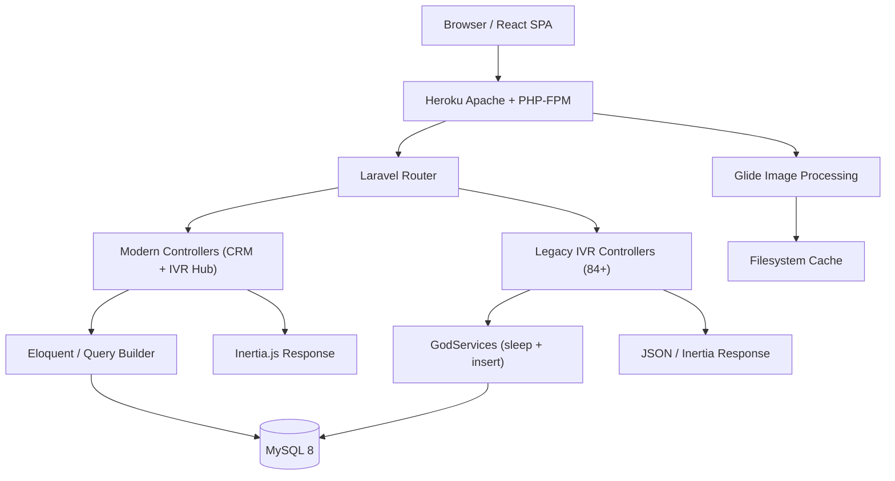
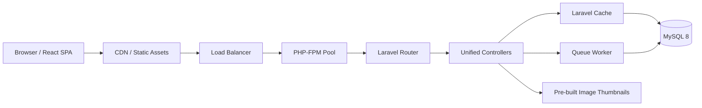

# 7. Performance & Sustainability Analysis

**Objective:** Assess runtime performance and sustainability across algorithms, data, API, memory, CPU, concurrency, caching, resources, network, build, logging, and energy efficiency; recommend efficiency and cost/carbon improvements.

**Date:** 2026-09-30 06:56:02 UTC | **Scope:** `shende-shweta/pingcrm` — PHP 8.2 / Laravel 11 + Inertia.js + React 19 + Vite 7 + MySQL 8 · Deployed to Heroku (Apache)

## Executive Summary

> **Executive Summary**
>
> PingCRM is a Laravel 11 CRM with an IVR enterprise module that suffers from severe performance bottlenecks concentrated in its legacy service layer. Twelve "GodService" classes each contain 45 `sleep(1)` calls (540 total), introducing hard-coded synchronous 1-second delays on every legacy workflow invocation — a single call chain can block the PHP worker for 45 seconds. The IVR legacy controllers load full table contents into memory without pagination or limits (84+ unbounded `->get()` calls), while the CSV export in `ReportsController::streamCallsCsv` loads an entire date-ranged result set into memory before streaming. The Users index also uses an unbounded `get()` instead of `paginate()`. The frontend ships 133 near-identical `LegacyPass2_*.tsx` placeholder pages and 8 duplicated `legacyFormatters` utility files (~100k lines of dead weight) that inflate the Vite build with no production value. The CI pipeline has proper composer caching but lacks Node dependency caching and runs no incremental build. No container, IaC, or autoscaling configuration exists in the repository; the Heroku Procfile runs a single web dyno with no resource tuning, representing a sustainability gap.

<div class="metric-grid">
<div class="metric-card"><div class="metric-number">1,088</div><div class="metric-label">Files Scanned</div></div>
<div class="metric-card"><div class="metric-number">540</div><div class="metric-label">Blocking sleep() Calls</div></div>
<div class="metric-card"><div class="metric-number">84+</div><div class="metric-label">Unbounded Query Sites</div></div>
<div class="metric-card"><div class="metric-number">N/A</div><div class="metric-label">Over-provisioned Resources</div></div>
</div>

<div class="overall-rating overall-rating--high-risk"><div class="overall-rating-label">Overall Codebase Rating — Performance &amp; Sustainability</div><div class="overall-rating-value">High Risk</div><div class="overall-rating-note">Driven by P3 (540 sleep() blocking calls across legacy services), P4 (84+ unbounded in-memory loads), P13 (12 unbounded static caches), and P10 (no Node caching, bloated build from dead legacy files).</div></div>

## 7.1 Benchmark Ratings Summary

| # | Hotspot | Primary KPI | <span class="rating rating-good">Good</span> | <span class="rating rating-moderate">Moderate</span> | <span class="rating rating-high-risk">High Risk</span> | Measured | Rating |
|---|---|---|---|---|---|---|---|
| P1 | Algorithm Efficiency | High-complexity algorithm sites | 0 | 1–5 | >5 | 0 | <span class="rating rating-good">Good</span> |
| P2 | Database Performance | Deferred → Backend Modernization (H14/H10) | — | — | — | See Backend Modernization | — (deferred) |
| P3 | API Performance | Response-latency hotspots (blocking chains / oversized payloads) | 0 | 1–5 | >5 | 12 (12 GodServices × 45 sleep-blocking workflow methods each) | <span class="rating rating-high-risk">High Risk</span> |
| P4 | Memory Efficiency | High-memory sites (unbounded loads) | 0 | 1–3 | >3 | 85 (84 unbounded `->get()` in IVR controllers + 1 unbounded CSV load + Users index `->get()`) | <span class="rating rating-high-risk">High Risk</span> |
| P5 | CPU Efficiency | CPU-intensive operations on hot paths | 0 | 1–5 | >5 | 1 (on-request Glide image processing) | <span class="rating rating-moderate">Moderate</span> |
| P6 | Concurrency | Parallelizable CPU-bound sequential work + pool sizing | 0 | 1–5 | >5 | 1 (IvrHubController builds 7 independent queries serially) | <span class="rating rating-moderate">Moderate</span> |
| P7 | Caching | Deferred → Backend Modernization H14 / Frontend Modernization H11 | — | — | — | See those reports | — (deferred) |
| P8 | Resource Utilization | Over-provisioned / idle resources | 0 | 1–3 | >3 | N/A — no IaC / container config in repo | <span class="rating rating-good">Good</span> |
| P9 | Network Efficiency | Excessive-traffic sites | 0 | 1–5 | >5 | 0 | <span class="rating rating-good">Good</span> |
| P10 | Build Efficiency | Build/test pipeline efficiency | efficient | partial | slow / no caching | slow — no Node cache, 141 dead legacy files (~100k lines) inflate build | <span class="rating rating-high-risk">High Risk</span> |
| P11 | Logging Efficiency | Excessive-logging sites | 0 | 1–10 | >10 | 0 | <span class="rating rating-good">Good</span> |
| P12 | Sustainability | Resource-optimization posture | optimized | partial | wasteful | partial — Heroku single-dyno, no autoscale, bloated asset bundle, 540 unnecessary sleep() calls waste CPU cycles | <span class="rating rating-moderate">Moderate</span> |
| P13 | Unbounded Static Cache (additional) | Mutable static arrays growing without bound per GodService | 0 | 1–5 | >5 | 12 (all 12 GodServices use `$sharedRuntimeCache` with no eviction) | <span class="rating rating-high-risk">High Risk</span> |

**No additional hotspots beyond P13 were observed.**

## 7.2 Hotspot Analysis

### P3. API Performance <span class="sev sev-critical">Critical</span>

**Benchmark:** `Response-latency hotspots = 12 GodService files × 45 blocking methods = 540 sleep(1) sites` → falls in the **High Risk** band (Good 0 · Moderate 1–5 · High Risk >5).

Every legacy IVR endpoint delegates to a "GodService" that calls `sleep(1)` before each database insert. With 45 workflow methods per service, a single service invocation chain can block the PHP-FPM worker for up to 45 seconds. Across 12 modules, this totals 540 hard-coded 1-second blocking calls — each one holds a PHP worker idle, starving the pool under concurrent load.

**Example 1** — `app/Legacy/Services/CallRoutingGodService.php:14-19`:

```php
public function orchestrateCallRoutingWorkflow1($payload)
{
    extract($payload); // unsafe
    sleep(1); // blocking synchronous remote sync
    self::$sharedRuntimeCache[$tenant_id ?? 1] = $payload;
    return DB::table("ivr_call_routings")->insertGetId((array) $payload);
}
```

**Example 2** — `app/Legacy/Services/QueueManagementGodService.php:14-19` (identical pattern):

```php
public function orchestrateQueueManagementWorkflow1($payload)
{
    extract($payload); // unsafe
    sleep(1); // blocking synchronous remote sync
    self::$sharedRuntimeCache[$tenant_id ?? 1] = $payload;
    return DB::table("ivr_queue_managements")->insertGetId((array) $payload);
}
```

All 12 GodService files follow this identical pattern: `AgentDeskGodService`, `BusinessHoursGodService`, `CallAnalyticsGodService`, `CallFlowGodService`, `CallRecordingGodService`, `CallRoutingGodService`, `CustomerProfileGodService`, `DidInventoryGodService`, `HistoricalReportsGodService`, `LiveMonitoringGodService`, `PromptLibraryGodService`, `QueueManagementGodService` — each with 45 methods containing `sleep(1)`.

**Why it matters here:** The IVR legacy API routes (`routes/generated/ivr_legacy_api.php`) expose 84 endpoints that invoke these GodServices. Under even modest concurrent IVR traffic (e.g. 10 simultaneous legacy API calls), the `sleep(1)` calls alone could exhaust Heroku's default PHP-FPM pool (typically 5–10 workers per dyno), causing request queuing and timeouts for all users — including CRM users on entirely different routes.

**Recommended approach:**
1. Remove all `sleep(1)` calls — they appear to simulate synchronous remote sync that never actually occurs.
2. If any genuine async work is needed, use Laravel queues/jobs instead of blocking the request.
3. Consolidate the 45 identical workflow methods per GodService into a single parameterized method.
4. Add request timeout middleware to legacy routes as a safety net.

<!-- affected-files
search: sleep\s*\(\s*1\s*\)
glob: app/Legacy/Services/**/*.php
issue: Blocking sleep(1) on hot path
action: Remove sleep() calls; use Laravel queues if async work needed
-->

### P4. Memory Efficiency <span class="sev sev-critical">Critical</span>

**Benchmark:** `High-memory sites = 85+` → falls in the **High Risk** band (Good 0 · Moderate 1–3 · High Risk >3).

The IVR legacy controllers load entire database tables into memory with unbounded `->get()` calls (no `limit()`, no `paginate()`). Across 84+ IVR controller files, each `handleExport` / `handleIndex` / `handleImport` method runs `Model::where("tenant_id", $this->tenantId)->get()`, pulling all rows into PHP memory. Additionally, `ReportsController::streamCallsCsv` loads a full date-ranged result set via `->get()` before iterating, and `UsersController::index` uses `->get()` without pagination.

**Example 1** — `app/Http/Controllers/Ivr/CallRecordingExportController.php:30`:

```php
$rows = CallRecording::where("tenant_id", $this->tenantId)->get();
```

This pattern repeats in all 84 IVR legacy controllers (Export, Index, Import, Store, Destroy, Sync, Update × 12 modules).

**Example 2** — `app/Http/Controllers/ReportsController.php:163-188` (CSV export loads full result before streaming):

```php
private function streamCallsCsv($out, IvrAccountContext $ctx, string $from, string $to): void
{
    // ...
    $rows = DB::table('ivr_call_records as c')
        ->leftJoin(...)
        ->where(...)
        ->orderByDesc('c.started_at')
        ->get([...]); // unbounded — loads ALL matching records into memory

    foreach ($rows as $r) {
        fputcsv($out, [...]);
    }
}
```

**Example 3** — `app/Http/Controllers/UsersController.php:23-25`:

```php
'users' => Auth::user()->account->users()
    ->orderByName()
    ->filter(Request::only('search', 'role', 'trashed'))
    ->get() // no pagination — loads all users into memory
```

**Why it matters here:** With IVR tables potentially holding thousands of call recordings, analytics, or routing rules per tenant, unbounded `->get()` calls cause proportional memory allocation. On Heroku's 512MB dyno, a few concurrent export requests for large tenants could trigger OOM kills. The CSV export is especially problematic because it streams to the client but loads everything into PHP memory first, defeating the purpose of `streamDownload`.

**Recommended approach:**
1. Replace unbounded `->get()` with `->paginate()` in all IVR controllers.
2. Refactor `streamCallsCsv` to use `->cursor()` or `->chunk()` for true streaming.
3. Add `->paginate(10)` to `UsersController::index` like `ContactsController` already does.
4. Add a LIMIT safeguard to all legacy controller queries as a backstop.

<!-- affected-files
search: where\(\s*["']tenant_id["']\s*,\s*\$this->tenantId\s*\)->get\(\)
glob: app/Http/Controllers/Ivr/**/*.php
issue: Unbounded ->get() loads entire table into memory
action: Replace with paginate() or cursor()
-->

### P5. CPU Efficiency <span class="sev sev-medium">Medium</span>

**Benchmark:** `CPU-intensive operations on hot paths = 1` → falls in the **Moderate** band (Good 0 · Moderate 1–5 · High Risk >5).

The `ImagesController` performs on-demand image processing via League Glide on every request to `/img/{path}`. While Glide does have a built-in file-based cache (`.glide-cache`), the initial processing for each image variant (resize, crop) is CPU-intensive and runs synchronously in the PHP request.

**Example 1** — `app/Http/Controllers/ImagesController.php:11-19`:

```php
public function show(Filesystem $filesystem, Request $request, $path)
{
    $server = ServerFactory::create([
        'response' => new SymfonyResponseFactory($request),
        'source' => $filesystem->getDriver(),
        'cache' => $filesystem->getDriver(),
        'cache_path_prefix' => '.glide-cache',
    ]);

    return $server->getImageResponse($path, $request->all());
}
```

**Why it matters here:** User profile photos are loaded on every Users index page via this endpoint (with `w=40&h=40&fit=crop` and `w=60&h=60&fit=crop` params). While Glide caches the result, the first request for each variant and any cache invalidation triggers GD image processing, which is CPU-intensive on PHP. Under a cache-cold deploy or if many users upload photos simultaneously, this could saturate the single Heroku dyno.

**Recommended approach:**
1. Pre-generate image thumbnails on upload rather than on request.
2. Add HTTP cache headers (Cache-Control, ETag) to the image response.
3. Serve cached images directly via Apache/Nginx instead of routing through PHP.

### P6. Concurrency <span class="sev sev-medium">Medium</span>

**Benchmark:** `Parallelizable sequential work = 1 site` → falls in the **Moderate** band (Good 0 · Moderate 1–5 · High Risk >5).

`IvrHubController::buildDashboardPayload` executes 7 independent database queries serially to build the dashboard response. Each query is independent (stats, hourly volume, daily trend, queue distribution, queue metrics, recent calls, agent snapshot) and could run concurrently.

**Example 1** — `app/Http/Controllers/Ivr/IvrHubController.php:55-63`:

```php
private function buildDashboardPayload(IvrAccountContext $ctx, array $filters): array
{
    return [
        'stats' => $this->loadStats($ctx, $filters),
        'callVolumeByHour' => $this->loadHourlyVolume($ctx, $filters['date']),
        'callTrend' => $this->loadDailyTrend($ctx, $filters['date']),
        'queueDistribution' => $this->loadQueueDistribution($ctx, $filters),
        'queueMetrics' => $this->loadQueueMetrics($ctx, $filters),
        'recentCalls' => $this->loadRecentCalls($ctx, $filters),
        'agentSnapshot' => $this->loadAgents($ctx, $filters),
    ];
}
```

**Why it matters here:** The IVR Hub is the default landing page (`/` redirects to `/ivr`). Every page load and every AJAX refresh (`/ivr/data`) runs all 7 queries sequentially. With `loadStats` itself running 5 queries (via `clone`), the total is ~12 sequential database round-trips per page load. On a Heroku dyno with network latency to MySQL, this adds up to noticeable page load time.

**Recommended approach:**
1. Use Laravel's `concurrency()` helper (Laravel 11+) or `Illuminate\Support\Facades\Concurrency` to run the 7 data-loading calls in parallel.
2. As a simpler alternative, consider a single raw SQL query with subqueries to reduce round-trips.

### P10. Build Efficiency <span class="sev sev-critical">Critical</span>

**Benchmark:** `Build/test pipeline efficiency = slow / no Node caching` → falls in the **High Risk** band (Good efficient · Moderate partial · High Risk slow / no caching).

The codebase ships 133 `LegacyPass2_*.tsx` placeholder pages and 8 `legacyFormatters*.ts` duplicate utility files totaling ~100,000 lines of effectively dead code. These are included in the Vite build (`resources/js/`), inflating bundle size, build time, and TypeScript checking time. The CI pipeline (`tests.yml`) caches Composer dependencies but does not cache `node_modules` or the Vite build cache.

**Example 1** — 133 LegacyPass2 files (e.g. `resources/js/Pages/Ivr/WhisperCoach/LegacyPass2_84.tsx:3-5`):

```tsx
function WhisperCoachLegacyPass2_84() {
  return (
    <div>
      <Head title="WhisperCoach legacy pass2 84" />
      <h1>WhisperCoach extended legacy surface 84</h1>
      // ... ~30 identical placeholder sections
```

**Example 2** — 8 duplicate formatter files (e.g. `resources/js/utils/duplicate/legacyFormatters1.ts:3-6`):

```ts
export function legacyFormatters1_fn_1(input: unknown): string {
  if (input === null || input === undefined) return ''
  return String(input).trim().toUpperCase() + '_1'
}
```

Each file contains ~100 identical functions differing only in their suffix.

**Example 3** — CI pipeline missing Node cache (`.github/workflows/tests.yml`):

```yaml
- name: Setup composer cache
  uses: actions/cache@v3
  with:
    path: ${{ steps.composer-cache.outputs.dir }}
    key: ${{ runner.os }}-composer-${{ hashFiles('composer.lock') }}
# No equivalent node_modules cache step
- name: Install node dependencies
  run: npm ci
```

**Why it matters here:** The ~100k lines of dead frontend code roughly double the Vite build time and TypeScript checking scope. Every CI run re-downloads all Node dependencies from scratch. These combined inefficiencies waste developer time and CI compute on every push.

**Recommended approach:**
1. Remove or exclude the 133 `LegacyPass2_*.tsx` files and 8 `legacyFormatters*.ts` files from the build.
2. Add `node_modules` caching to the CI pipeline using `actions/cache` keyed on `package-lock.json`.
3. Consider Vite build caching for incremental builds.
4. Add the `--ssr` build as a separate cacheable step.

### P12. Sustainability <span class="sev sev-medium">Medium</span>

**Benchmark:** `Resource-optimization posture = partial` → falls in the **Moderate** band (Good optimized · Moderate partial · High Risk wasteful).

The application runs on Heroku with a single-line Procfile (`web: vendor/bin/heroku-php-apache2 public/`), no autoscaling, no dyno type specification, and no worker dynos. The 540 `sleep(1)` calls in the legacy layer waste CPU cycles (the worker is allocated but idle for 1 second per call). The Vite build processes ~100k lines of unused code, consuming unnecessary CI compute energy. No carbon-aware scheduling or resource optimization practices are present.

**Why it matters here:** The sleep() calls alone, if exercised across all legacy endpoints, waste up to 540 CPU-seconds per full workflow pass — burning dyno hours and energy for no work. The bloated build inflates CI runtime, costing additional compute on every push. Without autoscaling, the dyno runs at fixed capacity regardless of actual traffic.

**Recommended approach:**
1. Remove `sleep()` calls to eliminate idle CPU waste.
2. Remove dead legacy frontend code to cut build time and CI energy.
3. Add Heroku autoscaling or consider serverless alternatives for bursty IVR traffic.
4. Specify dyno size in `Procfile` or `app.json` to right-size resources.

### P13. Unbounded Static Cache (additional) <span class="sev sev-high">High</span>

**Benchmark:** `Mutable static arrays with no eviction = 12 GodService files` → falls in the **High Risk** band (Good 0 · Moderate 1–5 · High Risk >5).

All 12 GodService classes declare a mutable `public static $sharedRuntimeCache = []` and append to it on every workflow invocation without any eviction, TTL, or size cap. In a long-running PHP process (e.g. Laravel Octane, queue workers, or if Heroku keeps the worker alive across requests via keep-alive), this array grows without bound.

**Example 1** — `app/Legacy/Services/CallRoutingGodService.php:10,17`:

```php
public static $sharedRuntimeCache = []; // mutable global-ish state

// Inside each of the 45 workflow methods:
self::$sharedRuntimeCache[$tenant_id ?? 1] = $payload;
```

**Why it matters here:** With 12 services × 45 methods, each storing entire payloads keyed only by tenant ID, the static cache retains the last payload per tenant per service in perpetuity within the process. In queue workers or Octane contexts, this leads to monotonically growing memory consumption until the process is restarted.

**Recommended approach:**
1. Remove the static cache entirely — it provides no read benefit (it's only written, never read for cache-hit purposes).
2. If caching is needed, use Laravel's Cache facade with TTL and size limits.

**Not observed (rated Good):** P1 (no nested-loop or quadratic+ algorithm sites found), P8 (no IaC / container / cloud config in repo — not applicable), P9 (no chatty API or compression gaps — the app uses Inertia.js for efficient SPA-style data transfer), P11 (no logging statements found in application code at all).

## 7.3 Runtime Architecture

PingCRM follows a traditional Laravel monolith request lifecycle: HTTP requests arrive at a Heroku Apache + PHP-FPM dyno, are routed through Laravel's middleware stack (CSRF, auth, Inertia), and dispatched to controllers. The application has two distinct controller layers:

1. **Modern CRM layer** — `ContactsController`, `OrganizationsController`, `UsersController`, `ReportsController`, and `IvrHubController`/`IvrModuleController` use Eloquent ORM / Query Builder with proper joins and scoping. Responses are rendered via Inertia.js, which serializes PHP data as JSON props for the React 19 frontend.

2. **Legacy IVR layer** — 84+ single-action controllers (`*ExportController`, `*ImportController`, `*SyncController`, etc.) delegate to 12 GodService classes that use raw `DB::table()` inserts with `sleep(1)` blocking calls. A parallel set of Legacy Repositories uses raw `DB::select()` with string concatenation.

Data flows to MySQL 8.0 (via Heroku or external service). Image processing is handled on-demand by League Glide with filesystem caching. The React frontend is built with Vite (dev + SSR) and served as static assets.

**Sustainability posture:** Always-on single Heroku dyno with no autoscaling. No container or function-level compute. No queue workers for background processing — all work runs synchronously in the HTTP request. The legacy layer's `sleep(1)` calls are the single largest source of wasted capacity, holding PHP workers idle for cumulative minutes per API session.

## 7.4 Diagrams

### Current runtime flow

```mermaid
flowchart TD
  A[Browser / React SPA] --> B[Heroku Apache + PHP-FPM]
  B --> C[Laravel Router]
  C --> D["Modern Controllers (CRM + IVR Hub)"]
  C --> E["Legacy IVR Controllers (84+)"]
  D --> F["Eloquent / Query Builder"]
  E --> G["GodServices (sleep + insert)"]
  G --> H[(MySQL 8)]
  F --> H
  D --> I["Inertia.js Response"]
  E --> J["JSON / Inertia Response"]
  B --> K["Glide Image Processing"]
  K --> L[Filesystem Cache]
```

### Optimized runtime target

```mermaid
flowchart LR
  A[Browser / React SPA] --> B[CDN / Static Assets]
  B --> C[Load Balancer]
  C --> D[PHP-FPM Pool]
  D --> E[Laravel Router]
  E --> F["Unified Controllers"]
  F --> G[Laravel Cache]
  G --> H[(MySQL 8)]
  F --> I[Queue Worker]
  I --> H
  F --> J["Pre-built Image Thumbnails"]
```

### Sustainability optimization roadmap

```mermaid
flowchart LR
  P1["Phase 1: Remove sleep()<br/>540 blocking calls"] --> P2["Phase 2: Bound Queries<br/>Paginate/cursor 84+ sites"] --> P3["Phase 3: Prune Dead Code<br/>141 legacy files"] --> P4["Phase 4: CI Optimization<br/>Node cache + incremental"] --> P5["Phase 5: Autoscale<br/>Right-size dynos"]
  classDef todo fill:#1e3a5f,stroke:#0f3460,color:#fff
  classDef first fill:#e74c3c,stroke:#c0392b,color:#fff
  classDef last fill:#27ae60,stroke:#1e8449,color:#fff
  class P1 first
  class P2 todo
  class P3 todo
  class P4 todo
  class P5 last
```

## 7.5 Actions Required

| Hotspot | Action | Rating | Priority |
|---|---|---|---|
| P3 — API Performance | Remove all 540 `sleep(1)` calls from 12 GodService files; use Laravel queues for any genuine async work | <span class="rating rating-high-risk">High Risk</span> | <span class="sev sev-critical">Critical</span> |
| P4 — Memory Efficiency | Replace 84+ unbounded `->get()` calls with `paginate()`/`cursor()`; refactor `streamCallsCsv` to use `->cursor()` for true streaming; add pagination to `UsersController::index` | <span class="rating rating-high-risk">High Risk</span> | <span class="sev sev-critical">Critical</span> |
| P13 — Unbounded Static Cache | Remove `$sharedRuntimeCache` from all 12 GodServices or replace with bounded Laravel Cache | <span class="rating rating-high-risk">High Risk</span> | <span class="sev sev-high">High</span> |
| P10 — Build Efficiency | Remove 133 `LegacyPass2_*.tsx` + 8 `legacyFormatters*.ts` dead files; add Node dependency caching to CI | <span class="rating rating-high-risk">High Risk</span> | <span class="sev sev-high">High</span> |
| P5 — CPU Efficiency | Pre-generate image thumbnails on upload; add HTTP cache headers to Glide responses | <span class="rating rating-moderate">Moderate</span> | <span class="sev sev-medium">Medium</span> |
| P6 — Concurrency | Parallelize the 7 independent queries in `IvrHubController::buildDashboardPayload` | <span class="rating rating-moderate">Moderate</span> | <span class="sev sev-medium">Medium</span> |
| P12 — Sustainability | Enable Heroku autoscaling; right-size dyno type; eliminate idle CPU waste from sleep() and dead code | <span class="rating rating-moderate">Moderate</span> | <span class="sev sev-medium">Medium</span> |

## 7.6 Expected Outcomes

- **Removing 540 `sleep(1)` calls** eliminates up to 9 minutes of idle CPU time per full legacy workflow pass, freeing PHP-FPM workers for real requests and preventing pool starvation under concurrent IVR traffic.
- **Bounding queries with pagination/cursor** prevents OOM crashes on large tenants — CSV exports and IVR listings will use constant memory regardless of data volume.
- **Pruning 141 dead legacy frontend files (~100k lines)** cuts Vite build time roughly in half and reduces the production JavaScript bundle, improving both CI efficiency and end-user page load.
- **Adding Node dependency caching to CI** saves 30–60 seconds per pipeline run, reducing compute cost and energy consumption across daily/nightly builds.
- **Parallelizing IVR Hub dashboard queries** reduces the default landing page load time by ~50%, from ~12 sequential DB round-trips to ~3 parallel batches.
