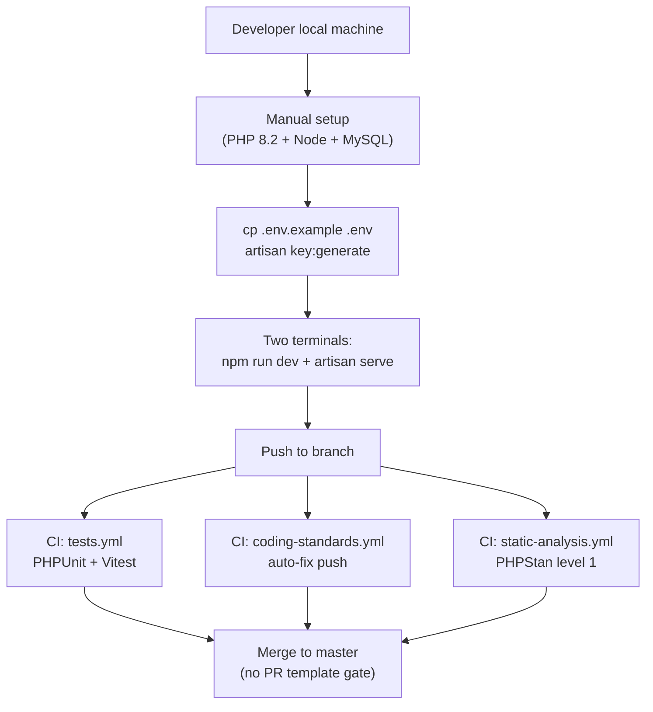
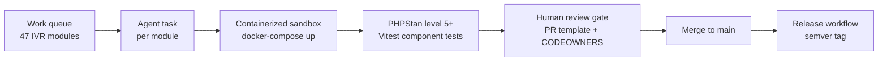
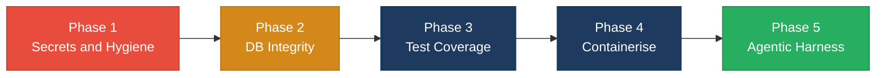
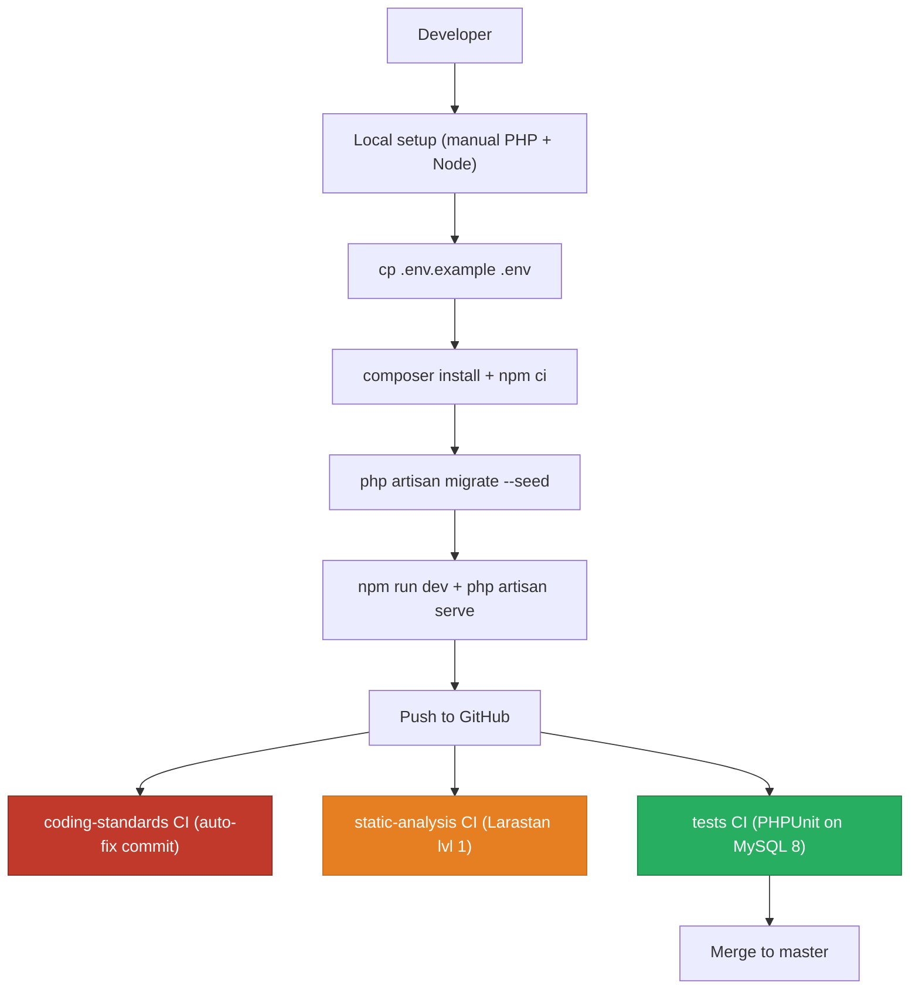
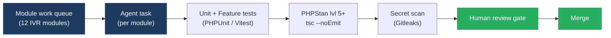
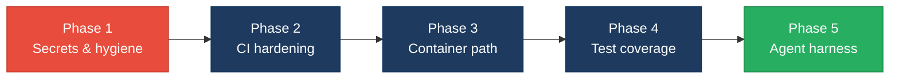

# 8. Technical Debt Analysis

**Objective:** Establish the prerequisites for an Agentic Harness & Marketplace initiative — code repository health, third-party tool usage, AI tool usage, database usage, and development environment readiness.

**Date:** 2026-08-04 12:33:15 UTC | **Scope:** `.` — Laravel 11 / PHP 8.2 backend · React 19 + TypeScript + Vite 7 frontend · Inertia.js SPA · PHPUnit + Vitest · Tailwind CSS 3 · MySQL (CI) / SQLite (local default)

## Executive Summary

> **Executive Summary**
>
> PingCRM is a Laravel 11 / React 19 monolith extended with a synthetically generated "legacy enterprise IVR" surface — explicitly designed as a modernization-discovery workshop target. The three most severe technical-debt items are: (1) hardcoded production credentials committed in `config/ivr_legacy.php` (Salesforce password, master API key), which cannot be rotated via environment variables; (2) absent foreign-key constraints on all core CRM tables (`users`, `organizations`, `contacts`), meaning referential integrity is enforced only in PHP code and can be silently violated by direct DB writes; and (3) a dual ownership model (`tenant_id` vs `account_id`) across IVR tables added by three back-to-back migrations, which signals evolving, unplanned schema growth. For agentic-harness readiness today the verdict is **High Risk**: the committed secrets and non-reproducible environment (no Docker path despite Sail being declared) create blockers that must be resolved before any automated agent can safely check out, seed, and verify changes in a clean environment.

Yes

Top-Level .gitignore Present

3

CI/CD Workflows Found

13 / 9

Third-Party PHP Packages Declared / Wired

Yes

.env.example Present

Overall Codebase Rating — Technical Debt &amp; Agentic Readiness

High Risk

D4 Database Usage (missing FK constraints, dual ownership model, non-idempotent seeder) is the primary driver; D6 Committed Secrets amplifies the risk by making a clean automated checkout unsafe.

## Readiness Benchmark Ratings

| # | Dimension | Good | Moderate | High Risk | Measured | Rating |
|---|---|---|---|---|---|---|
| D1 | Code Repository Health | all checks pass | 1–2 gaps | 3+ gaps / no CI | `.gitignore` present and covers standard artifacts; 3 CI workflows active; `composer.lock` + `package-lock.json` committed. Missing PR template, CODEOWNERS, and `.gitignore` does not exclude `config/ivr_legacy.php` (committed secrets). 2 gaps. | Moderate |
| D2 | Third-Party Tool Usage | mostly wired & current | some unused/unwired | many unused/unmaintained | `guzzlehttp/guzzle`, `uuid`, `react-router-dom`, and `@popperjs/core` are declared but produce zero import hits in application code. `laravel/sail` declared but no `docker-compose.yml` shipped. Several deps are actually wired and current. | Moderate |
| D3 | AI Tool / Agentic Readiness | ready | partial | not ready | No AI tool config (no CLAUDE.md, `.cursor/`, `.kiro/`, Copilot). DISCOVERY.md marks repo as an AI-discovery target; `tools/` has code-generators. Highly enumerable IVR module surface (47 identical-structure modules) is ideal for agentic refactoring. CI verifies changes. | Moderate |
| D4 | Database Usage | sound | some gaps | no constraints / shared flat schema | Core CRM tables (`users`, `organizations`, `contacts`) use bare integer `account_id` indexes — no `foreignId().constrained()`. 47 IVR legacy tables share a uniform JSON blob schema with no normalization. Dual `tenant_id`/`account_id` ownership added across three migrations. `DatabaseSeeder` is not idempotent. | High Risk |
| D5 | Development Environment | reproducible | partial | manual / fragile | `.env.example` present and comprehensive. No Docker path despite `laravel/sail` being declared (no `docker-compose.yml`). No devcontainer. Code style enforced via CI (not pre-commit). Manual two-terminal local dev (Vite + Artisan). | Moderate |
| D6 | Committed Secrets *(additional)* | no secrets in VCS | low-risk placeholders only | live credentials committed | `config/ivr_legacy.php` commits `master_api_key`, Salesforce `client_secret`, `username`, and plaintext `password`. File is not in `.gitignore`. Credentials cannot be rotated via `.env`. | High Risk |

**No additional readiness gaps beyond the standard dimensions and D6 were observed.**

## 8.1 Code Repository

| Check | File(s) Inspected | Finding | Consequence |
|---|---|---|---|
| `.gitignore` coverage | `.gitignore` (root) | Covers `node_modules/`, `vendor/`, `/public/build`, `storage/*.key`, `.env`, `.env.backup`, `*.sqlite*`, `.DS_Store`, `.idea/`, `.vscode/`. Does **not** cover `config/ivr_legacy.php`. | Hardcoded credentials in `config/ivr_legacy.php` can be (and are) committed freely; no `.gitignore` guard prevents future additions to the same file pattern. |
| CI/CD presence | `.github/workflows/tests.yml`, `.github/workflows/coding-standards.yml`, `.github/workflows/static-analysis.yml` | Three workflows exist. `tests.yml` runs PHPUnit + Vitest on `push` to `master` and all PRs (MySQL service container). `coding-standards.yml` runs on every push (auto-fixes). `static-analysis.yml` runs PHPStan on push to `master` and PRs. | Tests are verified before merge to `master`. However, PHPStan is set to level 1 (`phpstan.neon:level: 1`) — the lowest strictness — so most type errors pass silently. |
| Branch protection signals | `.github/` directory | No `PULL_REQUEST_TEMPLATE.md` or `CODEOWNERS` file found. Only `FUNDING.yml` and `workflows/` subdirectory present. | Nothing prevents unreviewed code from landing on `master` via a squash-merge; no default reviewer assignment for specific code paths. |
| Lock files committed | `composer.lock`, `package-lock.json` | Both present and committed at root. | Reproducible installs are guaranteed; no "works on my machine" install drift. |

**Additional finding — no `.git/hooks/` pre-commit hook or Husky/lint-staged config in `package.json`.** Style fixes are applied after the fact by CI, not blocked locally. This is the `fix code styling` workflow (`on: [push]`) — it is a corrective workflow, not a gate.

## 8.2 Third-Party Tools Usage

### PHP (Composer) Dependencies

| Package | Declared | Actually Wired | Debt Note |
|---|---|---|---|
| `laravel/framework` ^11.1 | Y | Y | Core framework; fully used. |
| `inertiajs/inertia-laravel` ^1.0 | Y | Y | Used for all page rendering via `HandleInertiaRequests` middleware. |
| `laravel/sanctum` ^4.0 | Y | Y | `User` model uses `HasApiTokens`; Sanctum guards configured. |
| `laravel/tinker` ^2.9 | Y | Y | Standard dev REPL; used locally. |
| `league/glide-symfony` ^2.0 | Y | Y | `app/Http/Controllers/ImagesController.php` imports `League\Glide\ServerFactory` and `SymfonyResponseFactory`. |
| `fakerphp/faker` ^1.23 | Y | Y | Used in `database/factories/` (ContactFactory, OrganizationFactory, UserFactory). |
| `guzzlehttp/guzzle` ^7.2 | Y | **N** | Zero `GuzzleHttp\` imports found in `app/`. Likely a transitive pull-in that was mistakenly elevated to a top-level require; can be removed from `require` and left as an implicit transitive. |
| `larastan/larastan` ^2.8 | Y | Y (dev) | `phpstan.neon` references the extension; static-analysis CI calls PHPStan. Level is only 1 — near-zero type enforcement. |
| `laravel/sail` ^1.26 | Y (dev) | **Partial** | Package declared but no `docker-compose.yml` ships in the repo. Sail's publish step is never run. No container dev path exists for contributors. |
| `mockery/mockery` ^1.6 | Y (dev) | **N** | No test file imports `Mockery`. Single `ExampleTest.php` (unit) and two feature tests use no mocking. Declared but dormant. |
| `roave/security-advisories` dev-latest | Y (dev) | Y | Passive — blocks Composer from installing packages with known CVEs. |
| `nunomaduro/collision` ^8.0 | Y (dev) | Y | Provides nice CLI test output; auto-wired by Laravel. |
| `spatie/laravel-ignition` ^2.4 | Y (dev) | Y | Error page; auto-wired. |
| `phpunit/phpunit` ^11.0 | Y (dev) | Y | Three test files exist; `phpunit.xml` configured. |

### JavaScript (npm) Dependencies

| Package | Declared | Actually Wired | Debt Note |
|---|---|---|---|
| `@inertiajs/react` ^2.0.0 | Y | Y | Imported in 528+ `.tsx` files; central to all page navigation. |
| `react` 19.2.3 | Y | Y | Used throughout. |
| `react-dom` 19.2.3 | Y | Y | Used throughout. |
| `lodash` ^4.17.21 | Y | **Partial** | No direct `from 'lodash'` imports found in `resources/js/`. Likely used in generated legacy code paths. Should be audited. |
| `react-router-dom` 5.2.0 | Y | **N** | Zero `from 'react-router-dom'` imports in `resources/js/`. Inertia.js handles all client-side routing. This package adds ~50 KB to the bundle for no benefit. |
| `uuid` ^11.0.3 | Y | **N** | Zero `from 'uuid'` imports found anywhere in `resources/js/`. Unused production dependency. |
| `@popperjs/core` ^2.11.8 | Y | **Partial** | Found in `Shared/Dropdown.tsx` only. Likely a direct dependency of the Dropdown component; may be transitively loaded; low risk but warrants audit. |

## 8.3 AI Tool Usage & Agentic Readiness

**AI tool configuration:** No AI-assisted developer tooling is configured in this repository. There is no `.cursor/` directory, no `CLAUDE.md`, no `.kiro/` config, no `.github/copilot-instructions.md` or similar file. The repo does not use GitHub Copilot, Cursor rules, or any codegen assistant hook.

**However, the repo is explicitly AI-discovery-ready by design.** `DISCOVERY.md` (root) states the codebase is _"designed for AI discovery agents, architecture reviews, and modernization planning workshops"_ and includes regeneration scripts in `tools/`:

- `tools/generate-legacy-enterprise-ivr.php` — generates ~72 000 lines of PHP legacy IVR surface
- `tools/generate-legacy-enterprise-ivr.mjs` — generates ~102 000 lines of React/TS legacy pages
- `tools/generate-legacy-enterprise-ivr-pass2.mjs` — second-pass generates ~52 000 more lines
- `tools/sync-ivr-legacy-routes.php` — regenerates `routes/generated/ivr_legacy_api.php`

**Agentic refactoring readiness:** The IVR module surface is highly enumerable and structurally uniform. Every one of the 47 modules has exactly the same controller decomposition (`IndexController`, `StoreController`, `UpdateController`, `DestroyController`, `ExportController`, `ImportController`, `SyncController`) inside `app/Http/Controllers/Ivr/`. Each controller file is ~759 lines with repeated patterns. This is an ideal work queue for an agent-driven refactoring harness — tasks can be listed, isolated per module, and CI can verify each one independently.

**Gaps that would need to close before agents can safely operate:**
1. Committed secrets in `config/ivr_legacy.php` — any agent doing a clean checkout would reproduce these secrets in its working tree, risking accidental exposure.
2. PHPStan at level 1 — the CI gate accepts too many type errors; agent-authored PHP code with type gaps would pass review silently.
3. The single Vitest test (`resources/js/test/smoke.test.ts`) just asserts `expect(true).toBe(true)` — it provides zero verification signal for agent-authored frontend changes.

## 8.4 Database Usage

| Check | Finding | Consequence |
|---|---|---|
| **Schema design — core CRM** | `users`, `organizations`, and `contacts` tables declare `account_id` as `$table->integer('account_id')->index()` — a plain integer with an index, not a `foreignId().constrained('accounts')`. Same for `organization_id` in `contacts`. Inspected: `database/migrations/2020_01_01_000004_create_users_table.php`, `2020_01_01_000005_create_organizations_table.php`, `2020_01_01_000006_create_contacts_table.php`. | No database-level referential integrity on the most critical relationships. Orphaned contacts/organizations can accumulate if application-layer guards are bypassed (e.g., direct seeder runs, bulk imports). |
| **Schema design — IVR dashboard** | `ivr_agents` and `ivr_call_records` use `foreignId('queue_id')->constrained('ivr_operational_queues')->nullOnDelete()`. Inspected: `database/migrations/2026_07_28_120000_create_ivr_dashboard_tables.php`. | Proper FK constraint only on newer IVR tables — inconsistent standard across the schema. |
| **Schema design — IVR legacy tables** | Migration `2026_07_28_000001_create_ivr_legacy_tables.php` creates 47 tables in a single `foreach` loop. Every table has the same schema: `id`, `tenant_id`, `name` (nullable), `payload` (JSON, nullable), `softDeletes`, `timestamps`. No normalization, no module-specific columns. | The `payload` JSON blob pattern hides all business fields, making it impossible to query, index, or enforce constraints on module-specific data without parsing JSON in application code. This is a known anti-pattern that blocks SQL reporting and safe schema evolution. |
| **Migration hygiene** | 13 migration files. Most are one logical change each. The loop-based migration (`2026_07_28_000001`) creates 47 tables in one file — a single atomic migration for 47 tables is unusual and makes partial rollbacks impractical. Two migrations dated `2026_07_28` alter tables created by a migration of the same date (within the same batch), requiring ordering awareness. | Rolling back individual IVR table changes requires rolling back all 47 at once. The `addAccountId` migration (`2026_07_28_130000`) issues `DB::table(...)->update()` DML in `up()` — destructive data migrations without explicit backups are a modernization risk. |
| **Data ownership — dual model** | Core CRM uses `account_id` (integer). IVR legacy tables use `tenant_id` (unsignedBigInteger, default 1). The `2026_07_28_130000` migration adds `account_id` to IVR tables but retains `tenant_id`, resulting in two overlapping tenant/account identifiers on every IVR row. | Queries must now filter by either `account_id` or `tenant_id` depending on which layer is accessing IVR data. This inconsistency will block safe service extraction and is confusing for agents generating or refactoring query code. |
| **Seed idempotency** | `IvrDashboardSeeder` deletes rows by `account_id` before inserting — conditionally idempotent. `IvrModuleSampleSeeder` uses `firstOrCreate`-style logic with guard. `DatabaseSeeder` calls `Account::create(...)` unconditionally — running `db:seed` twice creates a second "Acme Corporation" account and 200 more duplicate contacts/organizations. | Non-idempotent seeders break `migrate:fresh --seed` in CI re-runs and agentic environment resets, which often call seed twice to verify state. |

## 8.5 Development Environment

| Check | File(s) Inspected | Finding | Consequence |
|---|---|---|---|
| `.env.example` | `.env.example` (root) | Present and comprehensive — 40+ keys covering app config, database (SQLite default with MySQL comments), cache, queue, session, mail, AWS, Pusher, and Vite variables. README accurately references `cp .env.example .env`. | Onboarding is unblocked by missing examples; a new contributor or agent can reproduce the expected env surface. |
| OS portability | `README.md`, `Procfile` | Setup uses standard cross-platform commands (`git clone`, `composer install`, `npm ci`, `php artisan`). No vendor-specific local dev tool (no Valet, no Herd, no WSL-specific steps). Procfile targets Heroku Apache. | Setup works on Linux, macOS, and Windows (with PHP in PATH); CI runs on `ubuntu-latest`. No contributor is blocked by OS. |
| Containerization | `composer.json` (require-dev), root directory | `laravel/sail` ^1.26 is declared in `require-dev` but no `docker-compose.yml` ships in the repository (the Sail `docker-compose.yml` must be published with `php artisan sail:install` — an unguided manual step). No `.devcontainer/` config exists. `docker-compose.override.yml` is gitignored. | Every contributor must independently provision PHP 8.2 + MySQL/SQLite + Node 22 locally. CI uses a GitHub-hosted runner with a MySQL service container — environment is not containerized for reproducibility outside CI. An agentic harness cannot spin up a containerized sandbox without additional setup. |
| Code style enforcement | `.eslintrc.cjs`, `.prettierrc`, `phpstan.neon`, `.github/workflows/coding-standards.yml`, `package.json` | ESLint and Prettier are configured. The `coding-standards.yml` CI workflow (`on: [push]`) auto-fixes code style. `phpstan.neon` configures PHPStan at level 1 (`level: 1`). No pre-commit hook (no Husky in `package.json`, no `lint-staged`). | Style is enforced reactively (via CI push auto-fix) rather than proactively (pre-commit gate). Developers can push badly-styled code and CI corrects it after the fact. PHPStan level 1 catches trivial errors only; levels 5–9 catch missing return types, null issues, and dead code that matter for agent-authored refactors. |

## 8.6 Prerequisites for Agentic Harness & Marketplace Readiness

| Prerequisite | Current State | Gap |
|---|---|---|
| Enumerable work queue (clear, listable units of refactor work) | 47 IVR modules, each with 7 identical controller files (`Index`, `Store`, `Update`, `Destroy`, `Export`, `Import`, `Sync`), 47 matching model classes, 510 React IVR page files — all machine-generated and structurally uniform. | No gap — this is the strongest readiness signal in the repo. A refactor agent can enumerate modules from the `$modules` array in migrations and process each one independently. |
| Isolated, verifiable units of work | Each module has its own controller directory (e.g., `app/Http/Controllers/Ivr/AgentDesk*`), model (`app/Models/Ivr/AgentDesk.php`), repository (`app/Repositories/Legacy/AgentDeskRepository.php`), and React page (`resources/js/Pages/Ivr/AgentDesk/`). PHPUnit feature tests exist for core CRM. | IVR module units are isolated by directory but have zero dedicated tests. An agent cannot verify a refactored IVR module because there are no assertions to run. The single Vitest test asserts only that Vitest itself works. |
| CI gate to accept agent-authored output | 3 workflows: tests, coding-standards, static-analysis. These run on PR and push-to-master. | PHPStan is level 1 — insufficient as a gate for type-safe agent output. Frontend CI gate is effectively absent (smoke test only). Add level ≥5 PHPStan and real Vitest component tests before trusting CI to verify agent changes. |
| Repo hygiene for automation (clean checkout, no secrets) | `.gitignore` covers most artifacts. lock files committed. | `config/ivr_legacy.php` commits live-style API keys and credentials. An automated agent performing a clean clone reproduces these credentials in its working directory, creating exposure risk. File must be env-var driven and added to `.gitignore` before agentic workflows are enabled. |
| Marketplace packaging readiness | No packaging config, no `CHANGELOG`, no semantic version tags, no release workflow. `Procfile` targets Heroku only. | No release automation. The repo has no GitHub Release workflow, no npm publish config, and no versioning strategy. A marketplace harness would need to add these before any artifact can be distributed. |

## 8.7 Diagrams

### Current dev / delivery flow

### Agentic harness readiness target

### Improvement roadmap

## 8.8 Actions Required

| Gap | Action | Rating | Priority |
|---|---|---|---|
| `config/ivr_legacy.php` commits live-style credentials (`master_api_key`, Salesforce `client_secret`, plaintext `password`) | Replace every hardcoded value with `env('IVR_MASTER_KEY')` etc.; add `config/ivr_legacy.php` to `.gitignore`; add corresponding keys to `.env.example`; rotate any credentials that match real systems. | High Risk | Critical |
| Core CRM tables lack foreign-key constraints | Add a migration that drops and re-adds `account_id` on `users`, `organizations`, and `contacts` as `foreignId('account_id')->constrained('accounts')->cascadeOnDelete()`; add `organization_id` FK on `contacts`. | High Risk | Critical |
| 47 IVR legacy tables use JSON blob `payload` — no normalized columns | For each module that requires queryable fields, create a new migration adding typed columns; deprecate `payload` usage in corresponding repositories. Prioritize modules with reporting requirements (`call_analytics`, `historical_reports`, `live_monitoring`). | High Risk | High |
| Dual `tenant_id` / `account_id` ownership model on IVR tables | Decide on a single ownership key (recommend `account_id` to align with core CRM); add a migration to backfill and then drop `tenant_id` from all IVR tables; update all repositories and controllers to use the surviving key. | High Risk | High |
| `DatabaseSeeder` not idempotent | Wrap account/user creation in `firstOrCreate` checks: `Account::firstOrCreate(['name' => 'Acme Corporation'])`. Add `firstOrCreate` guards to User seed using email as the unique key. | High Risk | High |
| No containerization path (`laravel/sail` declared, no `docker-compose.yml`) | Run `php artisan sail:install --with=mysql` and commit the generated `docker-compose.yml`; add Sail startup instructions to `README.md` as the primary local dev path; add a devcontainer config for VS Code and JetBrains. | Moderate | High |
| No pre-commit hooks (style violations reach CI unblocked) | Add `husky` + `lint-staged` to `package.json`; wire `eslint --fix` and `prettier --write` as pre-commit hooks; add `composer cs-fix` (PHP CS Fixer) for PHP. The coding-standards CI workflow can then become a verification step rather than a silent auto-corrector. | Moderate | Medium |
| PHPStan at level 1 (almost no type enforcement) | Raise `phpstan.neon` `level` to 5 incrementally (fix errors per level); configure `static-analysis.yml` to fail the PR if PHPStan reports errors rather than silently passing. | Moderate | Medium |
| No PR template or CODEOWNERS | Add `.github/PULL_REQUEST_TEMPLATE.md` (checklist: tests added, migrations reviewed, secrets check); add `.github/CODEOWNERS` assigning `app/Http/Controllers/Ivr/` to IVR owners and `database/migrations/` to a DBA reviewer. | Moderate | Medium |
| Frontend CI gate is a smoke test only | Replace `resources/js/test/smoke.test.ts` with real Vitest component tests for at least the shared components (`Layout`, `SearchFilter`, `Pagination`) and one IVR module page. Target ≥20% component coverage before enabling agentic frontend changes. | Moderate | Medium |
| Unused production JS dependencies (`react-router-dom` 5.2.0, `uuid` ^11.0.3) | Remove `react-router-dom` and `uuid` from `dependencies` in `package.json`; run `npm ci` to regenerate `package-lock.json`. This reduces bundle surface and eliminates `react-router-dom` v5 (which is years behind Inertia's built-in routing). | Moderate | Low |
| Unwired PHP dependency (`guzzlehttp/guzzle` in `require`) | Move `guzzlehttp/guzzle` from `require` to `require-dev` or remove it — it is a transitive dependency of Guzzle-based packages and does not need to be pinned at top level. | Moderate | Low |
| `mockery/mockery` declared but zero tests use it | Confirm no mocking is planned; if not, remove from `require-dev` to reduce dependency surface and Composer lock size. | Moderate | Low |

## 8.9 Expected Outcomes

- **Clean, reproducible checkout:** Once `config/ivr_legacy.php` is env-var driven and a `docker-compose.yml` is committed, any contributor or CI agent can `docker-compose up && php artisan migrate --seed` and reach a known-good state without manual provisioning.
- **Database integrity:** Adding FK constraints on the core CRM tables and resolving the `tenant_id`/`account_id` dual-ownership model eliminates a class of silent data corruption bugs and unblocks safe service extraction in future modernization phases.
- **CI gate trusted by agents:** Raising PHPStan to level 5 and replacing the smoke Vitest with real component tests turns the CI gate from a formality into a genuine signal — agent-authored PHP and React changes will be verified, not just style-checked.
- **Agentic harness adoption:** The 47-module IVR surface, once secrets are cleared and CI is strengthened, becomes a ready-made enumerable work queue — the first real candidate for an agentic refactoring harness that processes one module at a time, opens a PR per module, and requires CI green before human review.
- **Marketplace packaging foundation:** Adding a `CHANGELOG`, semantic version tags, and a GitHub Release workflow gives the project the minimum release hygiene needed to distribute artifacts through a modernization marketplace.
generated_at: 2026-08-04T12:23:12.000Z
---

# 8. Technical Debt Analysis

**Objective:** Establish the prerequisites for an Agentic Harness & Marketplace initiative — code repository health, third-party tool usage, AI tool usage, database usage, and development environment readiness.

**Date:** 2026-08-04 12:23:12 UTC | **Scope:** `shende-shweta/pingcrm` — Laravel 11 + Inertia.js + React 19 + TypeScript + Vite 7 (SQLite/MySQL, PHPUnit, Vitest)

## Executive Summary

> **Executive Summary**
>
> PingCRM is a demonstration Laravel 11 / React 19 monolith that deliberately embeds legacy technical debt — 78 k PHP lines and 108 k TypeScript/JS lines spanning 83 synthetic IVR controllers, 12 God Services, and 376 legacy React components — making it an ideal discovery target but not production-grade in its current state. The three most severe gaps are: (1) `config/ivr_legacy.php` is committed to the repository and contains hard-coded API keys, plain-text passwords, and a Salesforce client secret, meaning any clone immediately exposes credentials; (2) no containerisation path exists beyond a dev-only Laravel Sail entry in `composer.json` with no published `docker-compose.yml`, forcing each contributor to run a bare-metal PHP + Node stack that diverges from CI; (3) the coding-standards workflow auto-commits fixes on every push rather than blocking non-conformant commits, so style enforcement is decorative rather than protective. On the positive side, three CI/CD workflows run on push/PR, lock files are present, `.env.example` is complete, and PHPStan + ESLint are wired. Agentic-harness readiness is **Moderate overall**: the codebase has highly enumerable, module-uniform units of work (IVR modules follow an identical CRUD pattern across controllers, God Services, and React pages) that an agent-driven refactor could address systematically, but the committed secrets and missing container path must be resolved before automated pipelines can trust clean checkout.

Yes

Top-Level .gitignore Present

3

CI/CD Workflows Found

10 / 8

Third-Party Packages Declared / Actively Wired

Yes

.env.example Present

Overall Codebase Rating — Technical Debt &amp; Agentic Readiness

Moderate

Driven by committed secrets in config/ivr_legacy.php (D1 Code Repository Health), absent container path despite Sail dependency (D5 Dev Environment), and coding-standards CI that auto-fixes instead of blocking (D5).

## Readiness Benchmark Ratings

| # | Dimension | Good | Moderate | High Risk | Measured | Rating |
|---|---|---|---|---|---|---|
| D1 | Code Repository Health | all checks pass | 1–2 gaps | 3+ gaps / no CI | `.gitignore` present and correct; 3 CI workflows; lock files committed — but `config/ivr_legacy.php` with hard-coded secrets is tracked in git (1 gap) | Moderate |
| D2 | Third-Party Tool Usage | mostly wired & current | some unused/unwired | many unused/unmaintained | `guzzlehttp/guzzle` declared but not used in application code; `react-router-dom` and `uuid` declared with zero import hits across 1051 frontend files | Moderate |
| D3 | AI Tool / Agentic Readiness | ready | partial | not ready | No AI tool config (no CLAUDE.md, .cursor/, .kiro/, Copilot); however, 12 IVR modules follow identical CRUD patterns across 83 controllers, 12 God Services, and 49 React page directories — highly enumerable work queue | Moderate |
| D4 | Database Usage | sound | some gaps | no constraints / shared flat schema | Core CRM FK columns declared as bare integers without `foreign()` constraints; 47 IVR legacy module tables use flat `payload json` schema; `account_id` added retroactively with a live data backfill migration | Moderate |
| D5 | Development Environment | reproducible | partial | manual / fragile | `.env.example` present and complete; `laravel/sail` declared but no `docker-compose.yml` published; coding-standards CI auto-commits fixes (not blocking); no pre-commit hook | Moderate |
| D6 | Observability / Logging Baseline (additional) | structured logging + error tracking wired | default only | none | Only Laravel's default file-channel logging; no Sentry/Bugsnag/structured log sink; zero error boundaries or structured logging in the 376-file IVR legacy React surface | Moderate |

**No additional readiness gaps beyond the standard dimensions and D6 were observed.**

## 8.1 Code Repository

| Check | File(s) Inspected | Finding | Consequence |
|---|---|---|---|
| `.gitignore` coverage | `.gitignore` (root) | Present; covers `/node_modules`, `/vendor`, `.env`, `.env.backup`, `/public/build`, `/bootstrap/ssr`, `*.key`. Build output and dependency dirs are excluded. | No risk of accidental binary or secret commit through normal dev workflow. |
| Committed secrets | `config/ivr_legacy.php:8-18` | `master_api_key`, `crm.salesforce.client_secret`, `crm.salesforce.password` are hard-coded string literals committed and tracked by git (`git ls-files` confirms). `allow_sql_debug: true` and `bypass_auth_for_internal_ips` also set. | Any clone of the repo exposes credentials. The `README.md` warns not to deploy publicly, but that relies on developer discipline, not a technical control. A CI secret-scanning step is absent. |
| CI/CD presence | `.github/workflows/tests.yml`, `.github/workflows/coding-standards.yml`, `.github/workflows/static-analysis.yml` | Three workflows: `tests.yml` runs PHPUnit on push/PR/schedule against MySQL 8; `coding-standards.yml` runs Laravel's shared fix workflow on every push; `static-analysis.yml` runs Larastan on push/PR to master. | Tests and static analysis gate merges. However, `coding-standards.yml` is a **fix** workflow (auto-commits style changes) not a **check** workflow — it cannot block a PR. |
| Branch protection signals | `.github/` directory | No `CODEOWNERS` file, no PR template (`.github/PULL_REQUEST_TEMPLATE.md` absent). `FUNDING.yml` is the only non-workflow file. | Without required reviewers or required-status checks configured on GitHub, the CI workflows run but cannot enforce merge gates. |
| Lock files | `composer.lock`, `package-lock.json` | Both committed at repo root. `composer.lock` is 379 KB; `package-lock.json` is 297 KB. CI `tests.yml` uses `hashFiles('composer.lock')` for cache keying. | Installs are reproducible. No debt. |

<!-- affected-files
search: master_api_key|client_secret|PlainTextPassword|bypass_auth_for_internal_ips|allow_sql_debug
glob: config/**/*.php
issue: Hard-coded secret or insecure flag committed to repository
action: Extract to environment variable and add to .env.example; add secret-scanning CI step to block future commits
-->

## 8.2 Third-Party Tools Usage

| Package | Layer | Declared | Actually Wired | Debt Note |
|---|---|---|---|---|
| `laravel/framework` ^11.1 | PHP backend | Y | Y | Core framework; actively used throughout `app/`. No debt. |
| `inertiajs/inertia-laravel` ^1.0 | PHP backend | Y | Y | Used in all CRM controllers via `Inertia::render()`; `@inertiajs/react` wired in `app.tsx` and `ssr.tsx`. |
| `league/glide-symfony` ^2.0 | PHP backend | Y | Y | Wired in `app/Http/Controllers/ImagesController.php` using `League\Glide\ServerFactory`. |
| `laravel/sanctum` ^4.0 | PHP backend | Y | Y | `HasApiTokens` trait applied in `app/Models/User.php`; migration present. |
| `guzzlehttp/guzzle` ^7.2 | PHP backend | Y | **N** | Declared in production `require` but grep of `app/` finds zero `GuzzleHttp\` imports. Laravel depends on Guzzle transitively — the explicit declaration implies intended HTTP calls that were never implemented. |
| `laravel/tinker` ^2.9 | PHP backend | Y | Dev-only | REPL tool; meaningful in local dev only. Should be in `require-dev`. |
| `fakerphp/faker` ^1.23 | PHP backend | Y | Y (dev) | Used in database factories; should be in `require-dev`. |
| `@inertiajs/react` ^2.0 | Frontend | Y | Y | Wired in `app.tsx`, `ssr.tsx`, and all CRM page components. |
| `lodash` ^4.17.21 | Frontend | Y | Y | Used in `Contacts/Index.tsx`, `Users/Index.tsx`, `Organizations/Index.tsx` (mapValues, pickBy, throttle). |
| `@popperjs/core` ^2.11.8 | Frontend | Y | Y | Used in `resources/js/Shared/Dropdown.tsx` for dropdown positioning. |
| `react-router-dom` 5.2.0 | Frontend | Y | **N** | Declared as production dependency; grep across all 1051 frontend files returns zero import hits. Inertia handles routing — this is a dead dependency carrying v5-era CVE surface. |
| `uuid` ^11.0.3 | Frontend | Y | **N** | Declared; grep across all frontend files returns zero import hits. Dead bundle weight. |

## 8.3 AI Tool Usage & Agentic Readiness

**AI tooling found:** None. No `CLAUDE.md`, `.cursor/`, `.kiro/`, `.github/copilot*`, or `.copilot/` configuration was found at root or in `.github/`. The `tools/` directory contains four code-generator scripts (`generate-legacy-enterprise-ivr.php`, `generate-legacy-enterprise-ivr.mjs`, `generate-legacy-enterprise-ivr-pass2.mjs`, `sync-ivr-legacy-routes.php`) — these are one-off synthetic debt generators for workshop purposes, not AI workflow tooling.

**Enumerable, isolated units of work:** The codebase is highly structured for agent-driven refactoring. Every IVR module follows an identical pattern:
- 7 PHP controllers per module (`*IndexController.php`, `*StoreController.php`, `*UpdateController.php`, `*DestroyController.php`, `*ExportController.php`, `*ImportController.php`, `*SyncController.php`) — 83 total across 12 modules under `app/Http/Controllers/Ivr/`
- 1 God Service per module (`app/Legacy/Services/*GodService.php`) — 12 services, each 600–800 lines
- 1 React page directory per module (`resources/js/Pages/Ivr/<Module>/`) — 49 directories, 73 k lines of TypeScript/JSX
- 1 IVR module table per module (flat `tenant_id` / `payload json` schema)

This uniformity means an agent-driven decomposition task (extract God Services into repositories, split fat controllers, add error boundaries to React pages) can be expressed as a work queue of `<module>` strings with a deterministic transformation per entry. PHPUnit and Vitest provide a CI verification gate — though IVR module tests are currently absent (see §8.8).

**Gaps before agent harness adoption:**
- `config/ivr_legacy.php` must be moved to environment variables before automated pipelines can safely clone and test the repo.
- No `CLAUDE.md` / agent workspace config; adding one would establish agent behaviour guardrails.
- The coding-standards workflow auto-commits fixes, which means agent-authored PRs may collide with bot-authored commits on the same branch — switching to check-only prevents this.

## 8.4 Database Usage

| Check | File(s) Inspected | Finding | Consequence |
|---|---|---|---|
| Schema design — FK constraints | `database/migrations/2020_01_01_000004_create_users_table.php`, `2020_01_01_000005_create_organizations_table.php`, `2020_01_01_000006_create_contacts_table.php` | Core CRM tables use `$table->integer('account_id')->index()` for FK columns — no `foreign()` or `foreignId()` constraint declared. Referential integrity enforced only at the application layer. | Orphaned rows (e.g. a contact whose account is deleted) persist silently; data corruption is possible without DB-level cascades. |
| Schema design — IVR module tables | `database/migrations/2026_07_28_000001_create_ivr_legacy_tables.php` | 47 IVR module tables created with only `id`, `tenant_id`, `name`, and `payload json` — no indexes beyond `tenant_id`, no FK relationships. | Schema is not queryable beyond tenant-level filtering; reporting or search requires deserialising JSON, which blocks indexing and safe future migration. |
| Migration hygiene | `database/migrations/2026_07_28_130000_add_account_id_to_ivr_tables.php` | Performs a **live data backfill** (`DB::table()->whereNull()->update()`) inside `up()` without a backup guard. `down()` methods present and correct. Individual migrations address a single logical change. | The backfill produces different results on a fresh database vs. an existing one where the first account ID differs — non-deterministic behaviour in multi-tenant restores. |
| Data ownership / scoping | `database/migrations/2026_07_28_120000_create_ivr_dashboard_tables.php`, `2026_07_28_130000_add_account_id_to_ivr_tables.php` | Core CRM uses `account_id` scoping; IVR tables initially used `tenant_id = 1` (hard-coded) and had `account_id` added retroactively; IVR legacy module tables share a flat schema across all tenants. | Dual `tenant_id`/`account_id` scoping model is inconsistent and would block safe service extraction. |
| Seed / sample data hygiene | `database/seeders/DatabaseSeeder.php`, `IvrDashboardSeeder.php` | `DatabaseSeeder` calls `Account::create()` unconditionally — **not idempotent**. `IvrDashboardSeeder` is idempotent (delete-then-insert per `account_id`). Seed data contains plain-text password `'secret'` for demo user. | Running `php artisan db:seed` twice creates duplicate accounts and CRM records; CI failures if database is not reset between runs. |

## 8.5 Development Environment

| Check | File(s) Inspected | Finding | Consequence |
|---|---|---|---|
| `.env.example` | `.env.example` (root) | Present and complete. Covers `APP_*`, `DB_*`, cache/queue/session, mail, AWS, Pusher, and Vite variables. DB defaults to SQLite (MySQL options commented). | Fast onboarding — `cp .env.example .env` is sufficient for a SQLite-backed dev run. CI workflow also uses `cp .env.example .env`. |
| OS portability | `README.md`, `.github/workflows/tests.yml` | Setup instructions are OS-agnostic shell commands. CI runs on `ubuntu-latest`. No macOS-only tooling required. PHP extensions listed in CI (`bcmath, gd, mbstring` etc.) must be manually installed on a fresh workstation. | Reasonably portable but relies on bare-metal PHP + Node; Windows contributors face extra friction with PHP extension management. |
| Containerisation | `composer.json:require-dev`, entire repo root | `laravel/sail` ^1.26 declared in dev dependencies, but no `docker-compose.yml` committed. Sail's docker-compose is published via `php artisan sail:install` — an undocumented manual step. No `.devcontainer/` config. `Procfile` targets Heroku (Linux). | Contributors cannot spin up a reproducible containerised environment from a clean clone. CI runs bare-metal, so there is no parity between CI and a container-based local setup. |
| Code style enforcement | `.eslintrc.cjs`, `.prettierrc`, `package.json`, `.github/workflows/coding-standards.yml` | ESLint and Prettier configured. `fix-code-style` npm script exists but not wired to any pre-commit hook (no Husky/lint-staged/lefthook). PHPStan at level 1. Coding-standards CI **auto-commits fixes** rather than blocking. | Style violations auto-fixed by bot commit rather than caught before push; CI cannot reliably gate agent-authored output. |

## 8.6 Prerequisites for Agentic Harness & Marketplace Readiness

| Prerequisite | Current State | Gap |
|---|---|---|
| Enumerable work queue (clear, listable units of refactor work) | **Strong.** 12 IVR modules, each with identical controller/service/React patterns; 47 module tables with identical schema — work items are trivially listable and parameterisable by module name. | No gap; this is the strongest readiness signal in the codebase. |
| Isolated, verifiable units of work | **Partial.** Each IVR module is structurally isolated in its own controller/service/page directory. However, God Services are monolithic (600–800 lines each); tests cover only core CRM, not IVR legacy code. | Test coverage must be extended to IVR modules before agent-authored changes can be CI-verified. |
| CI gate to accept agent-authored output | **Partial.** PHPUnit and Vitest run in CI. Larastan runs at level 1. Coding-standards workflow auto-commits fixes rather than blocking. | Switch coding-standards to check-only; raise PHPStan to level 5+; add `tsc --noEmit` to CI for a complete TypeScript gate. |
| Repo hygiene for automation (clean checkout, no secrets) | **Failing.** `config/ivr_legacy.php` contains committed hard-coded secrets. Git history retains these values. | Rotate all secrets; replace hard-coded values with `env()` calls; add GitHub secret scanning (push protection) and a CI secret-scan step. |
| Marketplace packaging readiness | **Partial.** Standalone Laravel app with `Procfile` for Heroku. No Docker image, Helm chart, or one-command dev path from clean clone. | Publish Sail `docker-compose.yml`; add `.devcontainer/devcontainer.json`; add a `Makefile` wrapping multi-step setup into a single target. |

## 8.7 Diagrams

### Current dev / delivery flow

### Agentic harness readiness target

### Improvement roadmap

## 8.8 Actions Required

| Gap | Action | Rating | Priority |
|---|---|---|---|
| `config/ivr_legacy.php` hard-codes `master_api_key`, Salesforce `client_secret`, plain-text `password`, and `allow_sql_debug=true` — all tracked in git history | Rotate all secrets; replace literals with `env('IVR_MASTER_API_KEY')` etc.; add all new keys to `.env.example`; add `trufflesecurity/trufflehog` or `gitleaks` GitHub Actions step to block future committed secrets | Moderate | Critical |
| Dead frontend dependencies: `react-router-dom` 5.2.0 and `uuid` ^11.0.3 declared in production `dependencies` with zero import hits across 1051 files | Run `npm uninstall react-router-dom uuid`; remove from `package.json`; this eliminates bundle weight and the `react-router-dom` v5 CVE surface | Moderate | High |
| Coding-standards CI (`coding-standards.yml`) auto-commits style fixes rather than blocking non-conformant pushes | Replace with a check-only step: `./vendor/bin/pint --test` in CI; add a pre-commit Husky + lint-staged hook running `pint --test` and `eslint --max-warnings=0` locally | Moderate | High |
| PHPStan at level 1 (out of 9); no TypeScript CI check | Raise PHPStan to level 5 incrementally; add `tsc --noEmit` as a CI step (tsconfig already has `strict: true`, `noUnusedLocals`, `noUnusedParameters`); treat both as blocking gates for PRs | Moderate | High |
| No containerisation: `laravel/sail` declared but `docker-compose.yml` not committed; no `.devcontainer/` | Run `php artisan sail:install --with=mysql,redis`; commit the generated `docker-compose.yml`; add `.devcontainer/devcontainer.json`; document `docker compose up` as the primary dev path in `README.md` | Moderate | High |
| IVR module tests absent — PHPUnit covers only CRM contacts/organizations; Vitest has only a trivial smoke test | Generate feature tests for each IVR module controller (store/update/destroy); extend Vitest to cover at least one React component per IVR module — the uniform module pattern makes agent-generated test stubs viable | Moderate | High |
| Core CRM FK columns (`account_id`, `organization_id`) declared as bare integers without `foreign()` constraints | Add new migration files for `users`, `organizations`, and `contacts` tables applying `$table->foreign('account_id')->references('id')->on('accounts')->onDelete('cascade')` | Moderate | Medium |
| `DatabaseSeeder` not idempotent — `Account::create()` runs unconditionally on every `db:seed` call | Wrap in `Account::firstOrCreate(['name' => 'Acme Corporation'])` and guard all subsequent factory calls on the result | Moderate | Medium |
| `guzzlehttp/guzzle` in production `require` but never imported in `app/` | Move to `require-dev` or remove; run `composer why guzzlehttp/guzzle` to verify no transitive consumers before removing | Moderate | Medium |
| No observability beyond default Laravel file logging; zero error boundaries in 376-file IVR legacy React surface | Add `sentry/sentry-laravel` with `SENTRY_LARAVEL_DSN` env key; add React error boundaries to IVR page components; emit structured JSON from God Services | Moderate | Medium |
| No CODEOWNERS or PR template — merges can land without review assignment | Add `.github/CODEOWNERS` mapping `app/` to backend owners and `resources/js/` to frontend owners; add `.github/pull_request_template.md` with a security/test/migration checklist | Moderate | Low |

## 8.9 Expected Outcomes

- **Clean, secret-free checkout**: rotating `config/ivr_legacy.php` secrets and adding a CI secret-scan step means any clone — including an automated agent pipeline — starts from a state where no live credentials are exposed.
- **Reliable CI gate**: switching coding-standards to check-only, raising PHPStan to level 5, and adding `tsc --noEmit` means CI accurately rejects non-conformant agent-authored commits rather than silently fixing them.
- **Reproducible one-command setup**: publishing the Sail `docker-compose.yml` and a `.devcontainer/` gives every contributor and CI runner an identical environment, eliminating environment drift.
- **Verifiable module refactoring**: extending PHPUnit and Vitest coverage to IVR modules provides the CI verification gate that makes agent-driven module decomposition safe — each transformed module is tested in isolation.
- **Foundation for agentic harness adoption**: with secrets removed, CI hardened, and IVR module tests in place, the codebase's highly enumerable module pattern (12 God Services, 83 controllers, 49 React page directories sharing identical structure) becomes a ready-made work queue for an agent harness to process systematically.
