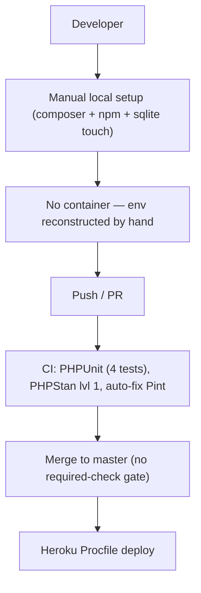
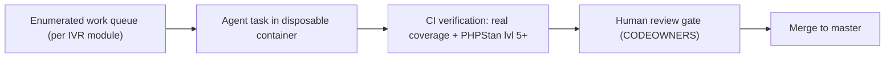
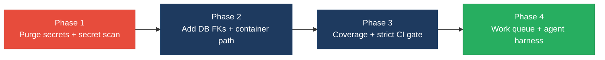

# 8. Technical Debt Analysis

**Objective:** Establish the prerequisites for an Agentic Harness & Marketplace initiative — code repository health, third-party tool usage, AI tool usage, database usage, and development environment readiness.

**Date:** 2026-08-07 12:38:05 UTC | **Scope:** `shende-shweta/pingcrm` (branch `master`) — Laravel 11 / PHP 8.2 backend, Inertia.js, React 19 + TypeScript + Vite 7 frontend; PHPUnit + Vitest; SQLite default DB. ~78k PHP LOC / ~108k JS-TS LOC across an intentionally-generated legacy IVR surface.

## Executive Summary

> **Executive Summary**
>
> PingCRM is a Laravel 11 + Inertia + React 19 demo CRM that has been deliberately extended with a large, machine-generated "legacy Enterprise IVR" surface (83 fat controllers, 12 legacy models, 47 identically-shaped `ivr_*` tables) documented in `DISCOVERY.md` as intentional technical debt for modernization workshops. On the positive side the repo has genuine hygiene fundamentals: a working `.gitignore`, both lock files committed, three GitHub Actions workflows (tests, static analysis, coding standards), an `.env.example`, and configured ESLint/Prettier/PHPStan tooling. The three most severe gaps are: (1) the database has **no foreign-key constraints anywhere** and a 47-table shared flat schema, pushing all integrity into application code and blocking safe service extraction; (2) **hard-coded production-style secrets are committed** in `config/ivr_legacy.php` (`master_api_key`, Salesforce `client_secret`, a plaintext password), so no clean automation checkout is possible; and (3) **near-zero test coverage** (4 PHPUnit files + 1 Vitest smoke test against ~186k LOC) means the CI gate cannot actually verify agent-authored changes. On agentic-harness readiness the verdict is **not ready today**: the codebase is highly enumerable and isolated (an ideal fan-out target), but the missing verification gate, absent container path, and committed secrets must be remediated before an agent fleet can be trusted to land changes.

Yes

Top-Level .gitignore Present

3

CI/CD Workflows Found

6 / 4

Third-Party Packages Declared / Wired

Yes

.env.example Present

Overall Codebase Rating — Technical Debt &amp; Agentic Readiness

High Risk

Driven by D4 (no FK constraints + 47-table shared flat schema) and D6 (hard-coded secrets committed in config), compounded by a CI gate with near-zero test coverage.

## Readiness Benchmark Ratings

One row per readiness dimension. "Measured" is the real state found; "Rating" is the band it falls into (worst-wins). This table is the source for the Overall Codebase Rating banner above.

| # | Dimension | Good | Moderate | High Risk | Measured | Rating |
|---|---|---|---|---|---|---|
| D1 | Code Repository Health | all checks pass | 1–2 gaps | 3+ gaps / no CI | `.gitignore`, 3 CI workflows, both lock files present; no CODEOWNERS/PR template, PHPStan level 1 | Moderate |
| D2 | Third-Party Tool Usage | mostly wired & current | some unused/unwired | many unused/unmaintained | Sanctum/Glide/PHPStan wired; Guzzle indirect-only; `laravel/sail` declared but no container; `react-router-dom@5.2.0` stale duplicate of Inertia routing | Moderate |
| D3 | AI Tool / Agentic Readiness | ready | partial | not ready | Highly enumerable/isolated units (83 controllers, 47 tables) but no AI config and no verification gate (near-zero tests) | Moderate |
| D4 | Database Usage | sound | some gaps | no constraints / shared flat schema | Zero FK constraints; 47 identical flat `ivr_*` tables; non-idempotent seeder | High Risk |
| D5 | Development Environment | reproducible | partial | manual / fragile | `.env.example` + lint/format configured & CI-run; but no Dockerfile/compose/devcontainer and no local pre-commit hook | Moderate |
| D6 | Repo hygiene for automation — committed secrets *(additional)* | no secrets in tree | isolated demo creds | production-style secrets committed | `config/ivr_legacy.php` commits `master_api_key`, SF `client_secret`, plaintext password | High Risk |
| D7 | Observability / logging baseline *(additional)* | structured logs + monitoring | basic logging only | none | `LOG_CHANNEL=stack` → single flat file; no structured/JSON logging or monitoring config | Moderate |

Additional readiness gaps beyond the standard five dimensions **were** observed and are captured as **D6** (committed secrets) and **D7** (no observability baseline) above.

## 8.1 Code Repository

| Check | Finding | Consequence |
|---|---|---|
| `.gitignore` coverage | Present (`.gitignore:1-20`). Covers `/vendor`, `/node_modules`, `.env`, `.env.backup`, `/public/build`, `/public/hot`, `/storage/*.key`, IDE dirs. A nested `database/.gitignore` ignores `*.sqlite*`. | Solid — the local SQLite DB and secrets file are not committable, so a clean checkout stays clean of local state. |
| CI/CD presence | 3 workflows: `.github/workflows/tests.yml:1-80` (PHPUnit on push→master, all PRs, nightly cron, against MySQL 8), `.github/workflows/static-analysis.yml:1-15` (Larastan, reusable Laravel workflow), `.github/workflows/coding-standards.yml:1-8` (Pint auto-fix, `on: [push]`). | Tests do run on every PR, which is the single biggest strength here. But `coding-standards` *auto-fixes and pushes* rather than gating, and static analysis runs at PHPStan **level 1** (`phpstan.neon:10`) — the lowest meaningful level, so almost nothing is actually caught. |
| Branch protection signals | No `CODEOWNERS`, no `.github/pull_request_template.md`, no required-checks config visible in the tree. Only `.github/FUNDING.yml` present. | Nothing in-repo forces the passing CI to be a merge gate; unreviewed/red-CI code can land on `master`. (Best-effort — server-side branch protection may exist but is not visible locally.) |
| Lock files committed | Both present: `composer.lock` (379 KB) and `package-lock.json` (297 KB). | Reproducible installs for both PHP and Node toolchains — good. |

## 8.2 Third-Party Tools Usage

Security- / infrastructure-relevant declared dependencies and whether they are actually wired into code (not merely declared):

| Package | Declared | Actually Wired? | Debt |
|---|---|---|---|
| `laravel/sanctum` (auth) | Y (`composer.json:18`) | Y — `HasApiTokens` trait on `app/Models/User.php:15`, `config/sanctum.php`, `personal_access_tokens` migration | Wired, but the generated legacy JSON API (`routes/generated/ivr_legacy_api.php`) is unversioned and per `DISCOVERY.md` has no auth/rate-limits — Sanctum protects CRM routes only. |
| `league/glide-symfony` (image serving) | Y (`composer.json:20`) | Y — used in `app/Http/Controllers/ImagesController.php` | Wired and used for on-the-fly image transforms. |
| `larastan/larastan` + `phpunit` (quality) | Y (`composer.json:23,27`) | Y — `phpstan.neon`, `phpunit.xml`, CI workflows | Wired but under-utilised: PHPStan at level 1, PHPUnit suite has 4 files. |
| `guzzlehttp/guzzle` (HTTP client) | Y (`composer.json:15`) | N — no `GuzzleHttp\`/`Http::` reference found in `app/` | Present only as a transitive/framework dependency; no first-party HTTP integration exists. Declared-but-unused surface. |
| `laravel/sail` (Docker dev) | Y (`composer.json:24`) | N — no `docker-compose.yml`, `Dockerfile`, or `.devcontainer` in the tree | Sail is declared but the container files it drives were never committed, so `sail up` cannot work — a dead dev-environment dependency. |
| `react-router-dom@5.2.0` (FE routing) | Y (`package.json:19`) | Partial — Inertia already owns routing via `@inertiajs/react@2.0.0` | A stale (v5, 2020-era) routing library declared alongside Inertia's own navigation; duplicated/redundant routing surface and an outdated pin. |

## 8.3 AI Tool Usage & Agentic Readiness

**Existing AI tooling:** None found. No `.cursor/`, `.kiro/`, `.github/copilot*`, `.cursorrules`, or `CLAUDE.md` exist inside the repository (the `.cursor/` dir in the CLI workspace is orchestration infrastructure, not part of `shende-shweta/pingcrm`). Maturity of AI-assisted tooling in the repo today: **zero**.

**Code generators / scaffolding:** The repo *is* substantially machine-generated. `tools/generate-legacy-enterprise-ivr.php`, `tools/generate-legacy-enterprise-ivr.mjs`, `tools/generate-legacy-enterprise-ivr-pass2.mjs`, and `tools/sync-ivr-legacy-routes.php` (documented in `DISCOVERY.md:12-18`) emit the entire legacy IVR surface. This means the codebase has an unusually **enumerable and structurally uniform** shape:

- **83** fat controllers under `app/Http/Controllers/Ivr/`
- **12** legacy models under `app/Models/Ivr/` and **17** god-service files under `app/Legacy/`
- **47** near-identical `ivr_*` module tables (all `tenant_id` / `name` / `json payload`), enumerated as a literal list in `database/migrations/2026_07_28_000001_create_ivr_legacy_tables.php`
- **83** React pages under `resources/js/Pages/Ivr/`

**Honest assessment:** The *decomposition* half of agentic readiness is excellent — an agent fleet could trivially enumerate "one task per IVR module / controller" and each unit is isolated enough to refactor independently. The *verification* half is missing: with only 4 PHPUnit files (`tests/Feature/ContactsTest.php`, `OrganizationsTest.php`, `Unit/ExampleTest.php`, plus `TestCase.php`) and a single `resources/js/test/smoke.test.ts`, the CI gate cannot confirm an agent-authored change didn't break behaviour. Additionally, 92 files use `extract()` and 105 use raw `DB::` query patterns — unsafe idioms that an automated refactor must handle carefully. Net: **partial** — ready to *fan out*, not yet ready to *trust the merge*.

<!-- affected-files
search: extract\(
glob: app/**/*.php
issue: Uses extract() — variable-injection idiom that obscures data flow and blocks safe automated refactor / verification
action: Replace extract() with explicit named variables so an agent can reason about and verify each unit
-->

## 8.4 Database Usage

| Check | Finding | Consequence |
|---|---|---|
| Schema design | **No foreign-key constraints anywhere.** Relationships are plain `integer('account_id')->index()` / `unsignedInteger('organization_id')->index()` columns (`create_contacts_table.php:16-17`, `add_account_id_to_ivr_tables.php`). Indexes exist beyond the PK, but referential integrity is absent. | Every integrity rule (valid `account_id`, `organization_id`, tenant scoping) lives in PHP; a bad write or a direct DB edit silently orphans rows, and the app cannot rely on the DB to reject them. |
| Migration hygiene | Good defensive style — legacy migrations guard every step with `Schema::hasTable()` / `Schema::hasColumn()` (`create_ivr_legacy_tables.php:27-29`, `add_account_id_to_ivr_tables.php:32-70`) and provide symmetric `down()` methods. The `account_id` backfill runs an idempotent `whereNull(...)->update(...)`. | Migrations are re-runnable and reversible — the one genuinely healthy part of the data layer. |
| Data ownership | **Shared, flat schema.** 47 `ivr_*` module tables share one identical shape (`tenant_id`, `name`, `json payload`) rather than being modelled per domain; CRM tables (`accounts`, `organizations`, `contacts`, `users`) are separate but IVR data is a single flat pool retro-fitted with a nullable `account_id`. | Blocks safe extraction into separate services later — there is no schema boundary per domain, so a "queue management" service and a "billing meter" service would today read the same undifferentiated table pattern. |
| Seed / sample data hygiene | `database/seeders/DatabaseSeeder.php:19-42` is **not idempotent** — it calls `Account::create(...)` and `User::factory()->create(...)` unconditionally (no `firstOrCreate`/`truncate`), so a second `db:seed` duplicates Acme Corporation and all demo data. It also seeds a hard-coded password `'secret'`. Scheduled `migrate:fresh --seed` reset commands exist (git history) as a workaround. | Re-seeding on a shared/CI environment silently doubles data; the workaround (full `migrate:fresh`) is destructive and unsuitable for anything but a throwaway DB. |

## 8.5 Development Environment

| Check | Finding | Consequence |
|---|---|---|
| `.env.example` | Present (`.env.example:1-68`) and consistent with README setup (`DB_CONNECTION=sqlite`, `APP_KEY=` to be generated, mail/redis/pusher placeholders). | Onboarding path is documented and reproducible for the core CRM. |
| OS portability | Setup is generic (`php artisan serve`, `npm run dev`, `touch database/database.sqlite`) with no OS-specific tooling in the README. `Procfile` targets Heroku (`heroku-php-apache2`). | Reasonably portable across macOS/Linux/WSL; no single-vendor lock-in blocking contributors. |
| Containerization | **None committed.** No `Dockerfile`, `docker-compose.yml`, or `.devcontainer/` in the tree, even though `laravel/sail` is a declared dev dependency (`composer.json:24`). | No reproducible container path — every contributor and the CI runner reconstruct PHP/Node/DB versions by hand, inviting environment drift between "works on my machine" and CI. |
| Code style enforcement | Configured **and** partially enforced: ESLint (`.eslintrc.cjs`) + Prettier (`.prettierrc`) + `fix-code-style` npm script, PHPStan (`phpstan.neon`), plus the `coding-standards` CI workflow. **But** there is no `.husky/`/pre-commit hook, and the CI standards job *auto-fixes and pushes* rather than failing the build. | Style tooling exists, yet nothing blocks a non-conforming commit locally, and the CI job masks violations by rewriting them — so style/lint drift is not actually prevented, only cosmetically corrected after the fact. |

## 8.6 Prerequisites for Agentic Harness & Marketplace Readiness

| Prerequisite | Current State | Gap |
|---|---|---|
| Enumerable work queue (clear, listable units of refactor work) | Strong — 83 IVR controllers, 47 uniform tables, 83 React pages, all machine-enumerable from `DISCOVERY.md` and the generator scripts | Not yet expressed as an explicit backlog/queue; the enumeration lives implicitly in generator arrays, not a task manifest an agent can consume |
| Isolated, verifiable units of work | Partial — units are structurally isolated, but "verifiable" fails: 4 PHPUnit + 1 Vitest test cover ~186k LOC | No characterization/regression tests around the legacy surface, so a refactor's correctness cannot be asserted |
| CI gate to accept agent-authored output | Partial — CI runs tests on every PR, but with near-zero coverage the gate is a formality; PHPStan is level 1; standards job auto-fixes instead of gating | Raise coverage + PHPStan level and make checks *required* so a green CI actually means "safe to merge" |
| Repo hygiene for automation (clean checkout, no secrets) | Fails — `config/ivr_legacy.php` commits real-looking secrets; 92 `extract()` + 105 raw-`DB::` sites | Move secrets to env, add a secret-scan step, and neutralize unsafe idioms so an agent runs on a clean, safe tree |
| Marketplace packaging readiness | Weak — no container image, no `.devcontainer`, `laravel/sail` declared without compose files | Add a Dockerfile/devcontainer so an agent task can spin up an identical, disposable environment |

## 8.7 Diagrams

### Current dev / delivery flow

### Agentic harness readiness target

### Improvement roadmap

## 8.8 Actions Required

Only dimensions/gaps rated Moderate or High Risk are listed; each has a concrete action.

| Gap | Action | Rating | Priority |
|---|---|---|---|
| Hard-coded secrets committed in `config/ivr_legacy.php` (`master_api_key`, SF `client_secret`, plaintext password) | Move all values to `env()` reads + `.env.example` placeholders, rotate the exposed credentials, and add a secret-scanning step (e.g. gitleaks) to CI | High Risk | Critical |
| No foreign-key constraints anywhere; integrity lives only in PHP | Add `foreignId(...)->constrained()` (or explicit `foreign()->references()`) for `account_id`/`organization_id`/`tenant_id` in a new migration; verify no orphaned rows first | High Risk | High |
| 47 `ivr_*` tables share one flat schema — blocks per-domain service extraction | Define per-domain schemas/ownership for the highest-value modules before any extraction; treat the flat `json payload` tables as a migration target, not an end state | High Risk | Medium |
| Near-zero test coverage → CI gate cannot verify agent output | Add characterization tests around CRM + top IVR modules; wire a coverage threshold and raise PHPStan from level 1 toward 5+ | Moderate | High |
| No merge gate (no CODEOWNERS/PR template/required checks) | Add `CODEOWNERS` + a PR template and mark `tests`/`static analysis` as required status checks on `master` | Moderate | Medium |
| No container path; `laravel/sail` declared without compose files | Commit a `docker-compose.yml`/`Dockerfile` (or `.devcontainer/`) so contributors, CI, and agent tasks share one disposable environment | Moderate | Medium |
| Style tooling not enforced locally; CI standards job auto-pushes fixes instead of gating | Add a pre-commit hook (husky + lint-staged / Pint) and change the CI job to *fail* on violations rather than rewrite them | Moderate | Low |
| Non-idempotent `DatabaseSeeder` duplicates data on re-run | Make seeders idempotent (`firstOrCreate`/`updateOrCreate` or guarded truncation) so seeding is safe on shared/CI databases | High Risk | Medium |
| Declared-but-unwired deps: `guzzle` (unused), `react-router-dom@5.2.0` (stale, duplicates Inertia) | Remove `react-router-dom` (Inertia owns routing) and drop/justify `guzzle`; prune to reduce install and audit surface | Moderate | Low |
| No observability/logging baseline (`LOG_CHANNEL=stack` → single flat file) | Add structured/JSON logging and a minimal monitoring hook so agent-driven changes are observable in a running environment | Moderate | Low |
| 92 `extract()` + 105 raw `DB::` sites obstruct safe automated refactor | Systematically replace `extract()` with explicit variables and parameterize raw queries (see §8.4 affected-files) | Moderate | Medium |

## 8.9 Expected Outcomes

- **A clean, safe checkout:** no secrets in the tree, a secret-scan gate, and neutralized `extract()`/raw-SQL idioms — the precondition for any agent to run on the repo.
- **A CI gate that means something:** meaningful test coverage plus a raised PHPStan level and required status checks, so a green build genuinely authorizes an agent-authored merge.
- **A durable data layer:** enforced foreign keys, per-domain table ownership, and idempotent seeders — removing the largest modernization and extraction blocker.
- **Reproducible environments everywhere:** a committed container/devcontainer path aligning contributor, CI, and agent-task environments, ending drift.
- **A foundation for the agentic harness & marketplace:** the repo's already-enumerable IVR surface expressed as an explicit work queue, feeding isolated, CI-verified, human-reviewed agent tasks.
