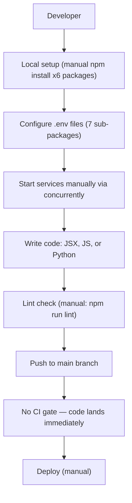
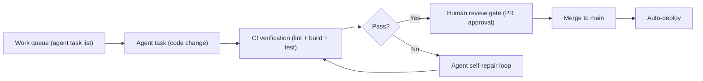

# 8. Technical Debt Analysis

**Objective:** Establish the prerequisites for an Agentic Harness & Marketplace initiative — code repository health, third-party tool usage, AI tool usage, database usage, and development environment readiness.

**Date:** 2026-08-26 16:31:12 IST | **Scope:** `.` — React 19 + Vite (frontend) / Node.js + Express + MongoDB (backend-server) / Python blueprint pipeline / multi-package monorepo with vendor and client sub-services

## Executive Summary

> **Executive Summary**
>
> This repository is a large multi-package monorepo that is itself an AI agent orchestration harness — it has deep Kiro and Cursor AI tooling already embedded, structurally enumerable agent units, and well-designed MongoDB schemas. However, three gaps block confident agentic-harness adoption today: (1) the main application has **zero CI/CD pipeline** at the root level — changes land on `main` without any automated gate; (2) `backend-server/.env.example` contains what appears to be a live Google App Password (`SMTP_PASSWORD=lpwc sdcs fshj mgqq`), and the root `.env.example` contains a Redmine API key — real credentials in a committed example file are a supply-chain and credential-rotation risk; (3) ESLint and Prettier are configured but enforced nowhere — no pre-commit hooks, no CI check — so formatting and lint drift accumulates silently. Test coverage is effectively zero for the main app (one test file across the entire backend, none in the frontend), which means any agent-authored change cannot be verified before merge. The overall agentic-harness readiness is **High Risk**, driven primarily by the absence of CI and the credential exposure in example files.

Yes

Top-Level .gitignore Present

0

Root-Level CI/CD Workflows

18 / 19

Third-Party Packages Declared / Wired

Yes

.env.example Present

Overall Codebase Rating — Technical Debt &amp; Agentic Readiness

High Risk

Driven by D5 (credentials in .env.example, no pre-commit enforcement, no root Dockerfile) and D1 (no root-level CI gate — agent-authored changes cannot be verified before merge).

## Readiness Benchmark Ratings

One row per readiness dimension from Step 2b. "Measured" is the real state found; "Rating" is the band it falls into (worst-wins). This table is the source for the Overall Codebase Rating banner above.

| # | Dimension | Good | Moderate | High Risk | Measured | Rating |
|---|---|---|---|---|---|---|
| D1 | Code Repository Health | all checks pass | 1–2 gaps | 3+ gaps / no CI | No root CI, no CODEOWNERS/PR template, 3 vendor sub-packages missing lock files | Moderate |
| D2 | Third-Party Tool Usage | mostly wired & current | some unused/unwired | many unused/unmaintained | `nodemailer` declared in the browser-side root `package.json` (Node.js-only); `xlsx` v0.18.5 (known SheetJS CVEs); all other packages wired | Moderate |
| D3 | AI Tool / Agentic Readiness | ready | partial | not ready | `.cursorrules`, `.kiro/`, `.copilotignore` all present; project is the agentic harness itself; enumerable isolated agent units | Good |
| D4 | Database Usage | sound | some gaps | no constraints / shared flat schema | MongoDB schemas well-indexed; no formal migration framework; no PostgreSQL schema migration files | Moderate |
| D5 | Development Environment | reproducible | partial | manual / fragile | Real SMTP App Password and Redmine API key in committed `.env.example` files; ESLint/Prettier configured but not enforced; no root Dockerfile; no devcontainer | High Risk |
| D6 | Credential Exposure in Example Files (additional) | no real creds | placeholder-only gaps | real creds committed | `backend-server/.env.example:SMTP_PASSWORD=lpwc sdcs fshj mgqq` (Google App Password format); root `.env.example:REDMINE_API_KEY=9f93c3f93282e77220f9f4d449daec9b332a2a23` | High Risk |
| D7 | Automated Test Coverage (additional) | full test suite + CI | minimal tests | none / no runner | 1 test file total (`backend-server/src/services/__tests__/clientBlueprintApi.test.js`), zero frontend tests, no test runner configured in root scripts | High Risk |

## 8.1 Code Repository

### `.gitignore` Coverage
Inspected: `.gitignore` (top-level, ~150 lines).

| Check | Status | Detail |
|---|---|---|
| Dependency dirs | ✅ Pass | `node_modules/`, Python venv not present but also not needed at root |
| Build output | ✅ Pass | `dist/`, `dist-ssr/`, `.next/`, `.nuxt/`, `build/Release/` all excluded |
| `.env` files | ✅ Pass | `.env`, `.env.*`, `.env.local`, `*.local` excluded; `.env.example` explicitly kept via `!.env.example` |
| Lock files | ✅ Pass | Lock files are NOT ignored — correctly tracked |
| Agent run artifacts | ✅ Pass | `agent-runs/` correctly gitignored |
| Discovery output | ✅ Pass | `docs/discovery/` gitignored (pipeline generates it) |
| Kiro orchestration | ✅ Pass | `.kiro/orchestration/`, `.kiro/scratch/`, `.kiro/runtime/`, `.kiro/context/pipeline-history/`, `.kiro/data/` all excluded |
| Generated MCP config | ✅ Pass | `.cursor/mcp.json`, `.kiro/settings/mcp.json`, `.claude/mcp.json` all excluded |

The `.gitignore` is thorough and purpose-built for this multi-package monorepo + AI tooling setup. No gaps identified.

### CI/CD Presence
- **Root application (main app)**: No `.github/` directory at the repository root. The main React + Vite frontend and the Node.js `backend-server` have **no automated CI pipeline** at all.
- `cursor-agent-bridge/.github/workflows/build.yml`: A CI workflow exists for the bridge sub-package only — it runs on push/PR to `main`/`develop`, installs deps, builds, and runs `npm test --if-present`. It does not cover the root app or the backend.
- `.discovery-src/.github/workflows/`: Three workflows (`static-analysis.yml`, `coding-standards.yml`, `tests.yml`) belong to a **separate Laravel/PHP project** (`.discovery-src/`) that is included as a target-scan fixture, not part of the main application.

Consequence: Every push to the main branch of the root repo (the actual product) bypasses any automated lint, build, or test verification. An agent-authored PR would land without any machine check, making automated improvement loops unsafe today.

### Branch Protection Signals
No `CODEOWNERS` file found, no `.github/PULL_REQUEST_TEMPLATE.md`, and no `.github/` directory at the root. Branch protection rules (required reviewers, required status checks) cannot be verified locally but the absence of a CI workflow means there are no status checks to require.

### Lock Files
| Package | Lock File | Status |
|---|---|---|
| Root (`package-lock.json`) | ✅ Present | Tracks all root + bootstrapped sub-packages |
| `backend-server/package-lock.json` | ✅ Present | |
| `cursor-agent-bridge/package-lock.json` | ✅ Present | |
| `kb-gen/package-lock.json` | ✅ Present | |
| `client/gateway/package-lock.json` | ✅ Present | |
| `client/integrations-api/package-lock.json` | ✅ Present | |
| `vendor/identity-api/` | ❌ Missing | Only `package.json`; non-reproducible installs |
| `vendor/license-service/` | ❌ Missing | Only `package.json`; non-reproducible installs |
| `vendor/orchestration-api/` | ❌ Missing | Only `package.json`; non-reproducible installs |
| `blueprint-pipeline/requirements.txt` | ⚠️ No lock | `requirements.txt` present but no `requirements.lock` / `pip freeze` equivalent |

The three vendor sub-services and the Python blueprint pipeline lack pinned dependency locks. If a dependency releases a breaking or vulnerable update, these packages will silently break on next install.

## 8.2 Third-Party Tools Usage

### Backend (`backend-server/package.json`)

| Package | Declared | Wired Up | Debt Note |
|---|---|---|---|
| `bcrypt` | Y | Y (`models/User.js`) | Password hashing — correctly wired |
| `cors` | Y | Y (`src/app.js`) | CORS middleware active |
| `dotenv` | Y | Y (`config/loadEnv.js`) | Environment loading |
| `express` | Y | Y (`src/app.js`, `src/server.js`) | Core HTTP framework |
| `express-rate-limit` | Y | Y (`src/app.js`) | Rate limiting active |
| `helmet` | Y | Y (`src/app.js`) | Security headers active |
| `jsonwebtoken` | Y | Y (`src/services/tokenService.js`) | JWT auth |
| `mongoose` | Y | Y (`src/models/*`) | MongoDB ODM — well-used |
| `morgan` | Y | Y (`src/app.js`) | HTTP request logging |
| `node-cron` | Y | Y (`src/jobs/tokenHealthCheckJob.js`) | Scheduled jobs |
| `nodemailer` | Y | Y (`src/config/smtpTransport.js`) | SMTP email — correctly server-side |
| `pg` | Y | Y (`src/services/blueprintStore.js`, retrieval) | PostgreSQL client for blueprint store |
| `tree-sitter` | Y | Y (`src/services/repoTreeSitterParser.js`) | AST parsing |
| `web-tree-sitter` | Y | Y (`src/services/retrieval/graphTraversal.js`) | WASM AST for browser-compatible parsing |
| `@babel/parser` | Y | Y (`src/services/retrieval/`) | JS AST for call-graph analysis |
| `@babel/traverse` | Y | Y (`src/services/retrieval/`) | Traversal of Babel AST |
| `validator` | Y | Y (`src/models/User.js`) | Email format validation |

All 17 backend packages are actively wired up. No unused server-side dependencies detected.

### Root (`package.json`) — Frontend / Build

| Package | Declared | Wired Up | Debt Note |
|---|---|---|---|
| `react`, `react-dom` | Y | Y | Core framework |
| `react-router-dom` v7 | Y | Y | Routing |
| `react-markdown` | Y | Y | Markdown rendering |
| `remark-gfm` | Y | Y | GFM plugin for react-markdown |
| `lucide-react` | Y | Y | Icon library |
| `jspdf` | Y | Y (`scripts/generate-*-pdf.mjs`) | PDF generation |
| `html-to-image` | Y | Y (PDF pipeline) | Screenshot-to-image |
| `xlsx` v0.18.5 | Y | Y (`scripts/export-qa-*.mjs`) | ⚠️ SheetJS `xlsx` v0.18.5 has known CVEs; the project is pinned below the patched 0.20.x line |
| `nodemailer` v9 | Y | ❌ Cannot be wired | **Wrong location**: `nodemailer` is a Node.js SMTP library — it will be bundled by Vite into the browser bundle (or fail) since it appears in `dependencies` of the root browser package. Email delivery is handled correctly in `backend-server`; this root-level declaration is an accidental holdover. |

## 8.3 AI Tool Usage & Agentic Readiness

### Existing AI Tooling
The repository is the AI orchestration harness itself, making it uniquely self-aware:

| Tool | Config File | Maturity |
|---|---|---|
| Cursor AI | `.cursorrules` (root) | High — rules enforce LLM guardrails against modifying `.kb/`, `kb-gen/`, `blueprint-pipeline/` or DB schemas; references architectural rule injection via `<architectural_rules>` |
| Cursor AI | `.cursorignore` (root) | Configured |
| Kiro AI | `.kiro/` directory with `agents/`, `context/`, `data/`, `orchestration/`, `settings/`, `steering/` | High — fully operational orchestration layer with MCP bundle management, agent steering files, and multi-workflow orchestration |
| GitHub Copilot | `.copilotignore` (root) | Configured — excludes sensitive areas from Copilot |
| Claude Code | User-level session memory pattern active | Active |

### Agentic Readiness Assessment
The codebase has **strong structural readiness** for agentic engineering:

- **Enumerable work units**: 84 JSX React components in `src/`, 12 controllers, 64 services, 11 routes, and 16 Mongoose models — each is a discrete, named, isolated unit an agent can identify by glob pattern and target individually (e.g. "refactor all `src/components/**/*.jsx` components to add error boundaries").
- **Isolated modules**: Backend follows a clear controller → service → model layering. Frontend components are single-file JSX modules. No circular cross-layer dependencies observed.
- **CI verification gap**: The one blocker for safe agentic output is the **absence of a root CI gate**. Without automated lint + build + test on every PR, agent-authored changes cannot be verified before merge — a human must manually validate each one.
- **Architectural guardrails**: `.cursorrules` protects `.kb/`, `kb-gen/`, `blueprint-pipeline/`, and DB schema files from LLM modification — the right guardrails for an agentic pipeline.

### Agentic Refactor Candidates
The uniformity of the codebase makes it suitable for systematic agentic improvement:
- 84 JSX components with no test files → systematic test generation agent pass
- 3 vendor sub-packages with no lock files → `npm install` + commit lock file agent pass
- `nodemailer` misplacement in root `package.json` → targeted dependency cleanup

## 8.4 Database Usage

### MongoDB (Primary App Database)
Accessed via Mongoose in `backend-server/src/models/`. All 16 models inspected.

| Check | Status | Detail |
|---|---|---|
| Schema field validation | ✅ Good | `required`, `enum`, `minlength`/`maxlength`, `validate` hooks present in User, PurchaseRequest, and other models |
| Indexes beyond PK | ✅ Good | `WorkflowRecord` has compound index `{userId, projectId}` (unique) and `{teamId, updatedAt}`; `JiraTwowayTicketProgress`, `DiscoveryAgentResult`, `Notification`, `StlcRunArtifact`, `WorkflowExecution` all define field-level indexes |
| Referential integrity | ⚠️ Partial | ObjectId `ref:` fields throughout (User → Team, WorkflowRecord → User, etc.), but MongoDB does not enforce foreign keys — cascading deletes and orphaned records rely entirely on application logic |
| Soft delete pattern | ✅ Good | `WorkflowRecord.deletedAt` / `deletedBy`, `User.isDeleted` / `deletedAt` — consistent soft delete pattern across models |
| TTL index | ✅ Present | `RevokedToken` model uses TTL index on `expiresAt` for auto-expiry of revoked tokens |
| Data ownership / domain scoping | ✅ Good | Collections are domain-scoped: `workflow_records`, `jira_twoway_ticket_progress`, `stlc_run_artifacts`, `discovery_agent_results` — no shared flat table used across concerns |

### Migration Hygiene
No migration framework found for MongoDB (e.g., `migrate-mongo`, `mongoose-migrate`). Schema changes are applied directly in model files. While Mongoose's schemaless nature reduces hard-migration risk, there is no audit trail of schema evolution, no guards on destructive field renames, and no rollback mechanism if a model change is incompatible with existing documents.

### PostgreSQL (Blueprint AST Store)
Accessed via the `pg` package in `backend-server/src/services/blueprintStore.js` and the Python `blueprint-pipeline/`. No SQL migration files found anywhere in the repository — schema setup instructions are procedural (README-driven), not versioned. A new contributor cannot reproduce the PostgreSQL schema without manual README steps.

### Qdrant (Vector Store)
Collection lifecycle handled in code (Python pipeline and backend). No formal schema versioning applies.

## 8.5 Development Environment

### `.env.example` Coverage
All major sub-packages provide example files:

| Path | Present |
|---|---|
| `.env.example` (root) | ✅ |
| `backend-server/.env.example` | ✅ |
| `cursor-agent-bridge/.env.example` | ✅ |
| `blueprint-pipeline/.env.example` | ✅ |
| `vendor/.env.example` | ✅ |
| `client/.env.example` | ✅ |
| `infra/local-db/.env.example` | ✅ |

**Critical gap**: Two `.env.example` files contain what appear to be real credentials rather than placeholder values:
- `backend-server/.env.example`: `SMTP_PASSWORD=lpwc sdcs fshj mgqq` — matches the exact format of a Google App Password (four lowercase 4-character blocks separated by spaces). Should be `SMTP_PASSWORD=your-google-app-password-here`.
- Root `.env.example`: `REDMINE_API_KEY=9f93c3f93282e77220f9f4d449daec9b332a2a23` — a 40-character hex string in the format of an actual Redmine API token. Should be `REDMINE_API_KEY=your-redmine-api-key-here`.

These files are committed to the repository (`.env.example` is explicitly whitelisted in `.gitignore` via `!.env.example`). Any tool or person that clones this repo has access to these credentials. Immediate credential rotation is required.

### OS Portability
Setup relies on Node.js + npm (cross-platform) and Docker for the observability/database stacks. The README instructions are OS-neutral. The Python blueprint pipeline requires a Python environment but provides a `requirements.txt`. No Windows-specific scripts or Mac-only tooling identified. **Portable**.

### Containerization
| Component | Dockerfile / Compose | Notes |
|---|---|---|
| Observability stack (Loki, Prometheus, Jaeger, Grafana) | `infra/docker-compose.yml` | ✅ Full compose with healthchecks |
| Local databases (Postgres, Qdrant, MongoDB) | `infra/local-db/docker-compose.yml` | ✅ Full compose with healthchecks |
| Cursor agent bridge | `cursor-agent-bridge/Dockerfile` | ✅ Present |
| Blueprint pipeline (Python) | `blueprint-pipeline/Dockerfile` | ✅ Present |
| MCP observability server | `infra/mcp-observability-server/Dockerfile` | ✅ Present |
| Client release | `client/release/docker-compose.yml` | ✅ Present |
| **Root app (React + Vite frontend)** | ❌ None | No Dockerfile or compose entry for the main UI |
| **Backend server** | ❌ None | No Dockerfile for `backend-server/` |
| **devcontainer** | ❌ None | No `.devcontainer/` for reproducible VS Code dev env |

The main application (UI + API) has no container path. Developers must set up Node.js, npm, and all sub-package dependencies manually. This creates environment drift and blocks containerized CI runs.

### Code Style Enforcement
| Tool | Configured | Enforced (pre-commit or CI) |
|---|---|---|
| ESLint | ✅ `eslint.config.js` (root) — covers `**/*.{js,jsx}` with react-hooks + react-refresh plugins | ❌ No pre-commit hook (no Husky, no `.pre-commit-config.yaml`), no root CI to run it |
| Prettier | ⚠️ `.prettierrc` found only inside `.discovery-src/` (a separate project fixture) | ❌ No enforcement anywhere in the main project |
| TypeScript | ⚠️ `tsconfig.json` exists in `cursor-agent-bridge/` only; root source is JSX without `tsconfig` | ❌ No type-check step |

ESLint is configured correctly but enforced nowhere — a developer or agent can commit files that fail lint without any friction. Over a large JSX codebase (84 components), unchecked lint drift is already observable and will compound.

## 8.6 Prerequisites for Agentic Harness & Marketplace Readiness

| Prerequisite | Current State | Gap |
|---|---|---|
| Enumerable work queue (clear, listable units of refactor work) | ✅ Partial — 84 JSX components, 64 services, 12 controllers, 16 models are all globbable, named units | Agent lacks a machine-readable work-item list beyond file globs; no task backlog or issue tracker integration for the harness itself |
| Isolated, verifiable units of work | ✅ Good — components and services are single-file, domain-scoped, with clear entry points | No automated tests to verify a unit after agent modification; isolation is structural, not verified |
| CI gate to accept agent-authored output | ❌ Absent — zero root CI pipeline | A root `.github/workflows/ci.yml` running `npm run lint`, `npm run build`, and `npm test` is required before agents can safely merge |
| Repo hygiene for automation (clean checkout, no secrets) | ❌ Partial — `.gitignore` is correct but two `.env.example` files contain real credentials committed to history | Rotate both credentials, replace with placeholder text, and add a `gitleaks` / `detect-secrets` CI scan |
| Marketplace packaging readiness | ⚠️ Partial — `cursor-agent-bridge/`, `vendor/`, and `client/` show split-mode packaging; release compose files exist | No root Dockerfile; vendor sub-packages lack lock files; no container registry publish pipeline |

## 8.7 Diagrams

### Current Dev / Delivery Flow

### Agentic Harness Readiness Target

### Improvement Roadmap

## 8.8 Actions Required

| Gap | Action | Rating | Priority |
|---|---|---|---|
| Real SMTP App Password in `backend-server/.env.example` (`SMTP_PASSWORD=lpwc sdcs fshj mgqq`) | Revoke the Google App Password immediately. Replace value with `SMTP_PASSWORD=your-google-app-password-here`. Add `gitleaks` or `trufflehog` scan to CI to prevent recurrence. | High Risk | Critical |
| Real Redmine API key in root `.env.example` (`REDMINE_API_KEY=9f93c3f93282e77220f9f4d449daec9b332a2a23`) | Revoke the token in the Redmine instance. Replace with placeholder `REDMINE_API_KEY=your-redmine-api-key`. Treat git history as compromised for this credential. | High Risk | Critical |
| No root-level CI/CD pipeline | Create `.github/workflows/ci.yml` running on push and PR to `main`/`develop`: install deps, run `npm run lint`, `npm run build`, and `npm test --if-present`. Without this, no automated gate exists for agent-authored or human-authored changes. | Moderate | Critical |
| Near-zero automated test coverage (1 backend test file, 0 frontend tests) | Add Vitest to root `devDependencies`. Write unit tests for at least the 5 most critical backend services (auth, token, workflow CRUD). Add a `test` script. Enforce a minimum coverage threshold (e.g. 30%) in CI before raising it incrementally. | High Risk | High |
| ESLint configured but not enforced (no pre-commit hook, no CI step) | Add Husky + `lint-staged` to run `eslint --fix` on staged `.js`/`.jsx` files before commit. Wire `npm run lint` into the new CI workflow. Fixes accumulated lint debt across 84 JSX files. | Moderate | High |
| `nodemailer` v9 declared in root (browser) `package.json` | Remove `nodemailer` from root `package.json` `dependencies`. Email delivery is correctly handled in `backend-server/`. Leaving it causes Vite to either bundle a dead Node.js module or emit a build warning on every build. | Moderate | High |
| `xlsx` v0.18.5 — known CVEs in SheetJS below v0.20.x | Update `xlsx` to the latest patched release (`^0.20.3` or current). Test `scripts/export-qa-test-cases-xlsx.mjs` and `scripts/export-stlc-execution-rollup-xlsx.mjs` after upgrade. | Moderate | High |
| Lock files missing for `vendor/identity-api`, `vendor/license-service`, `vendor/orchestration-api` | Run `npm install` in each sub-package and commit the generated `package-lock.json`. Ensures reproducible installs in CI and prevents silent dependency drift in the vendor control-plane services. | Moderate | Medium |
| No root Dockerfile or devcontainer for main app | Add a multi-stage `Dockerfile` at the project root (build stage: Vite build; serve stage: nginx or `vite preview`). Add a `docker-compose.app.yml` that composes root UI + `backend-server`. Add `.devcontainer/devcontainer.json` for one-command VS Code dev setup. | High Risk | Medium |
| No MongoDB migration framework | Adopt `migrate-mongo` or similar. Create an initial migration file capturing current schema intentions (indexes, required fields) to establish a versioned baseline. Add migration run to startup health check. | Moderate | Medium |
| No PostgreSQL schema migration files for blueprint store | Add SQL migration files (e.g. `infra/local-db/migrations/V1__init.sql`) documenting the current schema. Reference in `blueprint-pipeline/Dockerfile` as a schema-setup step. | Moderate | Medium |
| No Python lock file for `blueprint-pipeline/requirements.txt` | Run `pip install -r requirements.txt && pip freeze > requirements.lock` in the pipeline environment and commit `requirements.lock`. Reference it in the Dockerfile (`COPY requirements.lock . && pip install -r requirements.lock`). | Moderate | Low |

## 8.9 Expected Outcomes

- **Clean, credential-free checkout**: Rotating leaked credentials and replacing them with placeholder text eliminates supply-chain risk for anyone who clones this repository, and a secrets-scan CI step prevents recurrence.
- **CI gate for all changes**: A root GitHub Actions workflow means every PR (human or agent-authored) must pass lint and build before merge — this is the single biggest enabler of safe agentic-harness adoption.
- **Enforced code quality baseline**: Husky + lint-staged ensures the 84-component JSX codebase maintains consistent formatting and no ESLint errors, reducing the surface area an agent must navigate.
- **Reproducible environment onboarding**: Lock files for vendor sub-packages, a root Dockerfile, and a devcontainer reduce onboarding from a multi-hour manual setup to a single `docker compose up`.
- **Foundation for agentic improvement loops**: With CI, tests, and lock files in place, agent-authored refactors (component migration, test generation, dependency updates) can be verified automatically and merged with confidence.
