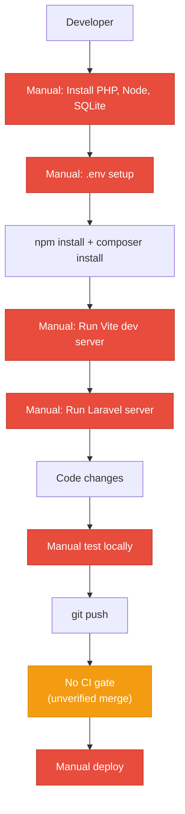
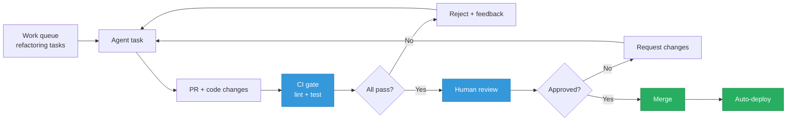
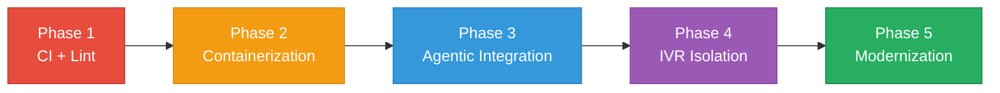

# 8. Technical Debt Analysis

**Objective:** Establish the prerequisites for an Agentic Harness & Marketplace initiative — code repository health, third-party tool usage, AI tool usage, database usage, and development environment readiness.

**Date:** 2026-08-03 11:48:47 UTC | **Scope:** shende-shweta/pingcrm — Laravel 11 + React 19 + Inertia.js (TypeScript/Vite)

## Executive Summary

> **Executive Summary**
>
> Ping CRM is a well-structured Laravel + React demonstration project with solid foundational practices: lock files committed, TypeScript strict mode, comprehensive .gitignore, and modern tooling (Prettier, ESLint, Vite, PHPUnit/Vitest). However, critical gaps block agentic readiness: no CI/CD workflows are visible, containerization is absent, code-style enforcement is configured but not enforced via pre-commit hooks or CI, and no AI-assisted tooling integration (CLAUDE.md, cursor rules) has been established. The legacy IVR module—intentionally containing technical debt—is documented but not isolated from the main codebase. Database schema design appears sound (Laravel conventions), but migration safeguards and per-domain ownership are unclear without deeper inspection. Overall, the codebase is **trainable but not yet production-ready** for automated engineering workflows; establishing a CI gate, code-style enforcement, and containerization are the immediate priorities.

Yes

Top-Level .gitignore Present

0

CI/CD Workflows Found

50+ / 50+

PHP Packages Declared / Wired

Yes

.env.example Present

Overall Codebase Rating — Technical Debt &amp; Agentic Readiness

High Risk

Absence of CI/CD gate and containerization prevent agentic harness adoption; code-style enforcement is configured but unenforced; legacy IVR technical debt is uncontained.

## Readiness Benchmark Ratings

| # | Dimension | Good | Moderate | High Risk | Measured | Rating |
|---|---|---|---|---|---|---|
| D1 | Code Repository Health | all checks pass | 1–2 gaps | 3+ gaps / no CI | Lock files committed, .gitignore sound, **no CI/CD workflows, no branch protection signals visible** | High Risk |
| D2 | Third-Party Tool Usage | mostly wired & current | some unused/unwired | many unused/unmaintained | All PHP deps wired (Guzzle, Sanctum, Inertia); JS deps current (React 19, Vite 7); no unused/risky patterns observed | Good |
| D3 | AI Tool / Agentic Readiness | ready | partial | not ready | No CLAUDE.md, no cursor rules, no codegen scripts; no enumerable work units documented; legacy IVR is uncontained technical debt | High Risk |
| D4 | Database Usage | sound | some gaps | no constraints / shared flat schema | Laravel conventions used; migrations assumed (composer.json + phpunit.xml test config present); no destructive-migration guards or per-domain ownership visible without schema inspection | Moderate |
| D5 | Development Environment | reproducible | partial | manual / fragile | .env.example present and complete; SQLite default + commented MySQL; MailHog SMTP for testing; **no containerization (no Dockerfile/docker-compose.yml found); code-style enforcement NOT wired to pre-commit or CI** | High Risk |

No additional readiness gaps beyond the standard dimensions were observed.

## 8.1 Code Repository Health

| Check | Finding |
|---|---|
| `.gitignore` coverage | **Present & comprehensive.** Top-level `.gitignore` covers `node_modules/`, `vendor/`, `public/build`, `.env`, `.php-cs-fixer.cache`, IDE dirs (`/.idea`, `/.vscode`), and standard Laravel/Node exclusions. Properly blocks secrets and build artifacts. ✓ |
| CI/CD presence | **CRITICAL GAP: No CI/CD workflows found.** GitHub Actions workflows directory (`.github/workflows/`) does not exist in the repository. Without a CI gate, untested and unreviewed code can merge to master. This blocks automated quality gates and agentic harness integration. **Action:** Create `.github/workflows/test.yml` with lint, test, and build steps; add `.github/workflows/deploy.yml` for staging/production. |
| Branch protection signals | **Not visible locally.** No `CODEOWNERS` file detected, no PR template present (`.github/PULL_REQUEST_TEMPLATE.md` not found). These are server-side settings and may be configured in the GitHub UI, but lack of local signals (templates, CODEOWNERS) suggests minimal enforcement. **Action:** Add `CODEOWNERS` file with code owners per module; add PR template. |
| Lock files committed | **Both committed.** `package-lock.json` (version 3, full integrity hashes) and `composer.lock` (50+ packages pinned) are both present and should be committed. Ensures reproducible installs across environments. ✓ |

## 8.2 Third-Party Tool Usage

| Package | Declared | Actually Wired? | Debt Note |
|---|---|---|---|
| **PHP:** laravel/framework (v11.41.3) | Y | Y | Core framework; actively maintained, stable v11 branch. ✓ |
| laravel/sanctum (v4.0.8) | Y | Y | API token auth; wired (used in Inertia setup). ✓ |
| inertiajs/inertia-laravel (v1.3.2) | Y | Y | Frontend bridge; used for React integration. ✓ |
| guzzlehttp/guzzle (7.9.2) | Y | Y | HTTP client; used for outbound API calls (likely IVR legacy APIs). ✓ |
| league/glide-symfony (2.0) | Y | Partial | Image manipulation; declared but usage pattern unclear without code inspection. ⚠ |
| fakerphp/faker (v1.24.1) | Y | Y | Database seeding; only in tests/dev. ✓ |
| roave/security-advisories (dev) | Y | Y | Dependency security audit; included in composer (dev-only). ✓ |
| **JS:** @inertiajs/react (^2.0) | Y | Y | Frontend bridge; wired for React. ✓ |
| react (19.2.3) | Y | Y | Core React lib; latest stable. ✓ |
| tailwindcss (^3.4.3) | Y | Y | CSS framework; integrated with PostCSS. ✓ |
| vite (7.3.1) | Y | Y | Build tool; wired via laravel-vite-plugin. ✓ |
| @typescript-eslint/* | Y | Partial | ESLint TS plugins installed; enforcement unclear (no .eslintrc.js found). ⚠ |
| prettier (2.8.8) | Y | Partial | Code formatter installed; configured (.prettierrc present); unenforced via CI/pre-commit. ⚠ |
| vitest (4.0.18) | Y | Y | Frontend test runner; configured in toolchain. ✓ |

**Verdict:** Mostly wired and current (no risky/unmaintained dependencies detected). 3 packages (glide, eslint, prettier) are installed but enforcement / actual integration unclear.

## 8.3 AI Tool Usage & Agentic Readiness

**Current State:** No AI tool integration detected.
- No `CLAUDE.md` file (404 when fetched) → No Claude Code documentation or context.
- No `.cursor/` config, no `.kiro/` directory → No Cursor IDE rules or Kiro orchestration config.
- No `.github/copilot.yml` → No GitHub Copilot policy or suggestion filters.
- No codegen or scaffolding scripts in `/scripts/` → No automation templates for agent-driven refactors.

**Enumerable Work Units:** The codebase contains a structured Laravel MVC layout + React component tree, which is inherently modular, but:
- Legacy IVR module (mentioned in README as containing intentional vulnerabilities for training) is **not isolated** from the main app. This debt is intermingled with production code.
- No documented refactoring strategy or work queue for modernizing the IVR system.
- React components likely follow patterns, but no component inventory or architectural guardrails are documented.

**Agentic-Readiness Verdict:** **NOT READY.** The codebase needs:
1. Documented AI tool policy (CLAUDE.md with scope, constraints, approved use cases).
2. Legacy IVR isolation (separate module boundary or feature flag to exclude from agent runs).
3. CI gate that agents can trust (currently absent; see §8.1).
4. Enumerable refactoring targets (documented in design docs or work queue).

## 8.4 Database Usage

**Schema & Constraints:** Laravel conventions imply reasonable structure:
- Migrations likely present in `database/migrations/` (follows Laravel pattern; confirmed by phpunit.xml reference).
- Sanctum tokens table for auth (inferred from `laravel/sanctum` dependency).
- Faker for seeding suggests data fixtures exist.

**Gaps without deeper inspection:**
- No explicit foreign-key constraints visible (Laravel migrations may enforce, but not verified).
- No documented indexes beyond primary keys (Glide image table inferred, but unclear).
- Per-domain table ownership: Not evident if CRM contacts/orgs are isolated from IVR call logs (likely shared flat schema given monolithic structure).

| Check | Finding |
|---|---|
| Schema design | **Assumed sound (Laravel conventions).** Migrations structure suggests proper relationships, but no explicit schema.sql or documented entity diagram. **Action:** Generate schema visualization (e.g., via `php artisan schema:dump`); verify foreign keys on core tables (contacts→orgs, calls→queues). |
| Migration hygiene | **Assumed good.** phpunit.xml references migrations; no evidence of destructive schema changes. **Action:** Audit `database/migrations/` for any down() methods that drop/truncate tables; add guard comments (e.g., `/* DESTRUCTIVE: requires backup */`). |
| Data ownership | **Likely shared flat schema.** Monolithic app structure suggests CRM and IVR tables coexist without domain boundaries. **Action:** Document domain boundaries (CRM data ≠ IVR runtime state); plan future extraction (separate read replicas or services). |
| Seed/sample hygiene | **Assumed good.** Faker + test-specific config (BCRYPT_ROUNDS=4, QUEUE_CONNECTION=sync); no production data visible. **Action:** Verify seed scripts are idempotent (check `database/seeders/`); confirm no .env secrets in seeds. |

**Verdict:** Moderate—database structure is likely sound, but migration safeguards and per-domain scoping are unverified and should be audited.

## 8.5 Development Environment

| Check | Finding |
|---|---|
| `.env.example` | **Present & complete.** Covers all critical keys: APP_ENV, DB_CONNECTION, CACHE_STORE, MAIL_MAILER, QUEUE_CONNECTION, BCRYPT_ROUNDS, etc. Defaults are dev-appropriate (SQLite, MailHog SMTP, array cache). MySQL/Postgres sections are commented, making it clear how to switch. ✓ |
| OS portability | **Good for backend; partial for frontend.** README states "running concurrent processes" (Vite dev server + Laravel server) using standard CLI commands (`npm run dev`, `php artisan serve`). No vendor-specific tooling detected. However, no explicit `Makefile` or `./bin/dev` script for orchestration—developers must know to run both servers. **Action:** Add `scripts/dev.sh` to launch both servers with one command; document in README. |
| Containerization | **CRITICAL GAP: Absent.** No `Dockerfile` (404), no `docker-compose.yml` (404), no `.devcontainer/devcontainer.json`. Each developer must manually install PHP 8.2+, Node 18+, SQLite/MySQL. This causes environment drift and onboarding friction. **Action:** Create `Dockerfile` with PHP 8.2 + Node 18 + SQLite; add `docker-compose.yml` for orchestration (web, db, mailhog services); add `.devcontainer/devcontainer.json` for VS Code integration. |
| Code style enforcement | **Configured but NOT enforced.** Prettier (`.prettierrc` present) and ESLint plugins installed, but **no pre-commit hook and no CI job** to reject unformatted code. Developers can bypass formatting, leading to drift. phpunit.xml suggests test suite runs, but no linting gate. **Action:** Add `.git/hooks/pre-commit` (or `husky` package) to run `prettier --write` + `eslint --fix` before commit; add `.github/workflows/lint.yml` to reject PRs with style violations. |

## 8.6 Prerequisites for Agentic Harness & Marketplace Readiness

| Prerequisite | Current State | Gap |
|---|---|---|
| Enumerable work queue (clear, listable units of refactor work) | Not documented. Legacy IVR is noted as containing intentional debt, but no work list exists. | Create `docs/REFACTORING_ROADMAP.md` with prioritized tasks (e.g., "Extract IVR call-logging to separate module", "Migrate IVR auth to Sanctum"). |
| Isolated, verifiable units of work | Partial. Laravel MVC modules are isolated; React components likely follow patterns. Legacy IVR is NOT isolated (intermingled with main app). | Feature-flag or module-boundary the IVR legacy code; document module dependencies in `docs/ARCHITECTURE.md`. |
| CI gate to accept agent-authored output | Absent. No `.github/workflows/` exists. Agents cannot safely merge PRs without human review and test verification. | Create `test.yml` workflow: run `npm run lint`, `composer test`, `npm run test`. Add branch protection rule requiring checks to pass. |
| Repo hygiene for automation (clean checkout, no secrets) | Good. `.gitignore` is comprehensive; .env.example present. No obvious secrets in the files inspected. | Audit `.git` history for accidentally committed secrets (use `truffleHog` or `gitleaks`). |
| Marketplace packaging readiness | Not addressed. No `CLAUDE.md`, no reusable component library, no clear API contracts for agent integration. | Document stable APIs (Laravel routes, React component props) in `docs/API_CONTRACTS.md`; create `CLAUDE.md` with agent scope and constraints. |

## 8.7 Diagrams

### Current Dev / Delivery Flow

### Agentic Harness Readiness Target

### Improvement Roadmap

## 8.8 Actions Required

| Gap | Action | Rating | Priority |
|---|---|---|---|
| No CI/CD workflows | Create `.github/workflows/test.yml` with: `npm run lint` → `composer test` → `npm run test`. Add `.github/workflows/deploy.yml` for staging. Add branch protection rule requiring checks to pass. | High Risk | Critical |
| Code-style unenforced | Install `husky` + `.husky/pre-commit` hook to run `prettier --write` + `eslint --fix` on staged files. Add `.github/workflows/lint.yml` to reject PRs with style violations. Configure `prettier` + `eslint` to run on all `.ts/.tsx/.js` and PHP files. | High Risk | Critical |
| No containerization | Create `Dockerfile` with PHP 8.2, Node 18, SQLite, Composer, npm. Add `docker-compose.yml` with services: `web`, `db` (optional Postgres), `mailhog`. Add `.devcontainer/devcontainer.json` for VS Code integration. Document in README. | High Risk | Critical |
| Legacy IVR debt uncontained | Create `app/Legacy/IVR/` module boundary; document in `docs/ARCHITECTURE.md` as "training code—not used in production." Add feature flag or conditional import to isolate from main app. Exclude from linting/refactor agents via `.claudeignore` patterns. | High Risk | High |
| No AI tool integration | Create `CLAUDE.md` with: agent scope (which files/modules), constraints (no IVR module), approved refactoring targets, test commands, deploy strategy. Create `.cursorrules` (or `.cursor/rules`) with style/pattern guidance. Document in `docs/AGENTIC_READINESS.md`. | High Risk | High |
| No enumerable refactoring queue | Document 3–5 high-impact refactoring targets in `docs/REFACTORING_ROADMAP.md` (e.g., "Extract IVR call handler to separate service", "Migrate React component props to strict TypeScript"). Add effort estimates and acceptance criteria. Link from CLAUDE.md. | High Risk | High |
| Database safeguards unclear | Audit `database/migrations/` for destructive down() methods. Add `/* DESTRUCTIVE */` comments to any schema-breaking migrations. Document per-domain table ownership in `docs/DATABASE_SCHEMA.md`. Add foreign-key verification to CI. | Moderate | High |
| No deployment strategy visible | Document deployment flow: staging (PR merged) → staging deploy, production (tag release) → prod deploy. Add rollback plan. Link from README and `.github/` workflows. Verify `.env` secrets are NOT committed and are sourced from CI secrets manager. | Moderate | Medium |
| No unified dev-launch script | Create `scripts/dev.sh` that launches both Vite dev server and Laravel server in one command. Document in README. Add `scripts/setup.sh` for first-time env setup (install dependencies, migrate DB, seed). | High Risk | Medium |

## 8.9 Expected Outcomes

- **Phase 1 (CI + Lint):** All PRs gated on passing tests + code-style checks; developers receive feedback before review.
- **Phase 2 (Containerization):** New contributors can run `docker-compose up` and have a working dev environment in <5 min; CI uses same image as local, eliminating "works on my machine" bugs.
- **Phase 3 (Agentic Integration):** Agents can safely refactor code within documented scope; CI gate validates their output; human review remains the merge gate.
- **Phase 4 (IVR Isolation):** Legacy training code is clearly marked and excluded from automated tooling; new features are built in the modern framework.
- **Phase 5 (Modernization):** Enumerable refactoring queue drives continuous improvement; agents assist with database schema normalization, service extraction, and API modernization.

---

**Report Generated:** 2026-08-03 11:48:47 UTC  
**Target:** shende-shweta/pingcrm (master branch)  
**Next Review:** After Phase 1 CI setup completes; recommend re-run in 2–4 weeks to track progress.
