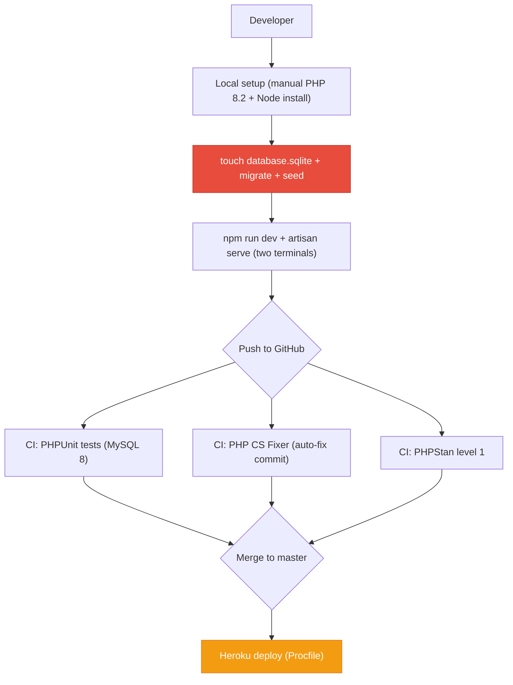
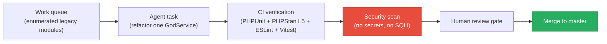
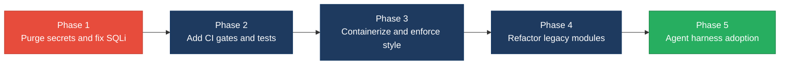

# 8. Technical Debt Analysis

**Objective:** Establish the prerequisites for an Agentic Harness & Marketplace initiative — code repository health, third-party tool usage, AI tool usage, database usage, and development environment readiness.

**Date:** 2026-08-05 14:42:50 UTC | **Scope:** `shende-shweta/pingcrm` — Laravel 11 + Inertia.js + React 19 + TypeScript + Vite 7 (PHP 8.2 backend, SQLite/MySQL database, Vitest + PHPUnit tests)

## Executive Summary

> **Executive Summary**
>
> The Ping CRM codebase is a Laravel 11 / React 19 demo application extended with a large-scale legacy IVR surface that constitutes the majority of its technical debt. Twelve "GodService" classes (4,476 lines total) contain 540 `extract()` calls and 12 hard-coded API keys committed to version control. Additionally, `config/ivr_legacy.php` ships a master API key, Salesforce credentials in plaintext, and deliberately insecure settings (`allow_sql_debug: true`, `session_lifetime_minutes: 99999`). All 12 legacy repository classes use raw string-concatenated SQL queries vulnerable to SQL injection. The core CRM codebase is well-structured with 3 CI workflows, lock files committed, and a valid `.env.example`, but the legacy IVR layer — 29 of 141 PHP source files and 510 of 769 TSX components — makes the repository **High Risk** for agentic-harness adoption today due to committed secrets, missing foreign-key constraints across 47 bulk-created tables, and zero test coverage of the IVR domain. The codebase does have strongly enumerable, repetitive legacy modules that would be excellent targets for agent-driven batch refactoring once secrets are purged and a CI security gate is added.

Yes

Top-Level .gitignore Present

3

CI/CD Workflows Found

10 / 7

Third-Party Packages Declared / Wired

Yes

.env.example Present

Overall Codebase Rating — Technical Debt &amp; Agentic Readiness

High Risk

Driven by D2 (Third-Party Tool Usage — committed secrets, unused packages) and D4 (Database Usage — 47 legacy tables without foreign keys, no migration guards).

## Readiness Benchmark Ratings

| # | Dimension | Good | Moderate | High Risk | Measured | Rating |
|---|---|---|---|---|---|---|
| D1 | Code Repository Health | all checks pass | 1–2 gaps | 3+ gaps / no CI | `.gitignore` present and covers `vendor/`, `node_modules/`, `.env`; 3 CI workflows (tests, coding-standards, static-analysis); both `composer.lock` and `package-lock.json` committed. No CODEOWNERS or PR template. 1 gap. | Moderate |
| D2 | Third-Party Tool Usage | mostly wired & current | some unused/unwired | many unused/unmaintained | 12 hard-coded API keys committed in GodService files; `config/ivr_legacy.php` ships plaintext Salesforce credentials and master API key; `guzzlehttp/guzzle` declared but never imported in app code; `react-router-dom` declared but no imports found; `uuid` declared but no imports found. 3 unused/risky packages + committed secrets. | High Risk |
| D3 | AI Tool / Agentic Readiness | ready | partial | not ready | No AI tool config (`.cursor/`, `.kiro/`, `CLAUDE.md`, Copilot) present. The legacy IVR layer has 12 structurally identical GodService files, 12 identical Repository files, and 82 identically-patterned controllers — highly enumerable units of work for an agent. However, no CI security gate exists to validate agent output, and secrets in the repo would be exposed to any agent context. Partial readiness. | Moderate |
| D4 | Database Usage | sound | some gaps | no constraints / shared flat schema | Core CRM tables (accounts, users, organizations, contacts) use indexes but no foreign-key constraints — `account_id` on users/organizations/contacts is a plain `integer` with no `foreign()` call. The bulk IVR legacy migration creates 47 tables in a loop with only `id`, `tenant_id`, `name`, `payload` (JSON blob), and timestamps — no foreign keys, no typed columns, no normalization. The 5 IVR dashboard tables do use `foreignId()->constrained()` properly. `migrate:fresh --seed` in `composer compile` is destructive with no guard. Seeder deletes data before re-inserting (not idempotent). | High Risk |
| D5 | Development Environment | reproducible | partial | manual / fragile | `.env.example` present and matches README instructions. No `Dockerfile` or `docker-compose.yml` — `laravel/sail` is declared but never initialized. ESLint + Prettier configured but not enforced via pre-commit hook or CI. PHPStan runs at level 1 (lowest). Setup requires manual `touch database/database.sqlite`. | Moderate |

**No additional readiness gaps beyond the standard dimensions were observed.**

## 8.1 Code Repository

| Check | File(s) Inspected | Finding | Consequence |
|---|---|---|---|
| `.gitignore` coverage | `.gitignore:1-20` | Present with 20 entries covering `vendor/`, `node_modules/`, `.env`, `.env.backup`, `public/build/`, `storage/*.key`, `/.idea`, `/.vscode`, `.DS_Store`. Does **not** exclude `config/ivr_legacy.php` which contains committed secrets. | Standard dependency/build artifacts are excluded. However, the config file with hard-coded credentials passes through without `.gitignore` protection. |
| CI/CD presence | `.github/workflows/tests.yml`, `.github/workflows/coding-standards.yml`, `.github/workflows/static-analysis.yml` | Three GitHub Actions workflows: `tests.yml` runs PHPUnit on push to master, PRs, and daily cron with MySQL 8 service container; `coding-standards.yml` runs Laravel's shared PHP CS Fixer on every push (auto-fix, not blocking); `static-analysis.yml` runs PHPStan on push to master and PRs. Frontend linting (ESLint) and frontend tests (Vitest) are **not** part of any CI workflow. | PHP changes are CI-verified. Frontend changes (510 IVR TSX files + 259 CRM TSX files) have zero CI verification — no ESLint, no Prettier check, no Vitest run in any workflow. |
| Branch protection signals | `.github/` directory | No `CODEOWNERS` file. No `pull_request_template.md`. Only `FUNDING.yml` and `workflows/` subdirectory present. | No enforced reviewer assignment or PR checklist. Unreviewed code can land on `master` without any gating beyond the CI workflows. |
| Lock files committed | `composer.lock` (379 KB), `package-lock.json` (297 KB) | Both present and committed at root. CI uses `hashFiles('composer.lock')` for cache keying in `tests.yml`. | Reproducible installs guaranteed. No drift between environments. |

## 8.2 Third-Party Tools Usage

### PHP (Composer) Dependencies

| Package | Declared | Actually Wired? | Debt Note |
|---|---|---|---|
| `laravel/framework` ^11.1 | Y | Y | Core framework — fully used throughout `app/`. No debt. |
| `inertiajs/inertia-laravel` ^1.0 | Y | Y | Used in `HandleInertiaRequests` middleware (`app/Http/Middleware/HandleInertiaRequests.php`) and all controllers via `Inertia::render()`. |
| `laravel/sanctum` ^4.0 | Y | Partial | `HasApiTokens` trait imported in `app/Models/User.php:11`; `config/sanctum.php` published. However, no API routes use Sanctum middleware — the app uses session-based auth exclusively. Token capability is wired but unused. |
| `laravel/tinker` ^2.9 | Y | Y | Dev REPL — no code wiring needed. |
| `league/glide-symfony` ^2.0 | Y | Y | Used in `app/Http/Controllers/ImagesController.php:7-8` for on-the-fly image manipulation via `ServerFactory` and `SymfonyResponseFactory`. |
| `guzzlehttp/guzzle` ^7.2 | Y | **No** | No import of `GuzzleHttp\Client` or `Http` facade found anywhere in `app/`. Declared in production `require` but never used in application code. |
| `fakerphp/faker` ^1.23 | Y | Y | Used in `database/factories/` for seeding. Note: declared in `require` (production) instead of `require-dev` — deployed to production unnecessarily. |
| `roave/security-advisories` dev-latest | Y | Y | Meta-package that blocks installing packages with known CVEs. Properly in `require-dev`. |
| `larastan/larastan` ^2.8 | Y | Y | Configured in `phpstan.neon` at level 1; runs via `.github/workflows/static-analysis.yml`. |
| `laravel/sail` ^1.26 | Y | **No** | No `docker-compose.yml` published — `artisan sail:install` was never run. Package provides no value without the Docker config it generates. |

### JavaScript (npm) Dependencies

| Package | Declared | Actually Wired? | Debt Note |
|---|---|---|---|
| `@inertiajs/react` ^2.0.0 | Y | Y | Core SPA bridge — used in all page components for navigation and data loading. |
| `react` / `react-dom` 19.2.3 | Y | Y | Framework — used in all 769 TSX files. |
| `lodash` ^4.17.21 | Y | Y | Tree-shaken imports (`mapValues`, `pickBy`, `throttle`) in `resources/js/Pages/Contacts/Index.tsx:2-4` and `resources/js/Pages/Users/Index.tsx:2-3`. |
| `@popperjs/core` ^2.11.8 | Y | Y | Imported in `resources/js/Shared/Dropdown.tsx:1` for dropdown positioning. |
| `react-router-dom` 5.2.0 | Y | **No** | Zero imports found across all TSX/TS files. Inertia.js handles routing. Dead dependency — v5 is two major versions behind current. |
| `uuid` ^11.0.3 | Y | **No** | Zero imports found across all TSX/TS files. Declared but completely unused. |

### Committed Secrets (Critical Debt)

Twelve GodService files under `app/Legacy/Services/` each contain a hard-coded `$apiKey` property with unique values (e.g., `LEGACY_IVR_KEY_2042` in `AgentDeskGodService.php:11`, `LEGACY_IVR_KEY_2012` in `CallFlowGodService.php:11`). Additionally, `config/ivr_legacy.php:11-18` contains:

- `master_api_key`: `IVR-MASTER-KEY-DO-NOT-COMMIT-2013`
- `crm.salesforce.client_secret`: `hardcoded_sf_secret_2015`
- `crm.salesforce.password`: `PlainTextPassword!`
- `allow_sql_debug`: `true`
- `session_lifetime_minutes`: `99999`
- `bypass_auth_for_internal_ips`: `['127.0.0.1', '10.0.0.0']`

These 16 secret/insecure-config instances across 13 files are committed to version control and present in any clone or fork.

<!-- affected-files
search: apiKey\s*=\s*"LEGACY_IVR_KEY
glob: app/Legacy/Services/*GodService.php
issue: Hard-coded API key committed to version control
action: Move secret to .env and reference via config()
-->

<!-- affected-files
search: master_api_key|client_secret|PlainTextPassword
glob: config/ivr_legacy.php
issue: Plaintext credentials committed to version control
action: Move all secrets to .env, reference via env() helper
-->

## 8.3 AI Tool Usage & Agentic Readiness

**Current AI tool usage:** None. No `.cursor/`, `.kiro/`, `CLAUDE.md`, `.github/copilot-instructions.md`, or codegen scripts were found in the repository. The `DISCOVERY.md` file documents the legacy IVR layer as intentional technical debt for workshops and discovery planning.

**Agentic readiness assessment:**

The codebase has an exceptionally strong candidate surface for agent-driven batch refactoring:

- **12 GodService files** (`app/Legacy/Services/*GodService.php`, 4,476 lines total) are structurally identical — each has 45 copy-pasted `orchestrate*Workflow` methods using `extract()`, `sleep(1)`, and raw `DB::table()->insertGetId()`. An agent could systematically rewrite each to use proper request validation, async jobs, and Eloquent models.
- **12 Legacy Repository files** (`app/Repositories/Legacy/*Repository.php`) each contain 40 identical `fetchChunk*` methods with string-concatenated SQL vulnerable to injection. These are enumerable, isolated, and verifiable targets for parameterized query conversion.
- **82 IVR controllers** (`app/Http/Controllers/Ivr/`) follow a consistent 7-action pattern (Index, Store, Update, Destroy, Export, Import, Sync) per module. Controllers are single-action invokable classes — isolated and independently testable.
- **5 Legacy Helper classes** (`app/Legacy/Helpers/`, 2,835 lines) contain numbered `transform*()` methods (up to 80 per class) that are all identical stubs — trivially collapsible to a single parameterized method.

**Blockers for agentic adoption:**
1. Committed secrets (16 instances across 13 files) would be exposed to any agent context reading the repo.
2. No CI gate runs frontend linting/tests — agent-authored TypeScript changes would not be automatically verified.
3. PHPStan runs at level 1 (lowest) — too permissive to catch agent-introduced type errors.
4. Zero test coverage of the IVR domain — agent refactoring output has no assertion-based verification.

## 8.4 Database Usage

| Check | File(s) Inspected | Finding | Consequence |
|---|---|---|---|
| **Schema design — Core CRM** | `database/migrations/2020_01_01_000004_create_users_table.php:14`, `2020_01_01_000005_create_organizations_table.php:14`, `2020_01_01_000006_create_contacts_table.php:14` | 4 core tables (accounts, users, organizations, contacts) use proper indexes (`account_id`, `organization_id`, `email` unique). However, `account_id` on users, organizations, and contacts is declared as `integer()->index()` with **no foreign-key constraint** — referential integrity is enforced only at the application layer. | Orphaned contacts/organizations can accumulate if application-layer guards are bypassed (e.g., direct seeder runs, bulk imports, or raw SQL). Cascading deletes must be handled manually. |
| **Schema design — IVR Legacy** | `database/migrations/2026_07_28_000001_create_ivr_legacy_tables.php` | Migration bulk-creates 47 tables in a `foreach` loop over a `$modules` array. Every table has an identical schema: `id`, `tenant_id` (indexed), `name` (nullable, indexed), `payload` (JSON blob, nullable), `soft_deletes`, `timestamps`. No typed columns, no foreign keys, no normalization. | All domain data is stuffed into the `payload` JSON field. The database cannot enforce field-level constraints, enable efficient queries on business attributes, or support relational joins between IVR modules. This is effectively a key-value store masquerading as 47 relational tables. |
| **Schema design — IVR Dashboard** | `database/migrations/2026_07_28_120000_create_ivr_dashboard_tables.php:28,41` | 5 dashboard tables (`ivr_operational_queues`, `ivr_agents`, `ivr_call_records`, `ivr_hourly_volumes`, `ivr_daily_trends`) are properly normalized with typed columns, indexes, and two `foreignId()->constrained('ivr_operational_queues')->nullOnDelete()` constraints on `queue_id`. | These are the only IVR tables with proper relational design — an inconsistent standard across the schema. |
| **Migration hygiene** | `database/migrations/2026_07_28_130000_add_account_id_to_ivr_tables.php`, `composer.json:34` | The `composer compile` script runs `migrate:fresh --seed`, which drops all tables and re-creates them — destructive. Migration `2026_07_28_130000` runs `DB::table()->whereNull()->update()` to backfill data in its `up()` method — this is a data migration mixed with a schema migration. The `down()` method drops `account_id`, permanently destroying the backfilled data. | Data loss risk on rollback. Running `composer compile` in a non-development context would destroy production data. |
| **Data ownership** | Multiple IVR migration files | Core CRM scopes by `account_id` (plain integer). IVR legacy tables use both `tenant_id` (unsignedBigInteger, default 1) and `account_id` (added retroactively). The dual-key scoping is confusing — `tenant_id` is always `1` in seeders, and `account_id` was backfilled from the first account in the database. | No clear domain boundary between CRM and IVR data. Queries must filter by different keys depending on the access layer, blocking safe service extraction. |
| **Seed/sample data hygiene** | `database/seeders/DatabaseSeeder.php`, `IvrDashboardSeeder.php` | `DatabaseSeeder` calls `Account::create()` unconditionally — running `db:seed` twice creates duplicate accounts and 200+ duplicate contacts/organizations. `IvrDashboardSeeder` deletes all rows per `account_id` before re-inserting — destructive but not idempotent. Demo credentials (`johndoe@example.com` / `secret`) are in both the seeder and README. | Non-idempotent seeders break CI re-runs and agentic environment resets. |

## 8.5 Development Environment

| Check | File(s) Inspected | Finding | Consequence |
|---|---|---|---|
| `.env.example` | `.env.example:1-66` | Present (66 lines) and matches the README setup instructions. Covers `DB_CONNECTION=sqlite`, `APP_KEY=` (generated by `artisan key:generate`), mail, cache, queue, session, AWS, Pusher/Vite config. | Onboarding unblocked by missing examples; a contributor or agent can reproduce the expected environment surface. |
| OS portability | `README.md`, `Procfile`, `.github/workflows/tests.yml` | No OS-specific tooling required. PHP 8.2 + Node.js + Composer work cross-platform. Only manual step (`touch database/database.sqlite`) is POSIX but trivially replaceable on Windows. CI runs on `ubuntu-latest`. `Procfile` targets Heroku (Apache). | Setup works on Linux, macOS, and Windows. No contributor is blocked by OS. |
| Containerization | `composer.json` (require-dev), root directory listing | No `Dockerfile`, `docker-compose.yml`, or `.devcontainer/` config exists. `laravel/sail` ^1.26 is declared in `composer.json` but was never initialized (`sail:install` not run). `.gitignore` references `docker-compose.override.yml`, suggesting Docker was intended but never set up. | Every contributor must independently install PHP 8.2, required extensions (`exif`, `gd`, `bcmath`, `mbstring`), Composer, Node.js, and SQLite. An agentic harness cannot spin up a containerized sandbox without additional setup. |
| Code style enforcement | `.eslintrc.cjs`, `.prettierrc`, `phpstan.neon`, `.github/workflows/coding-standards.yml`, `.git/hooks/` | **PHP:** `coding-standards.yml` CI runs PHP CS Fixer on every push — auto-fixes and commits, rather than blocking. PHPStan configured at level 1 (lowest; catches only syntax and basic errors). **JavaScript/TypeScript:** ESLint (`.eslintrc.cjs`) and Prettier (`.prettierrc`) are configured but neither runs in CI. `npm run fix:eslint` and `npm run fix:prettier` are manual-only scripts. **No pre-commit hooks** — all `.git/hooks/*` files are `.sample` only. `.editorconfig` standardizes whitespace settings. | Style is enforced reactively via CI auto-fix (PHP only), not proactively. Developers can push badly-styled TypeScript code and it reaches `master` unchecked. PHPStan level 1 is insufficient as a type-safety gate. |

## 8.6 Prerequisites for Agentic Harness & Marketplace Readiness

| Prerequisite | Current State | Gap |
|---|---|---|
| Enumerable work queue (clear, listable units of refactor work) | 12 GodServices x 45 methods, 12 Repositories x 40 methods, 82 controllers, 5 helper classes — all follow identical patterns. Work units are countable and structurally uniform. The `$modules` array in migrations provides a machine-readable enumeration. | Low — No formal work-queue tooling, but the repetitive structure makes automated enumeration trivial. This is the strongest readiness signal in the repo. |
| Isolated, verifiable units of work | Each GodService, Repository, and controller is a standalone file with no cross-dependencies within the legacy layer. Changes to one do not affect others. | Medium — Units are isolated, but zero tests exist for the IVR layer (only 2 PHPUnit feature tests for CRM contacts/organizations, 1 Vitest smoke test). Verification must be added before agent output can be trusted. |
| CI gate to accept agent-authored output | PHP tests, PHP CS Fixer, and PHPStan (level 1) run in CI. ESLint, Prettier, and Vitest do **not** run in CI. | High — Frontend changes have no automated verification. PHPStan level 1 is too permissive. Agent-authored PRs could introduce type errors or style violations undetected. |
| Repo hygiene for automation (clean checkout, no secrets) | 16 hard-coded secrets across 13 files committed to version control. Any agent reading the repo would ingest these credentials. | Critical — Secrets must be purged from history (via `git filter-repo` or BFG) and moved to `.env` before any agent is granted read access. |
| Marketplace packaging readiness | No `Dockerfile` for reproducible builds. No published API contract (OpenAPI/Swagger). No versioned release tags or CHANGELOG. | High — Cannot be packaged or deployed as a service without containerization, API documentation, and a release workflow. |

## 8.7 Diagrams

### Current dev / delivery flow

### Agentic harness readiness target

### Improvement roadmap

## 8.8 Actions Required

| Gap | Action | Rating | Priority |
|---|---|---|---|
| 16 hard-coded secrets committed across 13 files (`app/Legacy/Services/*GodService.php:11`, `config/ivr_legacy.php:11-18`) | Purge secrets from git history using `git filter-repo` or BFG Repo-Cleaner. Move all credentials to `.env` and reference via `env()` / `config()`. Add corresponding keys to `.env.example`. Add a CI secret-scanning step (e.g., `trufflehog`, `gitleaks`) to block future committed secrets. | High Risk | Critical |
| SQL injection in 12 Legacy Repository classes — 480 `fetchChunk*` methods with string-concatenated `$filter` in `AND name LIKE '%..%'` | Replace raw SQL string concatenation with parameterized queries: `DB::table('ivr_agent_desks')->where('tenant_id', $tenantId)->where('name', 'like', "%{$filter}%")->get()` or Eloquent scopes. | High Risk | Critical |
| 540 `extract()` calls across 12 GodService files (`app/Legacy/Services/*GodService.php`) | Replace `extract($payload)` with explicit variable assignment or typed request objects. `extract()` creates variables in the current scope from untrusted input — a variable injection and potential remote code execution vector. | High Risk | Critical |
| 47 IVR legacy tables with no foreign keys, no typed columns, JSON-blob-only schema (`database/migrations/2026_07_28_000001_create_ivr_legacy_tables.php`) | For modules that require queryable fields, create new migrations adding typed columns; deprecate `payload` usage in corresponding repositories. Prioritize modules with reporting requirements (`call_analytics`, `historical_reports`, `live_monitoring`). | High Risk | High |
| Core CRM tables missing foreign-key constraints on `account_id` (`users:14`, `organizations:14`, `contacts:14`) | Add a migration with `$table->foreign('account_id')->references('id')->on('accounts')->cascadeOnDelete()` for users, organizations, and contacts tables. Add `organization_id` FK on contacts. | High Risk | High |
| No frontend CI — ESLint, Prettier, and Vitest absent from all workflows | Add a GitHub Actions workflow running `npx eslint --max-warnings 0 resources/js/`, `npx prettier --check 'resources/js/**/*.{ts,tsx}'`, and `npm test` on push/PR. | Moderate | High |
| PHPStan at level 1 (lowest; `phpstan.neon:level: 1`) | Incrementally raise to level 5+ by fixing type errors in batches. Level 1 catches almost nothing beyond syntax — levels 5+ catch missing return types, null safety issues, and dead code. | Moderate | Medium |
| No CODEOWNERS or PR template | Add `.github/CODEOWNERS` assigning `app/Legacy/` to a legacy-debt team and `database/migrations/` to a DBA reviewer. Add `.github/pull_request_template.md` with a security/test/migration checklist. | Moderate | Medium |
| No containerization — `Dockerfile` / `docker-compose.yml` missing despite `laravel/sail` being declared | Run `php artisan sail:install --with=mysql` and commit the generated `docker-compose.yml`, or write a minimal `Dockerfile` + `docker-compose.yml` for PHP 8.2 + Node 20 + SQLite. Add `.devcontainer/devcontainer.json`. | Moderate | Medium |
| `fakerphp/faker` in `require` instead of `require-dev` | Move to `require-dev` — Faker should not be installed in production. | Moderate | Low |
| Unused npm packages — `react-router-dom` v5 and `uuid` declared but zero imports found | Run `npm uninstall react-router-dom uuid` to remove dead dependencies and reduce bundle surface. | Moderate | Low |
| `guzzlehttp/guzzle` declared in production `require` but never imported in `app/` | Remove from `composer.json` or move to `require-dev`. Laravel's HTTP facade is available without a top-level Guzzle dependency. | Moderate | Low |

## 8.9 Expected Outcomes

- **Clean, secret-free checkout** — any developer or agent can clone the repo without ingesting committed credentials, enabling safe agentic read access and eliminating credential exposure risk.
- **Full-stack CI gate** — PHP tests, PHPStan (level 5+), PHP CS Fixer, ESLint, Prettier, and Vitest all run on every PR, so agent-authored changes are automatically verified before human review.
- **Reproducible environment via containers** — Docker-based setup eliminates "works on my machine" drift and provides a consistent runtime for both contributors and agent task execution.
- **Parameterized, testable data access** — eliminating SQL injection and `extract()` patterns makes the codebase safe for production and provides a secure baseline for automated refactoring.
- **Foundation for agentic harness adoption** — with enumerable legacy modules (12 GodServices, 12 Repositories, 82 controllers), CI verification, and clean repo hygiene, the codebase becomes an ideal candidate for agent-driven batch modernization processing one module at a time with CI green gates.
