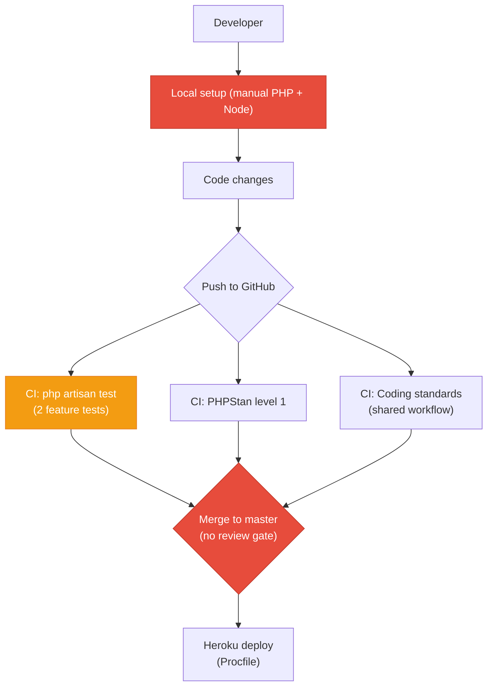
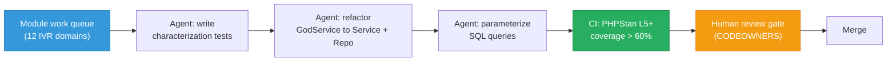
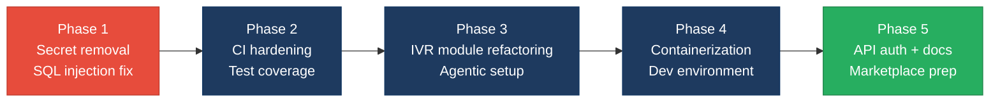

# 8. Technical Debt Analysis

**Objective:** Establish the prerequisites for an Agentic Harness & Marketplace initiative — code repository health, third-party tool usage, AI tool usage, database usage, and development environment readiness.

**Date:** 2026-09-30 07:03:19 UTC | **Scope:** `pingcrm` — Laravel 11 + Inertia.js (React 19 / TypeScript) monolith with a large generated legacy IVR enterprise layer

## Executive Summary

> **Executive Summary**
>
> The pingcrm repository is a Laravel 11 / Inertia.js / React 19 demo application that has been extended with a large generated "legacy IVR enterprise" layer comprising ~79k lines of PHP and ~100k lines of TypeScript. The IVR layer introduces severe technical debt: 12 "GodService" classes with hardcoded API keys and `extract()` calls, 12 repository files with SQL injection vulnerabilities via string-concatenated LIKE clauses, 759-line duplicated IVR controllers (84 files totalling ~61k LOC), a committed config file (`config/ivr_legacy.php`) containing plaintext CRM credentials and a master API key, and 540 blocking `sleep()` calls. Test coverage is minimal — only 2 feature tests and 1 trivial unit test for PHP, plus a single smoke test for the frontend. No Docker/devcontainer configuration exists, no CODEOWNERS or PR template is present, and PHPStan is pinned at level 1. The codebase is **not ready** for an agentic harness today: the IVR layer's highly duplicated, machine-generated structure is paradoxically enumerable (good for agents) but unsafe to automate against without CI quality gates and secret remediation first. Immediate priorities are credential removal, SQL injection fixes, and CI test-coverage expansion.

Yes

Top-Level .gitignore Present

4

CI/CD Workflows Found

18 / 14

Third-Party Packages Declared / Wired

Yes

.env.example Present

Overall Codebase Rating — Technical Debt &amp; Agentic Readiness

High Risk

Driven by D2 (hardcoded secrets in committed config/services), D4 (no database constraints on IVR tables), and D5 (no containerization, no enforced code style in CI).

## Readiness Benchmark Ratings

| # | Dimension | Good | Moderate | High Risk | Measured | Rating |
|---|---|---|---|---|---|---|
| D1 | Code Repository Health | all checks pass | 1–2 gaps | 3+ gaps / no CI | `.gitignore` present, 4 CI workflows, lock files committed; no CODEOWNERS, no PR template, no branch-protection signals | Moderate |
| D2 | Third-Party Tool Usage | mostly wired & current | some unused/unwired | many unused/unmaintained | 12 GodService files with hardcoded API keys committed in source; `sanctum` declared but IVR API routes have no auth middleware; `react-router-dom`, `@popperjs/core`, `uuid` declared but unused; `fakerphp/faker` in production `require` | High Risk |
| D3 | AI Tool / Agentic Readiness | ready | partial | not ready | IVR layer is highly enumerable (84 identical controller files, 12 services, 12 repos — agent-targetable). However, no CI quality gate beyond basic `php artisan test`, no characterization tests for the IVR surface, and secrets in source block safe automation | Moderate |
| D4 | Database Usage | sound | some gaps | no constraints / shared flat schema | Core CRM tables have indexes and soft-deletes. IVR dashboard tables use FK constraints. IVR legacy tables (46) have no foreign keys, no unique constraints, JSON payload with no schema enforcement. `tenant_id` hardcoded to 1 in controllers | High Risk |
| D5 | Development Environment | reproducible | partial | manual / fragile | `.env.example` present and comprehensive. No Dockerfile/docker-compose/devcontainer. ESLint + Prettier configured but not enforced in CI or pre-commit. PHPStan at level 1. `printWidth: 10000` effectively disables Prettier line wrapping. No pre-commit hooks | High Risk |

**No additional readiness gaps beyond the standard dimensions were observed.**

## 8.1 Code Repository

| Check | Status | Evidence | Consequence |
|---|---|---|---|
| `.gitignore` coverage | **Pass** | `.gitignore:1-17` — covers `node_modules/`, `vendor/`, `.env`, `.env.backup`, `.phpunit.result.cache`, IDE dirs (`.idea`, `.vscode`), build output (`public/build`, `public/hot`), `storage/*.key` | Dependency dirs and secrets are properly excluded from version control |
| CI/CD presence | **Pass** | `.github/workflows/tests.yml` — runs `php artisan test` on push/PR/daily cron with MySQL service container; `.github/workflows/static-analysis.yml` — PHPStan on push/PR; `.github/workflows/coding-standards.yml` — delegates to `laravel/.github` shared workflow; `.github/workflows/qa-ephemeral-runner.yml` — multi-framework ephemeral test dispatch | Four workflows provide basic gating; however, no code-coverage threshold, no frontend test step in CI, and no deployment gating |
| Branch protection signals | **Fail** | No `CODEOWNERS` file, no `PULL_REQUEST_TEMPLATE.md`, no `.github/branch-protection.yml` or similar found anywhere in the repository | Any contributor can merge directly without review; no structured PR checklist means quality depends entirely on individual discipline |
| Lock files committed | **Pass** | `composer.lock` (379,624 bytes) and `package-lock.json` (297,714 bytes) both present and tracked in version control | Reproducible installs across environments |

## 8.2 Third-Party Tools Usage

### PHP Dependencies (`composer.json`)

| Package | Declared | Actually Wired? | Debt |
|---|---|---|---|
| `laravel/framework` ^11.1 | Y | Y | Core framework — actively used throughout all controllers, models, and routes |
| `inertiajs/inertia-laravel` ^1.0 | Y | Y | Wired in all page controllers (`Inertia::render`) and middleware (`HandleInertiaRequests.php`) |
| `laravel/sanctum` ^4.0 | Y | Partial | Migration exists (`create_personal_access_tokens_table`), config published (`config/sanctum.php`), but the 84 IVR API routes at `routes/generated/ivr_legacy_api.php` have **no auth middleware** — accepts unauthenticated GET/POST via `Route::match` |
| `guzzlehttp/guzzle` ^7.2 | Y | Not observed | No direct HTTP client calls found in application code (`rg 'Http::' app/` and `rg 'new Client' app/` return nothing); pulled in transitively |
| `league/glide-symfony` ^2.0 | Y | Y | Used by `app/Http/Controllers/ImagesController.php` for image manipulation |
| `fakerphp/faker` ^1.23 | Y (**in `require`, not `require-dev`**) | Y | Used in `database/factories/` and seeders — but ships to production; should be `require-dev` |
| `larastan/larastan` ^2.8 | Y (dev) | Y | PHPStan extension wired in `phpstan.neon`; configured at level 1 with paths restricted to `app/` |
| `roave/security-advisories` dev-latest | Y (dev) | Y | Blocks installation of packages with known CVEs — good practice |
| `phpunit/phpunit` ^11.0 | Y (dev) | Y | Configured in `phpunit.xml` with Unit and Feature suites; 3 test files exist |
| `laravel/sail` ^1.26 | Y (dev) | Not observed | No `docker-compose.yml` generated; package is declared but never bootstrapped (`php artisan sail:install` was never run) |
| `mockery/mockery` ^1.6 | Y (dev) | Not observed | No mock usage in the 3 existing test files |
| `spatie/laravel-ignition` ^2.4 | Y (dev) | Y | Error page provider for local development |

### JavaScript Dependencies (`package.json`)

| Package | Declared | Actually Wired? | Debt |
|---|---|---|---|
| `@inertiajs/react` ^2.0.0 | Y | Y | Core Inertia React adapter — used in `app.tsx`, `ssr.tsx`, and all page components |
| `react` 19.2.3 / `react-dom` 19.2.3 | Y | Y | Used throughout the frontend as the rendering library |
| `react-router-dom` 5.2.0 | Y | **Not observed** | No `<Router>`, `<Route>`, `useHistory`, or `useNavigate` usage found anywhere — Inertia handles all routing. Two major versions behind (v7 current). Dead dependency |
| `@popperjs/core` ^2.11.8 | Y | **Not observed** | No tooltip/popover/dropdown positioning usage found; likely vestigial from a removed component library |
| `lodash` ^4.17.21 | Y | Partial | Only `pickBy` used in `resources/js/Shared/SearchFilter.tsx`; full 70KB library bundled for one function |
| `uuid` ^11.0.3 | Y | **Not observed** | No `import ... from 'uuid'` found in any frontend file |

## 8.3 AI Tool Usage & Agentic Readiness

**Existing AI/automation tooling:** None. No `.cursor/`, `.kiro/`, `CLAUDE.md`, `.github/copilot*`, or AI-related configuration files exist in the repository.

**Code generation tooling present:** The repository contains purpose-built generators in `tools/` that created the entire IVR legacy layer:
- `tools/generate-legacy-enterprise-ivr.php` (333 LOC) — PHP script that generates IVR controllers, GodServices, repositories, and helpers from a module list
- `tools/generate-legacy-enterprise-ivr.mjs` (234 LOC) — Node.js script generating legacy React hooks and monolith components
- `tools/generate-legacy-enterprise-ivr-pass2.mjs` (61 LOC) — Second-pass generator for additional frontend artifacts
- `tools/sync-ivr-legacy-routes.php` (53 LOC) — Syncs generated controller classes into `routes/generated/ivr_legacy_api.php`

**Agentic readiness assessment:**

The IVR legacy layer is **structurally ideal for agent-driven refactoring** — it consists of 12 identical domain modules, each with 7 controller actions (Index, Store, Update, Destroy, Import, Export, Sync), a GodService (373 LOC each), and a Repository (370 LOC each). The pattern is perfectly enumerable: an agent could target one module at a time (e.g., refactor `AgentDesk` → proper service + parameterized repository), verify via tests, then repeat for the remaining 11 modules.

**Three blockers prevent safe agentic automation today:**

1. **No characterization tests for IVR layer:** The 84 IVR controllers, 12 services, and 12 repositories have zero test coverage. An agent refactoring these files has no safety net to verify behavior preservation.
2. **Hardcoded secrets in source:** 12 GodService files contain `LEGACY_IVR_KEY_*` strings; `config/ivr_legacy.php` contains a master API key and Salesforce plaintext credentials. An agent working on these files risks exposing secrets in logs, diffs, or generated PRs.
3. **SQL injection in all repositories:** Every Legacy Repository file uses string concatenation for LIKE clauses. Automated refactoring that preserves this pattern propagates vulnerabilities; agents need an explicit "parameterize all queries" directive.

## 8.4 Database Usage

| Check | Status | Evidence | Consequence |
|---|---|---|---|
| Schema design — Core CRM | **Good** | `database/migrations/2020_01_01_000003–6`: `accounts`, `users`, `organizations`, `contacts` use `index()`, `unique()` on email, `softDeletes()`, and account-scoped integer FKs | Core data model is sound with proper indexing and soft-delete support |
| Schema design — IVR Dashboard | **Good** | `database/migrations/2026_07_28_120000_create_ivr_dashboard_tables.php`: `ivr_agents.queue_id` uses `constrained('ivr_operational_queues')->nullOnDelete()`, `ivr_call_records.queue_id` uses `constrained()->nullOnDelete()`, proper indexes on `tenant_id`, `external_id`, `stat_date`, `week_start` | Dashboard tables follow Laravel FK conventions with cascade rules and appropriate indexes |
| Schema design — IVR Legacy (46 tables) | **Fail** | `database/migrations/2026_07_28_000001_create_ivr_legacy_tables.php:28-36`: All 46 tables created in a loop with identical schema — `id`, `tenant_id` (default 1, indexed), `name` (nullable, indexed), `payload` (JSON, nullable), `softDeletes`, `timestamps`. No foreign keys between any tables, no unique constraints, no check constraints | 46 tables with zero referential integrity. The JSON `payload` column is schema-less — any value can be inserted without database-level validation. Cross-table relationships rely on application convention, not constraints, risking orphaned records and data corruption |
| Migration hygiene | **Moderate** | 13 migrations total (7 core CRM, 3 IVR, 3 framework). Ordered chronologically. The IVR batch migration at `2026_07_28_000001` creates/drops 46 tables in a single `up()`/`down()`. `composer.json` defines a `compile` script that runs `migrate:fresh --seed` — destructive by design | No destructive-migration guards. The `migrate:fresh` command in `compile` drops all tables — safe for demo/dev but dangerous if accidentally run against a shared database. Individual table rollback is impossible for the 46-table batch migration |
| Data ownership | **Mixed** | Core CRM tables: scoped by `account_id` FK. IVR dashboard: properly uses `account_id` and `organization_id` with FK constraints. IVR legacy: nominally scoped by `tenant_id` but hard-coded to `1` in controller properties (e.g., `AgentDeskIndexController.php:16: private $tenantId = 1`) | The legacy IVR layer cannot serve multiple tenants despite having a `tenant_id` column. This blocks multi-tenant extraction and means the column is decorative, not functional |
| Seed/sample data hygiene | **Good** | `DatabaseSeeder.php`: creates one Acme Corporation account with demo users/contacts/orgs. `IvrDashboardSeeder.php`: realistic call-center data with delete-then-insert pattern. `IvrModuleSampleSeeder.php`: named sample configs per module. No production data, no real credentials in seeders | Seeders are safe, idempotent, and use only fake data |

## 8.5 Development Environment

| Check | Status | Evidence | Consequence |
|---|---|---|---|
| `.env.example` | **Pass** | `.env.example:1-62`: Covers all required variables — `DB_CONNECTION=sqlite` default, mail, cache, queue, AWS placeholders, Pusher, Vite. The `composer.json` post-install script auto-copies `.env.example → .env` if missing | New developers get a working config out of the box with SQLite for zero-setup local dev |
| OS portability | **Moderate** | `Procfile` targets Heroku (Apache). CI runs on `ubuntu-latest` with MySQL service. PHP extensions listed in CI: `bcmath, ctype, exif, fileinfo, gd, json, mbstring, openssl, pdo, tokenizer, xml`. `config/ivr_legacy.php:9` references `/var/ivr/recordings` — a hardcoded Linux-only absolute path | Mostly portable via standard PHP/Node tooling, but the hardcoded `/var/` path in config would break on Windows/macOS. No Docker means local dev requires manual PHP 8.2 + extensions + Node.js setup |
| Containerization | **Fail** | No `Dockerfile`, `docker-compose.yml`, or `.devcontainer/` directory. `laravel/sail` ^1.26 is declared in `composer.json:require-dev` but `sail:install` was never run — no generated Docker config exists | Every contributor must install PHP 8.2+ with 10 extensions, Node.js, and MySQL/SQLite manually. Environment drift between developers is inevitable. The MySQL service in CI is not reproducible locally |
| Code style enforcement | **Partial** | **Configured:** ESLint (`.eslintrc.cjs` — TypeScript + React rules), Prettier (`.prettierrc`), EditorConfig (`.editorconfig`), PHPStan level 1 in CI. **Not enforced:** No `husky`/`lint-staged`/pre-commit hooks in `package.json`. `prettier.printWidth: 10000` effectively disables line-length formatting. `@typescript-eslint/no-explicit-any: 'off'` disables type safety. No PHP-CS-Fixer config. `coding-standards.yml` delegates to Laravel's opaque shared workflow — unclear what it enforces | Style tooling exists but is toothless. The `printWidth: 10000` setting makes Prettier a no-op for formatting. Disabling `no-explicit-any` undermines TypeScript's value — the 229 legacy components all use `any` props. No commit-time enforcement means all rules are advisory |

## 8.6 Prerequisites for Agentic Harness & Marketplace Readiness

| Prerequisite | Current State | Gap |
|---|---|---|
| Enumerable work queue (clear, listable units of refactor work) | 12 IVR domain modules × 7 actions each = 84 controllers + 12 GodServices + 12 Repositories — all structurally identical and independently targetable. Frontend mirrors this: 124 legacy hooks + 229 legacy components | Low — Structure is ideal for enumeration. Gap: no priority manifest documenting which modules to refactor first |
| Isolated, verifiable units of work | Each IVR module (e.g., AgentDesk) has its own controllers, service, repository, model, hooks, and components — can be refactored independently without touching other modules | High — Zero test coverage for IVR layer means no verification of behavior preservation after refactoring |
| CI gate to accept agent-authored output | `tests.yml` runs `php artisan test` (2 feature tests + 1 unit test). `static-analysis.yml` runs PHPStan level 1. No coverage threshold. No frontend tests in CI. No lint enforcement | High — CI is too weak to catch regressions from automated changes; an agent could break all IVR functionality with no CI failure |
| Repo hygiene for automation (clean checkout, no secrets) | `.gitignore` covers standard paths. But `config/ivr_legacy.php` commits plaintext CRM password and API keys. 12 GodService files commit `LEGACY_IVR_KEY_*`. `session_lifetime_minutes: 99999` and `bypass_auth_for_internal_ips` in committed config | Critical — Secrets must be removed and rotated before any automated tool processes these files |
| Marketplace packaging readiness | No module packaging (monolithic `app/` layout). No API versioning. No OpenAPI spec. No service contracts. IVR routes use `Route::match(['get','post'], ...)` with no middleware, no rate limiting, no auth | High — Far from packageable; no service boundaries, no API documentation, no authentication on IVR API endpoints |

## 8.7 Diagrams

### Current dev / delivery flow

```mermaid
flowchart TD
  A[Developer] --> B["Local setup (manual PHP + Node)"]
  B --> C["Code changes"]
  C --> D{"Push to GitHub"}
  D --> E["CI: php artisan test\n(2 feature tests)"]
  D --> F["CI: PHPStan level 1"]
  D --> G["CI: Coding standards\n(shared workflow)"]
  E --> H{"Merge to master\n(no review gate)"}
  F --> H
  G --> H
  H --> I["Heroku deploy\n(Procfile)"]
  style B fill:#e74c3c,stroke:#c0392b,color:#fff
  style E fill:#f39c12,stroke:#e67e22,color:#fff
  style H fill:#e74c3c,stroke:#c0392b,color:#fff
```

### Agentic harness readiness target

```mermaid
flowchart LR
  A["Module work queue\n(12 IVR domains)"] --> B["Agent: write\ncharacterization tests"]
  B --> C["Agent: refactor\nGodService to Service + Repo"]
  C --> D["Agent: parameterize\nSQL queries"]
  D --> E["CI: PHPStan L5+\ncoverage > 60%"]
  E --> F["Human review gate\n(CODEOWNERS)"]
  F --> G["Merge"]
  style A fill:#3498db,stroke:#2980b9,color:#fff
  style E fill:#27ae60,stroke:#1e8449,color:#fff
  style F fill:#f39c12,stroke:#e67e22,color:#fff
```

### Improvement roadmap

```mermaid
flowchart LR
  P1["Phase 1\nSecret removal\nSQL injection fix"] --> P2["Phase 2\nCI hardening\nTest coverage"] --> P3["Phase 3\nIVR module refactoring\nAgentic setup"] --> P4["Phase 4\nContainerization\nDev environment"] --> P5["Phase 5\nAPI auth + docs\nMarketplace prep"]
  classDef todo fill:#1e3a5f,stroke:#0f3460,color:#fff
  classDef first fill:#e74c3c,stroke:#c0392b,color:#fff
  classDef last fill:#27ae60,stroke:#1e8449,color:#fff
  class P1 first
  class P2,P3,P4 todo
  class P5 last
```

## 8.8 Actions Required

| Gap | Action | Rating | Priority |
|---|---|---|---|
| Plaintext credentials in `config/ivr_legacy.php` — master API key (`IVR-MASTER-KEY-DO-NOT-COMMIT-2013`), Salesforce `client_secret`, `password` | Move all secrets to `.env` variables with `env()` calls; add placeholders to `.env.example`; rotate all exposed credentials immediately | High Risk | Critical |
| Hardcoded API keys in 12 GodService files (`LEGACY_IVR_KEY_2042` through `_2122`) at `app/Legacy/Services/*GodService.php:11` | Replace `private $apiKey = "..."` with `config('ivr_legacy.module_keys.{module}')` backed by env vars; rotate all keys | High Risk | Critical |
| SQL injection in all 12 Legacy Repository files — unparameterized string concatenation in LIKE clauses at `app/Repositories/Legacy/*Repository.php` (~480 vulnerable call sites) | Replace `"AND name LIKE '%" . $filter . "%'"` with parameterized bindings: `DB::select($sql . " AND name LIKE ?", ['%' . $filter . '%'])` | High Risk | Critical |
| `extract($payload)` — ~4,940 unsafe calls across 84 IVR controllers and 12 GodServices | Remove all `extract()` calls; use explicit array key access (`$payload['key']`) or destructuring | High Risk | High |
| IVR legacy tables (46) have no FK constraints, no unique constraints | Add a migration with `foreignId()->constrained()` on cross-referencing columns; add `unique(['tenant_id', 'name'])` where applicable | High Risk | High |
| IVR API routes have no authentication middleware (`routes/generated/ivr_legacy_api.php`) | Add `auth:sanctum` (or at minimum `auth`) middleware to the `ivr-legacy` route group | High Risk | High |
| No containerization — no Dockerfile, docker-compose, or devcontainer | Run `php artisan sail:install` to generate Docker config from existing Sail dependency, or create a minimal `docker-compose.yml` with PHP-FPM, MySQL, and Node services; add `.devcontainer/` for VS Code | High Risk | High |
| Minimal test coverage — 2 Feature tests, 1 Unit test, 0 IVR tests, 1 frontend smoke test | Write characterization tests for each IVR module's Index and Store endpoints; add PHPUnit coverage to CI with minimum threshold (e.g., 40%); add Vitest component tests; run `vitest` in CI | Moderate | High |
| No CODEOWNERS or PR template | Add `.github/CODEOWNERS` mapping `app/Http/Controllers/Ivr/` and `app/Legacy/` to the platform team; add `.github/PULL_REQUEST_TEMPLATE.md` with a review checklist | Moderate | Medium |
| PHPStan at level 1 — lowest useful analysis level (`phpstan.neon:9`) | Incrementally raise to level 5+ with a generated baseline (`phpstan-baseline.neon`) so new code must pass at the higher level while existing violations are tracked | Moderate | Medium |
| `fakerphp/faker` in `require` instead of `require-dev` (`composer.json:10`) | Move to `require-dev`; verify seeders are only called in dev/testing environments | Moderate | Medium |
| 540 `sleep(1)` calls blocking synchronous execution in all 12 GodServices | Remove `sleep()` calls; if latency simulation is needed, use a configurable flag or queue-based async processing | Moderate | Medium |
| Prettier `printWidth: 10000` effectively disables line wrapping (`.prettierrc:3`) | Set `printWidth` to 100–120; run `prettier --write` across the codebase; add to CI as a check step | High Risk | Medium |
| 2,835 lines of duplicated Legacy Helper transforms — 5 classes × 80 identical methods each (`app/Legacy/Helpers/LegacyIvr*.php`) | Consolidate into a single `LegacyIvrTransformer::transform($value, $seed, $index)` method | Moderate | Low |
| Unused JS dependencies: `react-router-dom` 5.2.0, `@popperjs/core`, `uuid` | Remove from `package.json`; run `npm ci` and full test suite to verify no breakage | Moderate | Low |

## 8.9 Expected Outcomes

- **Clean, secret-free checkout:** All credentials moved to environment variables; committed secrets rotated; repository safe for any automated tool to process without risk of credential exposure in logs, diffs, or generated PRs.
- **CI gate trustworthy for agent output:** PHPStan raised to level 5+, coverage thresholds enforced, frontend lint and test steps added to CI — regressions from automated or manual changes caught before merge.
- **Enumerable refactoring queue established:** Each of the 12 IVR modules documented as a discrete work unit with characterization tests, enabling safe agent-driven refactoring one module at a time (GodService decomposition, repository parameterization, extract() removal).
- **Reproducible development environment:** Docker-based setup (via Sail or custom compose) ensures every contributor and CI runner operates on identical PHP/Node/MySQL stacks, eliminating environment drift.
- **Foundation for agentic harness adoption:** With secrets removed, SQL injection fixed, tests providing a safety net, and CI gates enforcing quality, the repository becomes a viable target for agent-driven modernization workflows.
