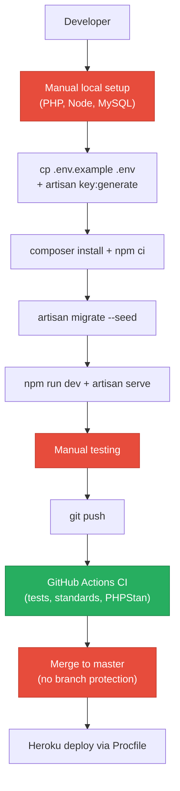
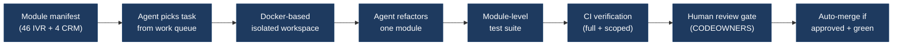
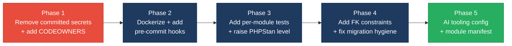

# 8. Technical Debt Analysis

**Objective:** Establish the prerequisites for an Agentic Harness & Marketplace initiative — code repository health, third-party tool usage, AI tool usage, database usage, and development environment readiness.

**Date:** 2026-09-30 06:00:25 UTC | **Scope:** `shende-shweta/pingcrm` (branch: `master`) — Laravel 11 + Inertia.js + React 19 + TypeScript + Vite 7, with a synthetically generated legacy IVR enterprise surface (~77k PHP LOC, ~108k TS/JS LOC)

## Executive Summary

> **Executive Summary**
>
> PingCRM is a Laravel 11 / React 19 demo application with a deliberately injected legacy IVR monolith surface totalling ~185k lines across 800+ generated files. The core CRM is well-structured with CI pipelines for tests, coding standards, and static analysis; lock files are committed and `.env.example` is present. However, the legacy IVR layer introduces severe technical debt: hard-coded secrets committed in `config/ivr_legacy.php`, `extract()` calls in God services, raw SQL concatenation in 10+ repository files, zero foreign keys on the original CRM tables (`users`, `contacts`, `organizations`), and no Docker or devcontainer configuration for reproducible environments. There is no `CODEOWNERS` file, no branch protection signals, no pre-commit hooks enforcing linters, and no AI-assisted tooling config (`.cursor/`, `CLAUDE.md`, `.kiro/`). PHPStan is configured at only level 1 out of 9. The codebase is **not ready** for an agentic harness today — the committed secrets alone block clean automation, and the absence of containerized environments makes reproducible agent-driven runs unreliable.

Yes

Top-Level .gitignore Present

4

CI/CD Workflows Found

19 / 15

Third-Party Packages Declared / Wired

Yes

.env.example Present

Overall Codebase Rating — Technical Debt &amp; Agentic Readiness

High Risk

Driven by D3 (no AI tooling config, committed secrets block automation) and D5 (no containerization, no pre-commit enforcement), with D4 contributing due to missing foreign key constraints on CRM tables.

## Readiness Benchmark Ratings

| # | Dimension | Good | Moderate | High Risk | Measured | Rating |
|---|---|---|---|---|---|---|
| D1 | Code Repository Health | all checks pass | 1–2 gaps | 3+ gaps / no CI | `.gitignore` present, 4 CI workflows, lock files committed; but no `CODEOWNERS`, no branch protection signals, no PR template | Moderate |
| D2 | Third-Party Tool Usage | mostly wired & current | some unused/unwired | many unused/unmaintained | 15 of 19 production deps actively wired; 4 declared but not evidently used in app code (Pusher, Mailgun, AWS SDK vars, `react-router-dom`) | Moderate |
| D3 | AI Tool / Agentic Readiness | ready | partial | not ready | No `.cursor/`, `CLAUDE.md`, `.kiro/`, or Copilot config; committed secrets in `config/ivr_legacy.php` block clean checkout for automation; IVR modules are structurally enumerable but not CI-verifiable in isolation | High Risk |
| D4 | Database Usage | sound | some gaps | no constraints / shared flat schema | IVR dashboard tables have FK constraints; CRM core tables (`users`, `contacts`, `organizations`) use integer `account_id`/`organization_id` with indexes but no foreign key constraints; 46 legacy IVR tables use an identical JSON-blob schema with no relational constraints | Moderate |
| D5 | Development Environment | reproducible | partial | manual / fragile | `.env.example` present; README has clear setup steps; but no `Dockerfile`/`docker-compose.yml`/devcontainer; no pre-commit hooks; linters configured but not enforced locally; PHPStan at level 1/9 | High Risk |

**No additional readiness gaps beyond the standard dimensions were observed.**

## 8.1 Code Repository

| Check | Status | Details |
|---|---|---|
| `.gitignore` coverage | **Pass** | Top-level `.gitignore` (`.gitignore:1-22`) covers `node_modules/`, `vendor/`, `.env`, `public/build/`, `storage/*.key`, IDE directories (`.idea/`, `.vscode/`), and build output. Missing explicit entries for `database/*.sqlite` (the default dev DB per README) and `*.log` files, though `storage/logs/` has its own nested `.gitignore`. |
| CI/CD presence | **Pass** | Four GitHub Actions workflows found in `.github/workflows/`: `tests.yml` (PHPUnit on MySQL 8.0 + asset build, runs on push/PR/daily cron), `coding-standards.yml` (Laravel shared coding-standards workflow on every push), `static-analysis.yml` (Laravel shared PHPStan workflow on push to master and PRs), `qa-ephemeral-runner.yml` (multi-framework dispatch runner for QA pipeline). All four gate on `push` or `pull_request` events, providing real CI verification. |
| Branch protection signals | **Gap** | No `CODEOWNERS` file, no `.github/pull_request_template.md`, no `branch-protection.yml` or `ruleset` config found in the repository. Without these, unreviewed and untested code can land on master. (Branch protection rules may exist at the GitHub repo level but are not visible locally.) |
| Lock files committed | **Pass** | Both `composer.lock` (379 KB) and `package-lock.json` (297 KB) are committed and tracked, ensuring reproducible installs across environments. |

## 8.2 Third-Party Tools Usage

### PHP Dependencies (`composer.json`)

| Package | Declared | Actually Wired? | Debt Note |
|---|---|---|---|
| `laravel/framework` ^11.1 | Y | Y | Core framework — used everywhere |
| `inertiajs/inertia-laravel` ^1.0 | Y | Y | Wired via `HandleInertiaRequests` middleware and all controllers returning `Inertia::render()` |
| `laravel/sanctum` ^4.0 | Y | Y | Config at `config/sanctum.php`, middleware registered in `bootstrap/app.php:26` |
| `league/glide-symfony` ^2.0 | Y | Y | Used by `ImagesController.php` for image manipulation |
| `guzzlehttp/guzzle` ^7.2 | Y | Partially | Declared as a production dep; used implicitly by Laravel's HTTP client but no direct `Guzzle` imports in app code |
| `fakerphp/faker` ^1.23 | Y | Y | Used in `database/factories/` and seeders — but declared in `require` rather than `require-dev`, meaning it ships to production |
| `ext-exif`, `ext-gd` | Y | Y | Required for image handling in `ImagesController` |
| `larastan/larastan` ^2.8 | Y (dev) | Y | Configured in `phpstan.neon`, integrated via `static-analysis.yml` CI workflow |
| `phpunit/phpunit` ^11.0 | Y (dev) | Y | Configured in `phpunit.xml`, 4 test files (282 lines) |
| `roave/security-advisories` dev-latest | Y (dev) | Y | Prevents installing packages with known security vulnerabilities — good practice |
| `laravel/sail` ^1.26 | Y (dev) | **Not wired** | Declared but no `docker-compose.yml` published (Sail would generate one); not used in CI or README setup instructions |

### JavaScript Dependencies (`package.json`)

| Package | Declared | Actually Wired? | Debt Note |
|---|---|---|---|
| `@inertiajs/react` ^2.0.0 | Y | Y | Core of the Inertia frontend; imported in `app.tsx`, `ssr.tsx`, and all pages |
| `react` 19.2.3 / `react-dom` 19.2.3 | Y | Y | Framework foundation |
| `react-router-dom` 5.2.0 | Y | **Unclear** | Pinned to an old v5 release; Inertia handles all routing — likely unused legacy dep |
| `lodash` ^4.17.21 | Y | Y | Imported in CRM page components for `pickBy`, `mapValues` etc. |
| `@popperjs/core` ^2.11.8 | Y | Y | Used by `Dropdown.tsx` for positioning |
| `uuid` ^11.0.3 | Y | Y | Used in IVR page components for key generation |
| `eslint` + TS/React plugins | Y (dev) | Y | Configured in `.eslintrc.cjs`, script in `package.json`; but not enforced via pre-commit hook or CI |
| `prettier` ^2.8.8 | Y (dev) | Y | Configured in `.prettierrc`, script `fix:prettier` in `package.json`; but not enforced via pre-commit hook or CI |
| `vitest` 4.0.18 | Y (dev) | Minimal | Configured in `vitest.config.ts`, but only 1 smoke test (`resources/js/test/smoke.test.ts`: `expect(true).toBe(true)`) |
| `prettier-plugin-tailwind` ^2.2.12 | Y (dev) | Y | Integrates with Prettier for Tailwind class sorting |

**Summary:** `fakerphp/faker` in production `require` is a packaging debt. `laravel/sail` is declared but unpublished. `react-router-dom` v5 appears unused alongside Inertia routing. `eslint`/`prettier` exist but lack enforcement.

## 8.3 AI Tool Usage & Agentic Readiness

**AI tooling config present:** None. No `.cursor/` directory, no `CLAUDE.md`, no `.kiro/` directory, no `.github/copilot*` config, and no codegen configuration files were found in the repository.

**Scaffolding / code generation scripts:** Four scripts exist under `tools/`:
- `generate-legacy-enterprise-ivr.php` — generates ~72k lines of PHP legacy IVR code
- `generate-legacy-enterprise-ivr.mjs` — generates ~102k lines of React/TS legacy code
- `generate-legacy-enterprise-ivr-pass2.mjs` — generates ~52k additional legacy lines
- `sync-ivr-legacy-routes.php` — auto-syncs IVR controller routes

These are code-generation tools for the legacy surface, not AI-assisted development tools.

**Structural enumerability:** The IVR module surface is highly enumerable — 46 modules, each with an identical 7-controller pattern (`Index`, `Store`, `Update`, `Destroy`, `Export`, `Import`, `Sync`), matching legacy model, repository, and God service. This makes the IVR layer an excellent candidate for systematic agent-driven refactoring (one module at a time, same transformation per module). The CRM core (contacts, organizations, users) is smaller but follows standard Laravel conventions, also suitable for agent work.

**Blockers to agentic readiness:**
1. **Committed secrets** in `config/ivr_legacy.php:9-19` (API keys, Salesforce credentials, SQL debug flag) — any automated clone/checkout exposes these; agents cannot safely operate in a repo with committed secrets.
2. **No containerized environment** — agents need deterministic, reproducible setups; manual PHP/MySQL/Node install steps are fragile.
3. **No CI-verifiable isolation** — the 46 IVR modules share a single migration and have no module-level test suites, so an agent cannot verify a single-module refactor without running the entire test suite (which itself is minimal).

## 8.4 Database Usage

| Check | Status | Details |
|---|---|---|
| Schema design — FK constraints | **Mixed** | The IVR dashboard tables (`2026_07_28_120000_create_ivr_dashboard_tables.php:28,41`) correctly use `foreignId()->constrained()->nullOnDelete()` for `queue_id` on `ivr_agents` and `ivr_call_records`. However, the original CRM tables (`2020_01_01_000004_create_users_table.php`, `2020_01_01_000005_create_organizations_table.php`, `2020_01_01_000006_create_contacts_table.php`) define `account_id` and `organization_id` as plain `integer` columns with indexes but **no foreign key constraints**. The 46 legacy IVR module tables (`2026_07_28_000001_create_ivr_legacy_tables.php`) use an identical generic schema (`id`, `tenant_id`, `name`, `payload` JSON, `timestamps`, `softDeletes`) with no relational constraints whatsoever. |
| Schema design — Indexes | **Adequate** | All `account_id`, `tenant_id`, `organization_id` columns are indexed. Email uniqueness enforced on users. The IVR dashboard tables index `stat_date`, `week_start`, and `external_id`. |
| Migration hygiene | **Gap** | 13 migrations total. The IVR legacy migration creates 46 tables in a single migration file with a loop — this is not one-migration-per-logical-change. The `down()` method uses `Schema::dropIfExists()` which is fine, but the `2026_07_28_130000_add_account_id_to_ivr_tables.php` migration performs DML (`DB::table()->update()`) to backfill account IDs with no guard for re-runnability or rollback safety. |
| Data ownership | **Partial** | CRM entities are scoped by `account_id` (multi-tenancy). IVR dashboard tables have both `tenant_id` and `account_id`. Legacy IVR tables have `tenant_id` and `account_id` but no foreign keys — ownership is enforced only at the application level (e.g., `IvrAccountContext` support class). Tables are not grouped into separate schemas or databases per domain. |
| Seed/sample data hygiene | **Adequate** | `DatabaseSeeder.php` creates a single demo account with factory-generated data. `IvrDashboardSeeder.php` clears existing data for the account before re-seeding (idempotent pattern via `DELETE` then `INSERT`). No production data or real secrets in seed files. The demo login credentials (`johndoe@example.com` / `secret`) are documented in README, which is appropriate for a demo app. |

## 8.5 Development Environment

| Check | Status | Details |
|---|---|---|
| `.env.example` | **Pass** | Present at `.env.example:1-63`, covers all required variables including `DB_CONNECTION=sqlite` default, mail, cache, queue, and Pusher/Vite vars. Matches the README setup instructions. |
| OS portability | **Adequate** | README instructions use cross-platform tools (`composer`, `npm`, `php artisan`). `Procfile` targets Heroku with Apache. No OS-specific scripts. The CI runs on `ubuntu-latest`. Setup is not tied to one platform, though lack of Docker means each developer must install PHP 8.2, MySQL (or SQLite), and Node.js manually. |
| Containerization | **Gap** | No `Dockerfile`, `docker-compose.yml`, or `.devcontainer/` configuration exists. `laravel/sail` is declared as a dev dependency in `composer.json` but was never published (`sail:install` was never run) — no `docker-compose.yml` was generated. This means every contributor must manually install PHP 8.2 with extensions (`exif`, `gd`, `bcmath`, etc.), a database server, Node.js, and Composer. |
| Code style enforcement | **Partial** | **Configured:** ESLint (`.eslintrc.cjs`), Prettier (`.prettierrc`), PHPStan (`phpstan.neon` at level 1/9), EditorConfig (`.editorconfig`), and a Laravel shared `coding-standards.yml` CI workflow. **Not enforced locally:** No `.husky/` directory, no `lint-staged` in `package.json`, no pre-commit hook installed (`.git/hooks/pre-commit` does not exist). ESLint and Prettier are run only when a developer explicitly calls `npm run fix-code-style`. PHPStan runs in CI at level 1 — the lowest useful level — catching only basic errors. |

## 8.6 Prerequisites for Agentic Harness & Marketplace Readiness

| Prerequisite | Current State | Gap |
|---|---|---|
| Enumerable work queue (clear, listable units of refactor work) | 46 IVR modules follow an identical 7-controller + model + repository + God service pattern; CRM has 4 standard resource controllers | Medium — Units are enumerable but not formally catalogued; no task list or module manifest exists for agents to iterate over |
| Isolated, verifiable units of work | Each IVR module is structurally isolated (own controller set, model, repository) but shares the same migration and has no module-level tests | High — No per-module test suites; an agent cannot verify a single-module refactor without running the entire (minimal) test suite |
| CI gate to accept agent-authored output | 4 CI workflows exist (tests, coding standards, static analysis, QA ephemeral runner); PRs trigger test + static analysis | Medium — CI gates exist but coverage is thin (282 lines of PHP tests, 1 JS smoke test); agent output would pass CI even with significant regressions |
| Repo hygiene for automation (clean checkout, no secrets) | `.gitignore` covers standard paths; lock files committed | Critical — Hard-coded secrets in `config/ivr_legacy.php` (API keys, Salesforce password, SQL debug flag) are tracked in Git; any automated checkout exposes credentials |
| Marketplace packaging readiness | Standard Laravel/npm project structure; `composer.json` and `package.json` with scripts | High — No Docker packaging, no `Dockerfile`, no infrastructure-as-code; `fakerphp/faker` in production deps |

## 8.7 Diagrams

### Current dev / delivery flow

```mermaid
flowchart TD
  A["Developer"] --> B["Manual local setup<br/>(PHP, Node, MySQL)"]
  B --> C["cp .env.example .env<br/>+ artisan key:generate"]
  C --> D["composer install + npm ci"]
  D --> E["artisan migrate --seed"]
  E --> F["npm run dev + artisan serve"]
  F --> G["Manual testing"]
  G --> H["git push"]
  H --> I["GitHub Actions CI<br/>(tests, standards, PHPStan)"]
  I --> J["Merge to master<br/>(no branch protection)"]
  J --> K["Heroku deploy via Procfile"]
  classDef gap fill:#e74c3c,stroke:#c0392b,color:#fff
  classDef ok fill:#27ae60,stroke:#1e8449,color:#fff
  class B,G,J gap
  class I ok
```

### Agentic harness readiness target

```mermaid
flowchart LR
  A["Module manifest<br/>(46 IVR + 4 CRM)"] --> B["Agent picks task<br/>from work queue"]
  B --> C["Docker-based<br/>isolated workspace"]
  C --> D["Agent refactors<br/>one module"]
  D --> E["Module-level<br/>test suite"]
  E --> F["CI verification<br/>(full + scoped)"]
  F --> G["Human review gate<br/>(CODEOWNERS)"]
  G --> H["Auto-merge if<br/>approved + green"]
  classDef target fill:#1e3a5f,stroke:#0f3460,color:#fff
  class A,B,C,D,E,F,G,H target
```

### Improvement roadmap

```mermaid
flowchart LR
  P1["Phase 1<br/>Remove committed secrets<br/>+ add CODEOWNERS"] --> P2["Phase 2<br/>Dockerize + add<br/>pre-commit hooks"]
  P2 --> P3["Phase 3<br/>Add per-module tests<br/>+ raise PHPStan level"]
  P3 --> P4["Phase 4<br/>Add FK constraints<br/>+ fix migration hygiene"]
  P4 --> P5["Phase 5<br/>AI tooling config<br/>+ module manifest"]
  classDef first fill:#e74c3c,stroke:#c0392b,color:#fff
  classDef mid fill:#1e3a5f,stroke:#0f3460,color:#fff
  classDef last fill:#27ae60,stroke:#1e8449,color:#fff
  class P1 first
  class P2,P3,P4 mid
  class P5 last
```

## 8.8 Actions Required

| Gap | Action | Rating | Priority |
|---|---|---|---|
| Hard-coded secrets committed in `config/ivr_legacy.php` | Move all secrets to `.env` variables; replace hard-coded values with `env()` calls; add `config/ivr_legacy.php` values to `.env.example` with placeholder values; run `git filter-branch` or BFG to purge secrets from history | High Risk | Critical |
| No branch protection or code review signals | Add `CODEOWNERS` file mapping `app/` to backend team and `resources/js/` to frontend team; add `.github/pull_request_template.md`; enable branch protection rules on `master` requiring CI pass and 1 approval | Moderate | High |
| No containerized development environment | Run `php artisan sail:install` to generate `docker-compose.yml`, or create a manual `Dockerfile` + `docker-compose.yml` with PHP 8.2-FPM, MySQL 8.0, and Node 20; add `.devcontainer/devcontainer.json` for VS Code | High Risk | High |
| Code style enforcement not enforced locally | Install `husky` + `lint-staged` in `package.json`; add pre-commit hooks running `eslint`, `prettier`, and `php-cs-fixer`; raise PHPStan from level 1 to at least level 5 | High Risk | High |
| No AI-assisted tooling configuration | Add `CLAUDE.md` with project conventions and commands; add `.cursor/rules` for IDE context; create a module manifest JSON listing all 46 IVR modules for agent iteration | High Risk | Medium |
| Missing FK constraints on CRM core tables | Add a migration to convert `account_id` on `users`, `organizations`, `contacts` to proper `foreignId()->constrained()` calls; add FK from `contacts.organization_id` to `organizations.id` | Moderate | Medium |
| `fakerphp/faker` in production `require` | Move `fakerphp/faker` from `require` to `require-dev` in `composer.json`; it is only used in factories and seeders | Moderate | Low |
| Minimal test coverage (282 PHP LOC, 1 JS smoke test) | Add feature tests for IVR hub routes, module CRUD operations, and reports; add Vitest component tests for key React pages; target at minimum one test file per IVR module for agent-verifiable units | Moderate | High |
| `react-router-dom` v5 likely unused | Verify no imports of `react-router-dom` exist in app code; if confirmed unused, remove from `package.json` to reduce bundle size and dependency surface | Moderate | Low |
| IVR legacy migration creates 46 tables in a single file | Split into per-module migrations or at minimum one-per-domain-group for cleaner rollback and migration ordering | Moderate | Low |

## 8.9 Expected Outcomes

- **Clean, secret-free checkout** — moving secrets to `.env` and purging history enables safe automated clones for CI, agents, and new contributors.
- **Reproducible containerized environment** — Docker-based setup eliminates "works on my machine" drift and gives agents a deterministic workspace.
- **CI gate trusts agent-authored changes** — per-module test suites and raised PHPStan levels ensure that agent-generated refactors are verifiable before human review.
- **Enforced code style on every commit** — pre-commit hooks with ESLint, Prettier, and PHP-CS-Fixer prevent style drift from any contributor, human or agent.
- **Foundation for agentic harness adoption** — a module manifest, `CLAUDE.md` conventions file, and CODEOWNERS-gated review process create the scaffolding for systematic, agent-driven modernization of the 46 IVR modules.
